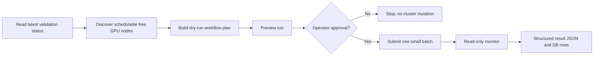

# c-val 2.0 Documentation

c-val 2.0 is the safe orchestration layer around the existing c-val GPU cluster validation engine. It keeps deterministic validation logic in scripts/jobs, while moving cluster orchestration into a tested Python package and CLI.

## Start Here

- [Architecture](architecture.md): components, ownership boundaries, and system design.
- [Configuration](configuration.md): TOML config model, precedence, and format choices.
- [Workflow](workflow.md): end-to-end logical and process flow with diagrams.
- [CLI Reference](cli-reference.md): operator commands and expected outputs.
- [Operations Runbook](operations-runbook.md): safe daily operation and one-node validation flow.
- [Result Schema](result-schema.md): structured result JSON and DB ingestion model.
- [Baselines & Classification](baselines.md): dynamic robust baselines and node classification.
- [DL Test](dl-test.md): how the deep learning unit test fits into c-val and how to read its output.
- [Hermes Integration](hermes-integration.md): safe Hermes operating model for c-val.
- [Design Decisions](design-decisions.md): why the implementation is shaped this way.
- [Troubleshooting](troubleshooting.md): common failure modes and read-only triage.
- [c-val 2.0 Implementation Notes](cval-2.0.md): historical first-refactor slice; use this index and the modular tracker for current status.

## Modular Framework Design and Incremental Implementation

- [Modular Validation Contract](modular-validation-contract.md): repository-local test registry, directory/config contract, adapter protocol, path rules, compatibility map, and synthetic plugin acceptance test.
- [Structured Result Schema v2](result-schema-v2.md): dynamic per-test result envelope, progress events, validation invariants, and v1 compatibility.
- [Modular Database Schema Design](database-schema-v3.md): run history, per-test result/health databases, lifecycle, concurrency, and additive migration boundaries.
- [Node Run History](run-history.md): implemented U6 schema, idempotent ingestion, read-only reporting, and approval-gated production activation.
- [U8 Health Engine Design Report](u8-health-engine-design-report.md): stable classes, deterministic formulas, exact provenance/schema, lifecycle, adapter boundary, tests, and operational non-activation.
- [Implementation Tracker](todo/cval-update.md): approval-gated U0–U12 execution backlog.

U2 configuration composition, U3 per-test boundaries, U4 generic job context,
U5 generic execution/result v2/canonical logs, U6 normalized run history, U7
canonical per-test raw/metric ingestion, the U8 versioned health-class engine,
and the U9 dry-run-first evaluator are implemented locally.
U6/U7 production writes remain independently default-off and unapproved.
U9 derived writes are also independently default-off: no live health DB,
evaluator service, automatic activation, migration, or deployment is
authorized. U9 remains IN PROGRESS pending independent certification; U11 owns
future live cutover.

## Repository Shape

The repository is named `c-val`, while the Python package is named `cval`.
That is intentional: Python imports cannot contain hyphens. Runtime jobs clone
the repository into `/workspace/c-val`, then execute `python -m cval.cli` and
scripts from that checkout.

## Mental Model

The new c-val control plane follows a dry-run-first loop:



## Safety Defaults

Read-only and dry-run commands are the default. Real Kubernetes job creation requires both:

```bash
--submit --confirm submit
```

Read-only commands such as `jobs --watch` never delete jobs. The separately
started `cval-live` service automatically prunes stale `Pending` jobs matching
its configured namespace and shared job-name prefix. Other cleanup remains
explicit and approval-gated.

## Historical Validated v1 State

The current c-val 2.0 flow has been tested with a pinned one-node run:

- commit: `c9a762a65bf9ae2989d71a01395d86dbc5c96af5`
- node: `slc01-cl02-hgx-0204`
- result: `storage=pass`, `nccl=pass`, `dltest=pass`, `overall=pass`
- result schema: `cval.results.v1`