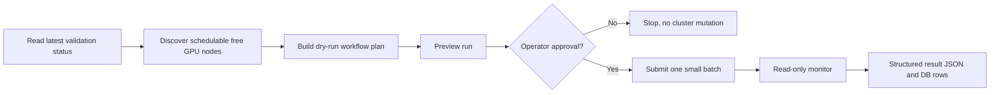

# c-val 2.0 Documentation

c-val 2.0 is the safe orchestration layer around the existing c-val GPU cluster validation engine. It keeps deterministic validation logic in scripts/jobs, while moving cluster orchestration into a tested Python package and CLI.

## Start Here

- [Architecture](architecture.md): components, ownership boundaries, and system design.
- [Configuration](configuration.md): TOML config model, precedence, and format choices.
- [Workflow](workflow.md): end-to-end logical and process flow with diagrams.
- [CLI Reference](cli-reference.md): operator commands and expected outputs.
- [Operations Runbook](operations-runbook.md): safe daily operation and one-node validation flow.
- [Result Schema](result-schema.md): structured result JSON and DB ingestion model.
- [DL Test](dl-test.md): how the deep learning unit test fits into c-val and how to read its output.
- [Hermes Integration](hermes-integration.md): safe Hermes operating model for c-val.
- [Design Decisions](design-decisions.md): why the implementation is shaped this way.
- [Troubleshooting](troubleshooting.md): common failure modes and read-only triage.
- [c-val 2.0 Implementation Notes](cval-2.0.md): current implementation status.

## Repository Shape

The repository is named `c-val`, while the Python package is named `cval`.
That is intentional: Python imports cannot contain hyphens. Runtime jobs clone
the repository into `/workspace/c-val`, then execute `python -m cval.cli` and
scripts from that checkout.

## Mental Model

The new c-val control plane follows a dry-run-first loop:



## Safety Defaults

Read-only and dry-run commands are the default. Real Kubernetes job creation requires both:

```bash
--submit --confirm submit
```

No c-val 2.0 command deletes jobs automatically. Cleanup remains explicit and approval-gated.

## Validated State

The current c-val 2.0 flow has been tested with a pinned one-node run:

- commit: `c9a762a65bf9ae2989d71a01395d86dbc5c96af5`
- node: `slc01-cl02-hgx-0204`
- result: `storage=pass`, `nccl=pass`, `dltest=pass`, `overall=pass`
- result schema: `cval.results.v1`