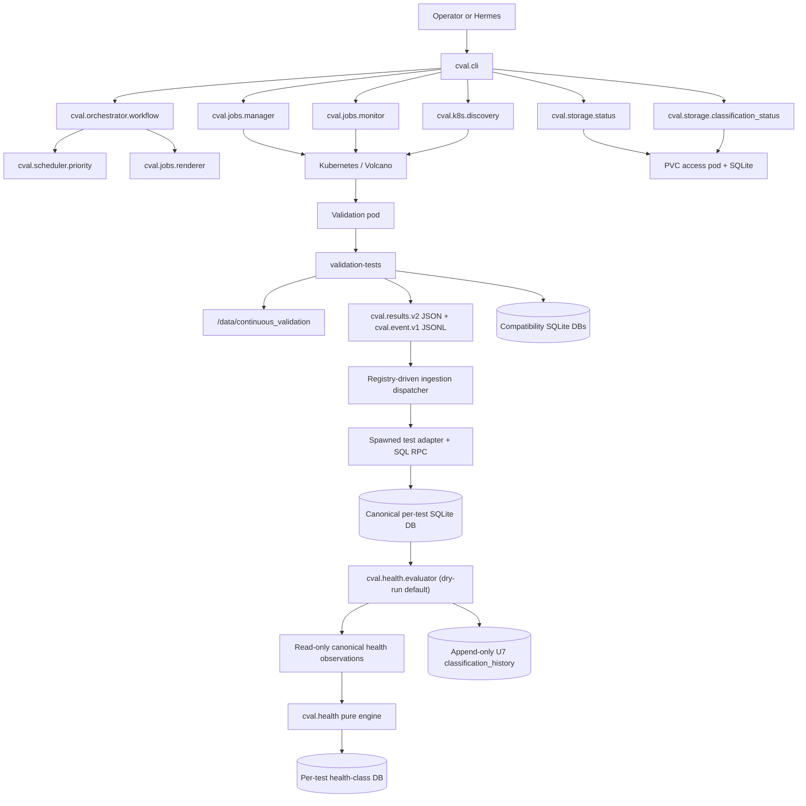

# Architecture

## Purpose

c-val 2.0 separates orchestration from validation execution. The Python package plans, previews, submits, monitors, and summarizes validation jobs. The in-pod validation scripts still run storage, NCCL, and DL checks and write deterministic artifacts.

## Component Diagram



## Package Responsibilities

| Module | Responsibility |
| --- | --- |
| `cval.config` | Load typed TOML configuration and expose effective defaults. |
| `cval.cli` | Human/Hermes command surface. |
| `cval.k8s.client` | Thin, testable `kubectl` wrapper. |
| `cval.k8s.discovery` | GPU usage parsing, schedulable-node filtering, free-node discovery. |
| `cval.storage.status` | Read-only latest-status DB access through PVC access pod. |
| `cval.storage.run_history` | Transactional normalized v2 run/test ingestion and read-only history queries. |
| `cval.storage.classification_status` | Read-only latest baseline verdict access and CSV export. |
| `cval.scheduler.priority` | Queue stale or never-tested free nodes. |
| `cval.jobs.renderer` | Render Volcano job YAML with node, timestamp, git repo, and git ref. |
| `cval.orchestrator.workflow` | Build a dry-run plan from discovery + history + template rendering. |
| `cval.policy` | Enforce namespace, batch-size, and confirmation gates. |
| `cval.jobs.manager` | Dry-run by default; explicitly submit approved plans. |
| `cval.jobs.monitor` | Read-only job phase polling and timeout classification. |
| `cval.validation.results` | Parse and validate structured result JSON. |
| `cval.validation.registry` | Compose and validate explicit repository-local test descriptors. |
| `cval.validation.scaffold` | Dry-run-first, no-overwrite creation of disabled pass/fail-only test templates. |
| `cval.validation.compatibility` | Immutable legacy registrations, env/result projection, markers, aliases, separately classified current supervisor/ingestion protocol names, surface inventory, and bounded copied-input audit. |
| `cval.validation.operational_targets` | Build the immutable enabled/capability-derived compatibility target catalog and central DL alias overlay. |
| `cval.validation.operations` | Re-resolve targets and dispatch compatibility baseline/classification/export hooks with strict return contracts. |
| `cval.validation.runtime` | Build the generic registry/config runtime context and compatibility payload. |
| `cval.validation.ingestion` | Preflight v2/config/evidence identity and dispatch isolated per-test raw/metric ingestion. |
| `cval.validation.plugins` | Validate and load repository-confined `cval.plugin.v1` adapters and immutable contexts/receipts. |
| `cval.storage.ingest` | Write result and metrics rows from inside validation pods. |
| `cval.storage.per_test_results` | Own common canonical result schema, adapter transactions, versions, and durable receipts. |
| `cval.storage.write_provenance` | Bind compatibility and DL writes to validated result/config/path capabilities. |
| `cval.health.combination` | Build canonical comparable-environment JSON/SHA-256 identities. |
| `cval.health.engine` | Validate observations/provenance, build content-addressed robust candidates, apply normalized class bands, enforce DNR, and validate custom aggregation. |
| `cval.health.storage` | Exact per-test SQLite schema, immutable evidence, candidate lifecycle, snapshot-consistent reads, and transactional activation. |
| `cval.evaluator.state` | Fixed-owner state-root validation, retained root/ancestry/target bindings, descriptor-relative publication helpers, and the bounded per-test lock shared by U7, U9, and backup apply. |
| `cval.health.evaluator` | Registry enumeration, bounded source catalogs, authoritative candidate triggers, classification history, dry-run reports, and deliberate activation. It imports no Kubernetes modules. |
| `cval.health.sqlite_values` | Reject coercive/non-finite SQLite scalars at health adapter read boundaries. |
| `cval.baselines.stats` | Robust statistics kernels (median, MAD, percentiles, modified z-score, bootstrap). |
| `cval.baselines.build` | Build dynamic baselines from result DBs per stratum. |
| `cval.baselines.storage` | Persist versioned baselines (candidate/active/superseded). |
| `cval.baselines.classify` | Classify nodes against the active baseline, including DL component aggregation. |

## Runtime Artifacts

```text
/data/continuous_validation/
  logs/job_logs/<node>/<run-id>/{job.log,stdout.log,stderr.log,events.jsonl,result.json}
  logs/<test-id>/<node>/<run-id>/{stdout.log,stderr.log,events.jsonl}
  validation_tests/<test-id>/runs/<node>/<run-id>/{result.json,summary.*,artifacts/}
  validation_tests/storage/storage_results.db
  validation_tests/storage/storage_health_classes.db   # declared U8 path; not live
  validation_tests/nccl/nccl_results.db
  validation_tests/nccl/nccl_health_classes.db         # declared U8 path; not live
  validation_tests/dltest/dltest_results.db
  validation_tests/dltest/dltest_health_classes.db     # declared U8 path; not live
  metadata/validation.db
  metadata/node-run-history.db
  metadata/test-storage.db
  metadata/test-nccl.db
  metadata/dltest_numerical_correctness.db
  metadata/dltest_compute_performance.db
  metadata/dltest_collective_performance.db
  metadata/dltest_overlap_performance.db
  baselines/test-storage-baselines.db
  baselines/test-nccl-baselines.db
  baselines/dltest_numerical_correctness-baselines.db
  baselines/dltest_compute_performance-baselines.db
  baselines/dltest_collective_performance-baselines.db
  baselines/dltest_overlap_performance-baselines.db
  baselines/classification-results.db
```

The old `storage/`, `nccl/`, `dltest/`, and `results/` trees remain readable as
historical v1 evidence. New runs do not write those paths.

The three canonical per-test DB paths are implemented but
`storage.per_test_ingestion_enabled` remains `false`. They are not production
write surfaces until a separately approved dual-write activation. U7, U8,
activation keys, evaluator locks, and U9 state resolve below the dedicated
`health_evaluator.state_root`; `runtime.validation_root` remains shared
validation evidence and is never chmod/chown'ed by the evaluator. U7 activation
is blocked until ingestion runs as the configured fixed UID/GID. The current
validation workload identity is unspecified, so enabling U7 now fails closed.
Every gate-on U7/U9/backup operation uses the same descriptor-relative per-test
lock inode. Production U9 retains the exact state-root ancestry, U8/key parent,
and existing file descriptors before health storage is called. Initial U8/key
creation stages, opens, publishes, and cleans up relative to that retained
parent; existing U8 reads/writes use the captured inode. Missing shadow
ancestry is also a binding: appearance of its first missing component or target
fails preflight. These local safety properties do not provision the state root
or close any live rollout blocker.
Likewise,
`metadata/node-run-history.db` remains independently default-off.

U9 now wires U8 through a local/PVC-copy evaluator. `health evaluate` is
dry-run by default, enumerates only enabled registry tests with both `health`
and `ingest`, treats a missing U7 DB as a structured skip, and isolates each
test. Apply requires the independent `health_evaluator.write_enabled=true`
gate and exact confirmation. It additively migrates a validated U7 v1 DB to v2,
stores candidates and append-only verdict history, and never updates the
nullable latest-health cache columns. All built-ins remain
`auto_activate=false`; activation is a separate deliberate command. No live DB,
background service, Kubernetes manifest, or deployment is authorized by U9.
Routine evaluator catalogs scan bounded `test_results` primary-key pages and
batch current-target probes through the unique history target index. Full
history content validation is a separate streamed joined integrity audit, not a
routine schema/evaluator scan. Atomic history persistence retains a per-record
`stored`/`idempotent` outcome when exact concurrent appends race preflight.

U10 separately makes the existing compatibility baseline, classification, and
result-export target surface registry/capability-driven. The `baseline`
capability owns compatibility build/classify targets; `export` owns result
exports. The four DL component aliases are one central overlay owned by the
enabled `dltest` registration. This is selection and dispatch only: built-ins
still read the metadata metric DBs and store compatibility baselines/verdicts
under `baselines/`; no U7/U8/U9 source cutover or live loop restart is implied.

U11 adds a locally testable one-shot service boundary around U9, but no live
cutover. `cval.evaluator.service` verifies the commit embedded in the immutable
image against the expected release commit, requires a digest-pinned image
declaration equal to the rendered container image, runs deployment preflight,
invokes one U9 cycle, suppresses dependency output, and emits one
`cval.evaluator-cycle.v1` stdout object even on handled SIGINT/SIGTERM. Runtime
code cannot attest the actual started image; admission, signature, and
provenance verification remain mandatory live controls. The checked-in suspended Kustomize
shadow variant mounts only the pre-existing `continuous_validation/evaluator_state`
PVC subPath read-only and has no apply argument; the separately reviewed apply
variant mounts only that subPath read-write and carries the
independent write gate plus exact evaluator confirmation. Both use a tokenless
ServiceAccount, evaluator-scoped deny-all NetworkPolicy, Restricted pod
security, bounded resources/deadlines/history, and no runtime Git, package
installation, network, Kubernetes, GPU, or RDMA dependency. The checked-in
multi-stage recipe installs the packaged commit marker and offline locked wheel
inputs into a distroless non-root image, while all base/image digests remain
fail-closed placeholders. Preflight traverses foreign outer mount ancestors by
descriptor without changing them, then validates the state root/descendants as
the fixed UID/GID with exact `0700`/`0600` modes plus strict U7 row/receipt ownership; copied JSON/SQLite
parity uses exact class, DNR, baseline, identity, and integer timestamp
semantics. See
[U11 evaluator rollout preparation](u11-evaluator-rollout.md). U11 remains
blocked on approval to provision the state subroot, a fixed-identity ingestion
execution path, live U7/PVC ownership facts, an approved image digest, backup/restore
evidence, Kubernetes facts, shadow acceptance, and explicit apply/cutover
approval.

U12A removes fixed test configuration views and makes targeted raw reporting
registry ordered and classification capability driven. Compatibility behavior
is retained. The evaluator builder assembles descriptors and declared adapters
from a no-follow, identity-checked copy of the global registry instead of
listing built-ins in the Dockerfile. It validates the full plugin API/config
contract before destination mutation and atomically publishes one staged
catalog tree without overwrite.
Removal remains blocked on U11 live acceptance and the compatibility period.
The U12 inventory does not misclassify descriptor-anchored supervisor controls
or canonical ingestion path guards as legacy cleanup candidates: they are
reported separately as `internal-current-protocol`. Token scanning treats path
separators as boundaries while rejecting names embedded in larger identifiers.

Validation-job startup is descriptor anchored. After the pinned checkout and
runtime-payload decode, one Python supervisor opens the absolute validation root
component by component with `O_NOFOLLOW|O_DIRECTORY`, creates global and
enabled-test run descendants with `mkdirat`/`openat`, applies exact `0700`
run-directory and `0600` evidence-file modes, and retains every final directory
descriptor. The generic runner and compatibility ingestion receive
`/proc/self/fd/<fd>` paths and inherited descriptors; the shell template does
not reopen PVC paths with `mkdir`, redirection, or `tee`. The supervisor owns
global logging, child process groups, signal forwarding, atomic `.run-active`
reservation, and root-to-final identity revalidation between stages. Result
JSON continues to expose the unchanged canonical `/data/...` paths.

The four `metadata/dltest_*` DBs hold raw tall DL metric rows. The
`baselines/*-baselines.db` files hold versioned dynamic baselines. The
`baselines/classification-results.db` file holds derived baseline decisions; raw
validation status remains in `metadata/validation.db`.

## Configuration Boundary

Operator-owned defaults live in `config/cval.toml`. Kubernetes resource shape
stays in `ymls/specific-node-job.yml`, but environment-specific values such as
namespace, queue, PVC, image, and resource requests are injected from TOML when
the job is rendered. Test-specific settings are no longer individual YAML
placeholders: the renderer emits a generic run ID and one deterministic
base64-encoded, shell-quoted runtime payload containing registry metadata,
config digest, and current v1 compatibility exports. The pod decodes it only
after checking out the pinned Git ref.

## Design Boundary

The orchestrator answers: what should run, where, and how safely. The top-level
in-pod supervisor owns secure path reservation and process lifetime, while the
generic runner owns phase order, aggregate state, and stable progress markers;
each registered test directory owns its `setup.sh`, canonical `run-test.sh`,
documentation, settings, and workload assets. Compatibility wrappers preserve
the old storage/NCCL/DL paths for pinned jobs. This boundary keeps the agent
from replacing deterministic checks with free-form shell guessing.

The framework commits a common raw per-test row independently, then gives a
trusted adapter a constrained SQL RPC facade in a fresh spawn worker. The parent
retains the raw SQLite connection, authorizer, transaction, receipt validation,
commit, and rollback. One adapter failure cannot mutate another test DB or
change deterministic raw status through framework APIs.

The U8 health boundary is similarly framework-owned: trusted adapters expose
read-only observations and, for custom strategy, final aggregation only. The
framework binds policy/schema/config/combination/receipt provenance, exact
per-result sample keys, deterministic statistics and thresholds, and immutable
candidate identity. Raw `pass/fail/incomplete` is never rewritten by health.