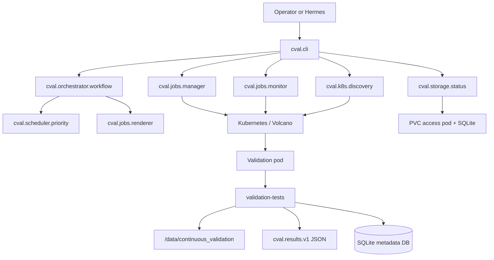

# Architecture

## Purpose

c-val 2.0 separates orchestration from validation execution. The Python package plans, previews, submits, monitors, and summarizes validation jobs. The in-pod validation scripts still run storage, NCCL, and DL checks and write deterministic artifacts.

## Component Diagram



## Package Responsibilities

| Module | Responsibility |
| --- | --- |
| `cval.cli` | Human/Hermes command surface. |
| `cval.k8s.client` | Thin, testable `kubectl` wrapper. |
| `cval.k8s.discovery` | GPU usage parsing, schedulable-node filtering, free-node discovery. |
| `cval.storage.status` | Read-only latest-status DB access through PVC access pod. |
| `cval.scheduler.priority` | Queue stale or never-tested free nodes. |
| `cval.jobs.renderer` | Render Volcano job YAML with node, timestamp, git repo, and git ref. |
| `cval.orchestrator.workflow` | Build a dry-run plan from discovery + history + template rendering. |
| `cval.policy` | Enforce namespace, batch-size, and confirmation gates. |
| `cval.jobs.manager` | Dry-run by default; explicitly submit approved plans. |
| `cval.jobs.monitor` | Read-only job phase polling and timeout classification. |
| `cval.validation.results` | Parse and validate structured result JSON. |

## Runtime Artifacts

```text
/data/continuous_validation/
  storage/<node>/storage-<node>-<timestamp>/
  nccl/<node>/nccl-<node>-<timestamp>/
  dltest/<node>/dltest-<node>-<timestamp>/
  results/<node>/cval-results-<node>-<timestamp>.json
  metadata/validation.db
  metadata/test-storage.db
  metadata/test-nccl.db
```

## Design Boundary

The orchestrator answers: what should run, where, and how safely. The validation scripts answer: did storage, NCCL, and DL checks pass on that node. This boundary keeps the agent from replacing deterministic checks with free-form shell guessing.