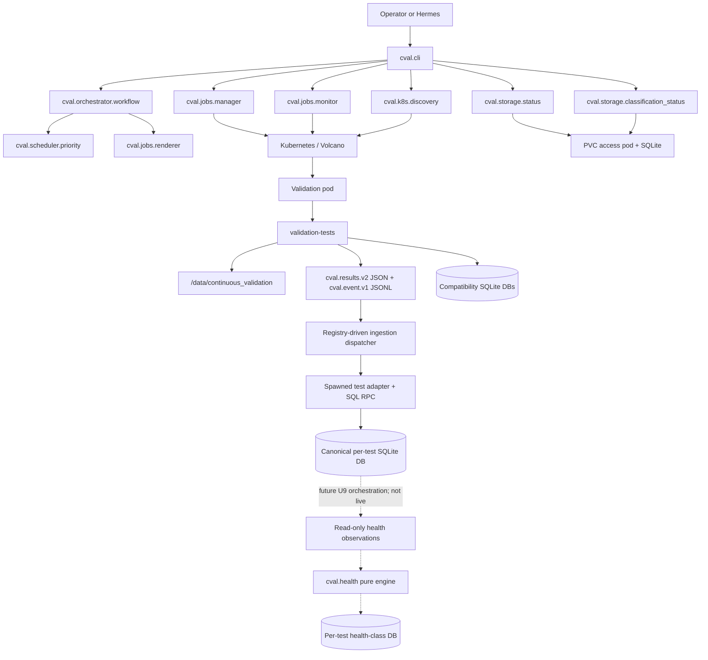

# Architecture

## Purpose

c-val 2.0 separates orchestration from validation execution. The Python package plans, previews, submits, monitors, and summarizes validation jobs. The in-pod validation scripts still run storage, NCCL, and DL checks and write deterministic artifacts.

## Component Diagram



## Package Responsibilities

| Module | Responsibility |
| --- | --- |
| `cval.config` | Load typed TOML configuration and expose effective defaults. |
| `cval.cli` | Human/Hermes command surface. |
| `cval.k8s.client` | Thin, testable `kubectl` wrapper. |
| `cval.k8s.discovery` | GPU usage parsing, schedulable-node filtering, free-node discovery. |
| `cval.storage.status` | Read-only latest-status DB access through PVC access pod. |
| `cval.storage.run_history` | Transactional normalized v2 run/test ingestion and read-only history queries. |
| `cval.storage.classification_status` | Read-only latest baseline verdict access and CSV export. |
| `cval.scheduler.priority` | Queue stale or never-tested free nodes. |
| `cval.jobs.renderer` | Render Volcano job YAML with node, timestamp, git repo, and git ref. |
| `cval.orchestrator.workflow` | Build a dry-run plan from discovery + history + template rendering. |
| `cval.policy` | Enforce namespace, batch-size, and confirmation gates. |
| `cval.jobs.manager` | Dry-run by default; explicitly submit approved plans. |
| `cval.jobs.monitor` | Read-only job phase polling and timeout classification. |
| `cval.validation.results` | Parse and validate structured result JSON. |
| `cval.validation.registry` | Compose and validate explicit repository-local test descriptors. |
| `cval.validation.runtime` | Build the generic registry/config runtime context and compatibility payload. |
| `cval.validation.ingestion` | Preflight v2/config/evidence identity and dispatch isolated per-test raw/metric ingestion. |
| `cval.validation.plugins` | Validate and load repository-confined `cval.plugin.v1` adapters and immutable contexts/receipts. |
| `cval.storage.ingest` | Write result and metrics rows from inside validation pods. |
| `cval.storage.per_test_results` | Own common canonical result schema, adapter transactions, versions, and durable receipts. |
| `cval.storage.write_provenance` | Bind compatibility and DL writes to validated result/config/path capabilities. |
| `cval.health.combination` | Build canonical comparable-environment JSON/SHA-256 identities. |
| `cval.health.engine` | Validate observations/provenance, build content-addressed robust candidates, apply normalized class bands, enforce DNR, and validate custom aggregation. |
| `cval.health.storage` | Exact per-test SQLite schema, immutable evidence, candidate lifecycle, snapshot-consistent reads, and transactional activation. |
| `cval.health.sqlite_values` | Reject coercive/non-finite SQLite scalars at health adapter read boundaries. |
| `cval.baselines.stats` | Robust statistics kernels (median, MAD, percentiles, modified z-score, bootstrap). |
| `cval.baselines.build` | Build dynamic baselines from result DBs per stratum. |
| `cval.baselines.storage` | Persist versioned baselines (candidate/active/superseded). |
| `cval.baselines.classify` | Classify nodes against the active baseline, including DL component aggregation. |

## Runtime Artifacts

```text
/data/continuous_validation/
  logs/job_logs/<node>/<run-id>/{job.log,stdout.log,stderr.log,events.jsonl,result.json}
  logs/<test-id>/<node>/<run-id>/{stdout.log,stderr.log,events.jsonl}
  validation_tests/<test-id>/runs/<node>/<run-id>/{result.json,summary.*,artifacts/}
  validation_tests/storage/storage_results.db
  validation_tests/storage/storage_health_classes.db   # declared U8 path; not live
  validation_tests/nccl/nccl_results.db
  validation_tests/nccl/nccl_health_classes.db         # declared U8 path; not live
  validation_tests/dltest/dltest_results.db
  validation_tests/dltest/dltest_health_classes.db     # declared U8 path; not live
  metadata/validation.db
  metadata/node-run-history.db
  metadata/test-storage.db
  metadata/test-nccl.db
  metadata/dltest_numerical_correctness.db
  metadata/dltest_compute_performance.db
  metadata/dltest_collective_performance.db
  metadata/dltest_overlap_performance.db
  baselines/test-storage-baselines.db
  baselines/test-nccl-baselines.db
  baselines/dltest_numerical_correctness-baselines.db
  baselines/dltest_compute_performance-baselines.db
  baselines/dltest_collective_performance-baselines.db
  baselines/dltest_overlap_performance-baselines.db
  baselines/classification-results.db
```

The old `storage/`, `nccl/`, `dltest/`, and `results/` trees remain readable as
historical v1 evidence. New runs do not write those paths.

The three canonical per-test DB paths are implemented but
`storage.per_test_ingestion_enabled` remains `false`. They are not production
write surfaces until a separately approved dual-write activation. Likewise,
`metadata/node-run-history.db` remains independently default-off.

U8 health candidate construction, classification, and exact per-test health DB
persistence are implemented as callable Python modules. No CLI/evaluator cycle
invokes them in production, all built-in descriptors keep `auto_activate=false`,
and no health DB is assumed to exist. U9 orchestration, classification-history
writes, live migration, and deployment remain separate approval-gated work.

The four `metadata/dltest_*` DBs hold raw tall DL metric rows. The
`baselines/*-baselines.db` files hold versioned dynamic baselines. The
`baselines/classification-results.db` file holds derived baseline decisions; raw
validation status remains in `metadata/validation.db`.

## Configuration Boundary

Operator-owned defaults live in `config/cval.toml`. Kubernetes resource shape
stays in `ymls/specific-node-job.yml`, but environment-specific values such as
namespace, queue, PVC, image, and resource requests are injected from TOML when
the job is rendered. Test-specific settings are no longer individual YAML
placeholders: the renderer emits a generic run ID and one deterministic
base64-encoded, shell-quoted runtime payload containing registry metadata,
config digest, and current v1 compatibility exports. The pod decodes it only
after checking out the pinned Git ref.

## Design Boundary

The orchestrator answers: what should run, where, and how safely. The top-level
in-pod runner owns phase order, aggregate state, and stable progress markers;
each registered test directory owns its `setup.sh`, canonical `run-test.sh`,
documentation, settings, and workload assets. Compatibility wrappers preserve
the old storage/NCCL/DL paths for pinned jobs. This boundary keeps the agent
from replacing deterministic checks with free-form shell guessing.

The framework commits a common raw per-test row independently, then gives a
trusted adapter a constrained SQL RPC facade in a fresh spawn worker. The parent
retains the raw SQLite connection, authorizer, transaction, receipt validation,
commit, and rollback. One adapter failure cannot mutate another test DB or
change deterministic raw status through framework APIs.

The U8 health boundary is similarly framework-owned: trusted adapters expose
read-only observations and, for custom strategy, final aggregation only. The
framework binds policy/schema/config/combination/receipt provenance, exact
per-result sample keys, deterministic statistics and thresholds, and immutable
candidate identity. Raw `pass/fail/incomplete` is never rewritten by health.