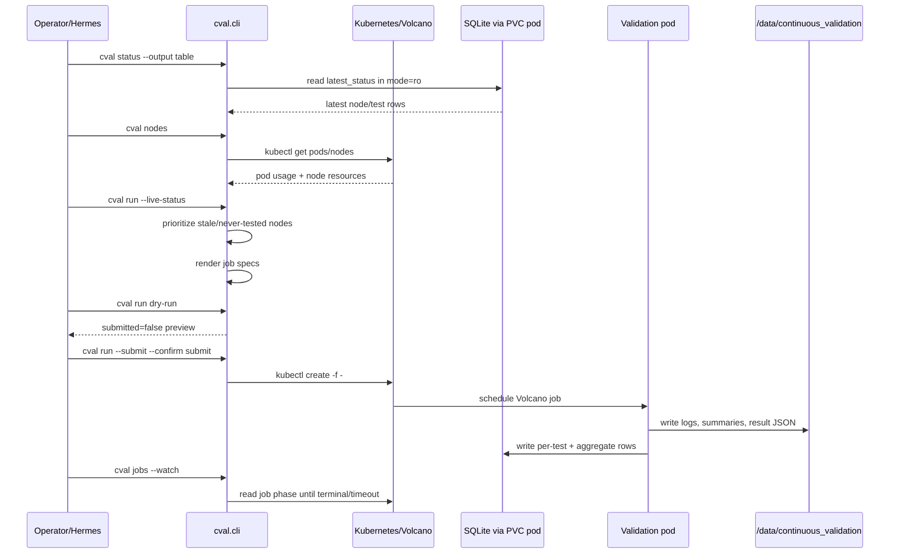

# Agentic Continuous Validation Framework for GPU Clusters

This is a continuous validation framework designed for large-scale GPU clusters. It orchestrates health checks on currently free nodes in a prioritized manner, ensuring comprehensive coverage and automated result tracking over time.

## High-Level Logical Flow

## Challenge
Large-scale GPU clusters experience frequent hardware and software degradation.
*   **Silent Failures**: "Bad" nodes often appear "Ready" to Kubernetes but fail user jobs immediately upon launch.
*   **Inconsistent Performance**: Inconsistent hardware and software stack can lead to "slow" nodes that drag down the performance of distributed jobs (stragglers).
*   **Operational Friction**: Debugging failures often requires distinguishing between user code bugs and infrastructure issues, wasting valuable researcher and engineering time.

## Goals

The primary objective of this framework is to transition from reactive troubleshooting to proactive assurance.

### 1. Successful Job Submissions
Ensure that the cluster provides a stable foundation for user workloads, minimizing job failures due to infrastructure issues.
*   **Consistency**: Guarantee uniform performance behavior across all nodes in the cluster. Users should experience the same runtime characteristics regardless of which specific GPU node their job lands on.
*   **Predictability**: Establish a reliable baseline expectation for job performance. General Deep Learning (DL) workloads should run within defined performance tolerances, allowing researchers to accurately estimate training times and resource requirements.

### 2. Performance and Scalability
Verify that the infrastructure can support high-performance, large-scale distributed training.
*   **Streamlined Investigation**: Decouple application debugging from infrastructure debugging. By ensuring the underlying stack (hardware, drivers, network, storage) is continuously validated, users and admins can investigate workload issues with the confidence that the platform itself is healthy.
*   **Scalability Verification**: Continuously verify the cluster's capability to scale out. Ensure that network interconnects (NCCL) and storage throughput can sustain the demands of multi-node distributed training without degradation.

## Assumptions & Design Philosophy
This framework operates based on several key assumptions about cluster management and failure modes:

- **Prioritized Opportunistic Sampling**: The framework operates opportunistically by utilizing free nodes as they become available between user workloads. However, the selection of which available nodes to test is strictly prioritized:
    1. Filter out nodes that already have valid test results (test result validity within certain threshold days).
    2. Prioritize nodes without any test results history available.
    3. Order the nodes with oldest test results first, latest result last.
- **Node Availability Heuristic**: "Bad" nodes are statistically more likely to be free than "good" nodes. This is based on the observation that jobs scheduled on faulty nodes tend to crash or fail quickly, releasing the resource back to the pool. Prioritizing free nodes naturally targets potential problem areas.
- **Cost-Benefit Balance**: Performing full online validation (pre-flight or post-flight) for every user job is  expensive in terms of time and compute resources. An out-of-band continuous validation loop balances deep validation coverage with cluster utilization.
- **Application-Level Validation**: Standard infrastructure monitoring (e.g., Kubernetes Node Problem Detector) often misses subtle ecosystem instabilities. This framework validates the stack at the level user workloads operate (e.g., Deep Learning unit tests, NCCL tests, and storage benchmarks).
- **Non-Interference**: The system explicitly targets "free" nodes to minimize interference with user workloads. It re-tests nodes only if their validation history is expired (older than a configurable threshold) and submits validation jobs in controlled batches to avoid swamping the cluster with too many concurrent jobs.

## Validation Tests
The validation suite consists of three core tests, each targeting a specific layer of the stack imperative for distributed deep learning operations.

### 1. DL Unit Test
This test provides a lightweight, reproducible framework for benchmarking and verifying the numerical consistency of deep learning layers across GPU hardware. It validates that the GPUs are not only functioning but mathematically correct. By running these primitives, we catch silent data corruption or driver/hardware incompatibilities early, ensuring the training platform is stable for long-running jobs.

### 2. NCCL Loop-Back AllReduce
Unlike standard NCCL tests that verify interconnects between multiple nodes, the loop-back AllReduce test forces communication through the InfiniBand (IB) interface even within a single node. This technique bypasses NVLink for specific operations, validating strict adherence to the network path data will travel in a distributed setting. It ensures that the node's HCAs (Host Channel Adapters) and PCIe fabric are correctly initiating and handling IB traffic without requiring a multi-node reservation.

### 3. Storage I/O Validation (FIO)
Storage performance is critical for data loading and checkpointing. We utilize `fio` to run a suite of I/O patterns (Random Read/Write, Sequential Read/Write) against the cluster's shared PVC or NFS mount.
- **Why validate shared storage?** In distributed training, all nodes often slam the same file system simultaneously to read datasets or write checkpoints. A degraded network mount on a specific node can cause "straggler" behavior, slowing down the entire cluster training job. This test ensures every node processes I/O operations within acceptable latency and throughput limits.

## Workflow Internals

The orchestration logic in `job-runner.ipynb` follows these steps:

### 1. Discovery
- **Function:** `get_free_node_list()`
- **Action:** Queries the cluster scheduler to identify nodes that are currently idle and schedulable.

### 2. History Lookup
- **Function:** `get_db_latest_status()`
- **Action:** Reads the `validation.db` (via the helper pod) to retrieve the last known validation timestamp for every node. Nodes with no history are treated as having a "very old" timestamp.

### 3. Prioritization
- **Function:** `build_priority_queue(free_nodes_list, db_latest_status, Z_days_threshold)`
- **Logic:**
    1.  **Filter:** Intersect free nodes with the history.
    2.  **Qualify:** Select nodes where test result is older than `Z` days.
    3.  **Sort:** Order by timestamp ascending (oldest tested -> highest priority).
- **Output:** A priority queue of nodes requiring validation.

### 4. Batch Execution and Monitoring
- **Function:** `run_batch()`
- **Logic:** Submits jobs in strictly controlled batches (e.g., 3 jobs at a time) to avoid swamping the scheduler.
    - **Job Creation:** Hydrates `specific-node-job.yml` with the target node name and test parameters.
    - **Monitoring:** Polls job status every `X` minutes.
        - **Timeouts:** Monitoring is read-only. Submit-mode stale-`Pending` pruning
            is default-off and requires the separate exact
            `CVAL_PRUNE_CONFIRM=delete-pending` gate.

### 5. In-Pod Execution
Once scheduled, the validation pod:
1.  Clones the latest test scripts.
2.  Runs the specified validation suite (storage, NCCL loop-back, DL unit tests).
3.  Streams logs to the shared PVC.
4.  Updates the `validation.db` directly with the node-id,timestamp, and `Pass`/`Fail` outcome.

## Result Evaluation

Results classification on node health evolves around two principles
    -  **Baseline-Based Classification**: When definitive performance baselines are available, the system will compare gathered metrics against these thresholds to deterministically classify results as "Pass" or "Fail".
    -  **Peer Comparison & Outlier Detection**: In the absence of baselines, the system will utilize peer comparison. By analyzing a node's performance relative to the cluster cohort, we can statistically isolate outliers and "bad" nodes without pre-defined limits.
