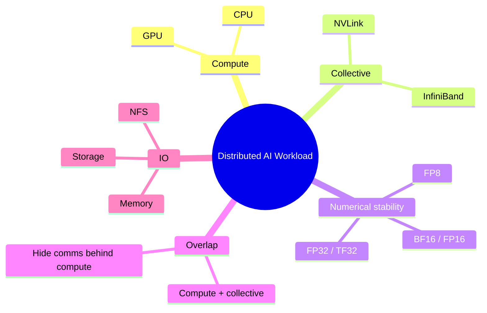
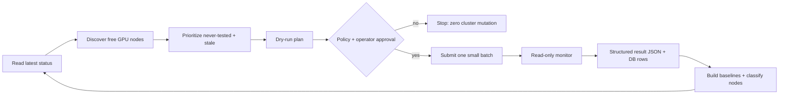

<!--
Speaker tips:
- Marp-compatible: export with `marp docs/c-val-overview.md --pdf` (or --pptx).
  It also reads top-to-bottom as a normal markdown doc.
- Slides are separated by `---`. Speaker notes live in HTML comments like this.
- Audience: mixed engineers + managers. Each section has a "why it matters" line.V
- Suggested time: ~20 min + Q&A.
-->

# c-val
## Continuous Validation for GPU Clusters

**From reactive firefighting → proactive assurance.**

Discover free GPU nodes → validate the full stack → baseline → classify bad nodes → repeat.

<!--
Opening line: "Every GPU-hour we spend debugging infrastructure is a GPU-hour we don't spend training models. c-val exists to give that time back."
-->

---

## Agenda

1. **What is c-val?**
2. **The problem** — why "Ready" isn't enough
3. **Distributed AI workload** — the pillars we depend on
4. **Assumptions & design philosophy**
5. **Validation tests** — what we actually run
6. **Evaluation** — baselines + delta (+ two evolving principles)
7. **Next steps** — where c-val is heading

---

# 1. What is c-val?

---

## What is c-val?

**c-val** (short for *continuous validation*) is an **out-of-band validation loop** that continuously tests a GPU cluster the way **real user workloads** experience it — not the way Kubernetes sees it.

- Runs **deterministic** GPU, network, storage, and deep-learning checks on **free** nodes.
- **Prioritizes** never-tested and stale nodes; skips recently-validated ones.
- Records **every** result in SQLite with full history.
- Builds **statistical baselines** and **classifies** nodes as `normal` / `degraded` / `improved`.
- **Safe by default**: dry-run first, approval-gated submission, read-only monitoring.

> **Net effect:** cluster health becomes *visible, measurable, and continuously validated* — before a researcher's job ever lands on a bad node.

<!--
One sentence for managers: "c-val is an always-on health check for the GPU fleet that catches bad and slow nodes before they cost us failed training runs."
-->

---

## Purpose & goal

**Purpose** — shift the cluster from **reactive troubleshooting** to **proactive assurance**: continuously validate the stack the way user workloads actually experience it.

**Goal**

- **Successful job submissions** — a stable foundation for user workloads:
  - *Consistency* — uniform performance regardless of which node a job lands on.
  - *Predictability* — reliable baselines so researchers can estimate training time and resources.
- **Performance & scalability** — sustain large-scale distributed training:
  - *Streamlined investigation* — decouple application debugging from infrastructure debugging.
  - *Scalability verification* — continuously verify NCCL interconnects and storage throughput scale out.

---

## What's new in c-val 2.0

- **Pre-agentic foundation** — the framework is now **CLI-based and broken into modules**, so once we make the top layer **agentic** (Hermes, etc.), the workflow is already prepared.
- **Automated tasks** — background services run the loop unattended: rolling validation, daily baseline build, and periodic classification.
- **New evaluation strategy + node health ratings / ranking** — robust statistical baselines and peer comparison produce graded `normal` / `degraded` / `improved` verdicts, not just hard pass/fail.

<!--
The 2.0 message: we didn't just rewrite the prototype — we built the runway. CLI + modules now, agent on top later, with zero workflow rework.
-->

---

# 2. The problem

---

## "Ready" does not mean "healthy"

Large GPU fleets degrade **silently and constantly**.

- **Silent failures** — a node looks `Ready` to Kubernetes but **crashes real jobs** on launch.
- **Stragglers** — one slow GPU, NIC, or NFS mount **drags down an entire distributed job**.
- **Job debugging dilemma** — a customer reports their job isn't running; we lose **hours** deciding: *is it their code, or the cluster?*

> Standard infra monitoring (node problem detector, kubelet health) misses **application-level** instability — the exact layer where distributed training actually runs.

<!--
Manager framing: silent bad nodes = failed runs, wasted GPU-hours, eroded researcher trust.
Engineer framing: kubelet health checks never run an NCCL all-reduce or verify DL numerics.
-->

---

## The cost of a silent bad node

A single undetected bad node in a 100-node training job can:

- **Fail the whole run** on launch (silent failure) — restart from the last checkpoint.
- **Slow the whole run** for days (straggler) — every GPU waits on the slowest one.
- **Burn triage time** — researchers debug *their* code while the real fault is infrastructure.

**Key observation:** *bad nodes are statistically more likely to be free.* Jobs scheduled on faulty nodes crash fast and release the resource back to the pool.

> So the free nodes we can safely test are *exactly* where the problems hide.

---

# 3. Distributed AI workload

---

## A distributed AI workload stands on many pillars

A training job is only as healthy as its **weakest pillar**. c-val validates **every** one.



<!--
Walk the branches clockwise. Stress that a failure in ANY branch silently taxes the whole job.
The point of this slide: "monitoring the node is not the same as monitoring the workload's dependencies."
-->

---

# 4. Assumptions & design philosophy

---

## Assumptions

- **Prioritized opportunistic sampling** — test **free** nodes as they appear, but choose *which* to test by priority:
  1. Skip nodes with **valid** results inside the freshness window.
  2. Prioritize **never-tested** nodes (no signal yet = highest value).
  3. Then **oldest-result-first**.
- **Node-availability heuristic** — *bad nodes are more likely to be free*, so sampling free nodes naturally hunts problem areas.
- **Cost–benefit balance** — full pre-flight validation on *every* user job is too expensive; an **out-of-band continuous loop** balances coverage with utilization.
- **Application-level validation** — validate at the layer **user workloads** operate (DL unit tests, NCCL, storage), not just infra signals.
- **Non-interference** — target only free nodes, re-test only when results expire, submit in **controlled batches**.

<!--
This slide is the conceptual core inherited from c-val 1.0. The heuristic ("bad nodes are more likely free") usually gets a nod from the engineers.
-->

---

## Design philosophy (c-val 2.0)

- **Dry-run first** — operating a shared production cluster demands a safe default; nothing is submitted without explicit, auditable approval.
- **Deterministic validation lives in jobs** — the orchestrator decides *what runs, where, how safely*; the in-pod tests decide *did it pass*. No guessing health from logs.
- **CLI as the contract** — humans **and** automation use the *same* commands → reproducible and auditable.
- **Robust statistics over mean/stdev** — fleets are skewed and contaminated by the very outliers we're hunting.
- **Candidate → active baselines** — humans decide *when* "normal" changes; a degrading fleet can't silently re-baseline itself.
- **Separation of truth** — raw pass/fail is immutable; derived health verdicts evolve alongside it.

---

## The continuous loop



**Rolling, per-slot rebuild:** before filling each open batch slot, c-val re-reads live cluster + DB state — so it never submits to a node that just got busy.

---

# 5. Validation tests

---

## What c-val validates — the stack, end to end

| Layer | Tool | Example metrics | "Good" means |
|---|---|---|---|
| **Storage** | FIO on PVC/NFS | 12 IOPS/bandwidth metrics (read/write × seq/rand × iodepth/numjobs) | Higher is better |
| **NCCL** | Loop-back all-reduce | `busbw` (GB/s), `latency` (µs) | High busbw, low latency |
| **InfiniBand** | HCA / link checks | per-device bandwidth / health | Stable across HCAs |
| **DL unit test** | `dl_unit_test` (torchrun, 8 GPU) | kernel compute time (CPU+GPU), NVLink/collective time, numerics across precisions | Times near baseline; numerics near-exact |
| **Result history** | SQLite + baselines | freshness, peer outliers | Within statistical band |

<!--
DL is the crown jewel: it exercises GPUs, CUDA, the framework stack, AND numerical correctness across many layer/op configs per rank.
-->

---

## 1) DL unit test — kernels, NVLink, and numerics

A single-node `torchrun` benchmark (`dl_unit_test`) that exercises the GPU the way training does — across three axes, each compared to a baseline:

- **Compute timing vs baseline (CPU *and* GPU)** — forward/backward timers for the widely-used kernels: **fully-connected (Linear), Conv2d / Conv3d, attention (SDPA / flash), normalization**, and more (`nn_tasks`, `f_tasks`).
- **NVLink / collective performance** — intra-node collectives (reduce-scatter, all-reduce, …) over **NVLink**, plus **overlap** of compute + collective (`coll_tasks`, `overlap_tasks`).
- **Numerical correctness across precisions** — output and gradient norms (`norm_output`, `weight`, `bias`) verified near-exact across **FP32 / TF32 / BF16 / FP16 / FP8**.

> One test exercises GPU compute, CPU scheduling, NVLink, the framework stack, **and** numerical correctness — across hundreds of kernel/precision configs per rank. The deepest signal we collect.

---

## 2) NCCL loop-back all-reduce — *is the network path healthy?*

Unlike standard multi-node NCCL tests, the **loop-back** all-reduce forces communication through the **InfiniBand** interface even within a single node.

- Bypasses NVLink for specific operations to validate the **real network path** distributed jobs use.
- Verifies the node's **HCAs** and **PCIe fabric** correctly initiate and handle IB traffic.
- **No multi-node reservation required** — we get IB-path confidence from one free node.

> Captures `busbw` and `latency` — the numbers that decide whether scale-out training is communication-bound.

---

## 3) Storage I/O validation (FIO) — *can every node feed the GPUs?*

Storage performance is critical for **data loading** and **checkpointing**.

- `fio` runs a suite of I/O patterns: **random/sequential read & write**, varying iodepth and numjobs.
- Validates the shared **PVC / NFS** mount the whole cluster slams simultaneously.

> **Why it matters:** in distributed training, all nodes hit the same file system at once. A single degraded mount creates a **straggler** that slows the entire job.

---

## How results are recorded

Each run writes a dynamic `cval.results.v2` artifact, structured progress
events, canonical global/per-test logs, and then ingests compatibility rows into
SQLite:

```text
/data/continuous_validation/
  logs/job_logs/<node>/<run-id>/         # global logs, events, result.json
  logs/<test-id>/<node>/<run-id>/        # per-test stdout/stderr/events
  validation_tests/<test-id>/runs/...    # summaries and raw artifacts
  metadata/validation.db                 # latest status (raw pass/fail)
  metadata/test-storage.db, test-nccl.db, dltest_*.db
```

Every row now also records `image_name`, `pytorch_version`, and `cuda_version` — so results are tied to the exact software stack that produced them.

---

# 6. Evaluation — baselines + delta

---

## Evaluation — outline

> Detailed evaluation design is **owned by another engineer**; this is the outline.

A node can **pass** every test and still be **20% slow** — a straggler that taxes every job that lands on it. Evaluation turns raw metrics into a **graded health verdict** (`normal` / `degraded` / `improved`) using two complementary principles.

---

## Two evolving principles

**1. Baseline-Based Classification** — when definitive performance baselines are available, compare gathered metrics against these thresholds to **deterministically** classify results as **Pass** or **Fail**.

**2. Peer Comparison & Outlier Detection** — in the absence of baselines, use **peer comparison**: analyze a node's performance relative to the **cluster cohort** to statistically isolate outliers and "bad" nodes **without pre-defined limits**.

> Precision where we have history (**baselines**); coverage where we don't (**peer comparison**).

---

## Baseline + delta — outline

- **Baseline** — a robust reference of "normal" for each metric, built per stratum from result history (robust statistics, since fleets are skewed and contaminated by the very outliers we're hunting).
- **Delta** — how far a node's value sits from its baseline, judged against a **directional, tolerance-aware** acceptance band.
- **Verdict** — the sign and size of the delta map to `normal` / `degraded` / `improved`; a node's value is the **median of recent runs**, so one noisy run never flips it.

> Full method, formulas, and per-test rules: see `docs/baselines.md`.

---

# 7. Next steps

---

## Next steps — toward an agentic validation platform

- **Automatic node cordoning** — on a confirmed-bad verdict, cordon the node automatically, paired with an **agentic validation summary** that explains *why* (which tests, which metrics, how far off baseline).
- **Advanced straggler detection with stress tests** — go beyond single-shot checks with sustained **stress / load tests** that surface stragglers which only appear under pressure.
- **Agentic orchestration + diagnostic report generation** — a Hermes-style agent drives the loop and produces human-readable **diagnostic reports** and triage summaries on top of the same CLI.
- **MoE readiness tests** — readiness validation for **Mixture-of-Experts** workloads (e.g., using **DeepSeek's node-tester tooling**) to exercise expert-parallel communication patterns.

> The 2.0 CLI + modular design is the runway: each item lands as a new capability the agent can call — no workflow rewrite required.

---

## Summary

c-val turns a GPU fleet from **"hopefully healthy"** into **"continuously measured and validated."**

- ✅ Validates the stack the way **real workloads** experience it
- ✅ Tests the **right nodes** opportunistically, without interfering
- ✅ Detects **degradation**, not just failure, with **robust statistics**
- ✅ **Safe** to run on production — dry-run first, approval-gated
- ✅ Two complementary verdicts: **baselines** + **peer outlier detection**

> **Bad nodes find users. c-val finds bad nodes first.**
