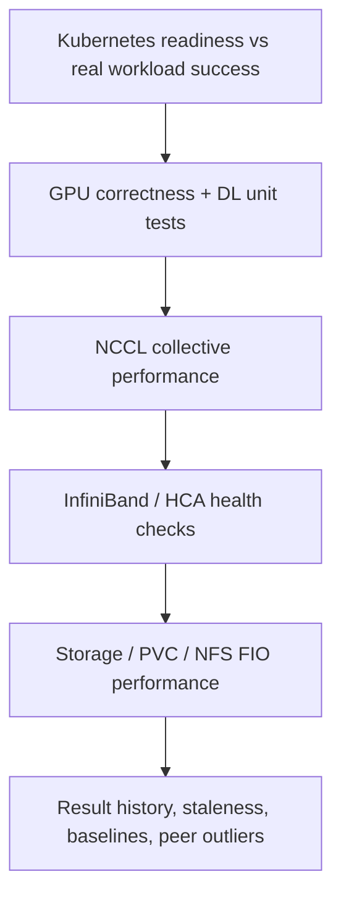
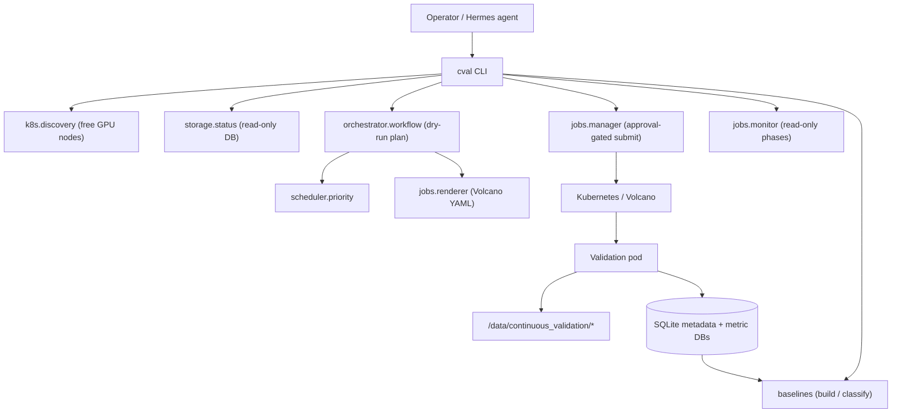
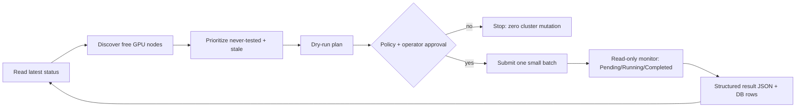

<!--
Speaker tips:
- This deck is Marp-compatible. Export with: `marp docs/c-val-presentation.md --pdf`
  (or --pptx). It also reads top-to-bottom as a normal markdown doc.
- Slides are separated by `---`. Speaker notes live in HTML comments like this one.
- Suggested time: 25-30 min talk + 10 min demo + Q&A.
-->

# c-val
## Continuous Validation for GPU Clusters

**From reactive firefighting → proactive assurance**

Discover free GPU nodes → validate the full stack → baseline → classify bad nodes → repeat.

<!--
Opening line: "Every GPU hour we spend debugging infrastructure is a GPU hour we don't spend training models. c-val exists to give that time back."
-->

---

## Today's story

1. **Why c-val exists** — `Ready` nodes still fail real GPU workloads.
2. **How it works** — safe orchestration, deterministic validation, and history.
3. **What makes 2.0 different** — CLI, structured results, robust baselines, node classification.
4. **How we operate it** — `overview`, `results`, live runner, baseline services, and demo commands.

Audience contract: enough detail for engineers to trust the design, and enough signal for managers to see the operational value.

---

## The problem: "Ready" does not mean "healthy"

Large GPU fleets degrade **silently and constantly**.

- **Silent failures** — a node looks `Ready` to Kubernetes but crashes real jobs on launch.
- **Stragglers** — one slow GPU, NIC, or NFS mount drags down an entire distributed job.
- **Operational friction** — hours lost deciding: *is it my code, or the cluster?*

> Standard infra monitoring (node problem detector, etc.) misses **application-level** instability — the layer where training actually runs.

<!--
Manager framing: silent bad nodes = failed runs, wasted GPU-hours, and eroded researcher trust.
Engineer framing: kubelet health checks don't run NCCL all-reduce or DL numerics.
-->

---

## What c-val is

A **continuous, out-of-band validation loop** that tests the cluster the way *user workloads* experience it.

- Runs **deterministic** GPU/network/storage/DL checks on **free** nodes.
- **Prioritizes** never-tested and stale nodes; skips fresh ones.
- Records every result in SQLite with full history.
- Builds **statistical baselines** and **classifies** nodes as normal / degraded / improved.
- **Safe by default**: dry-run first, approval-gated submission, read-only monitoring.

**Net effect:** platform health becomes visible, measurable, and continuously validated before a researcher's job lands on it.

---

## Three pillars

| Pillar | What it means | Why it matters |
|---|---|---|
| **Deterministic validation** | Fixed storage / NCCL / IB / DL tests with known-good behavior | Repeatable, trustworthy signal — not log-scraping guesswork |
| **Safe orchestration** | Dry-run plans, policy gates, explicit confirm, no auto-delete | Operate a shared production cluster without fear |
| **Statistical baselines** | Robust median/MAD baselines + peer comparison | Detect *degradation*, not just hard failures |

<!--
This slide is the spine of the whole talk. Everything else hangs off these three.
-->

---

## What we validate — the stack, end to end



We don't ask *"is the node up?"* — we ask *"will a training job actually succeed and be fast here?"*

---

## The validation layers in detail

| Layer | Tool | Example metrics | "Good" means |
|---|---|---|---|
| **Storage** | FIO on PVC/NFS | 12 IOPS/bandwidth metrics (read/write × seq/rand × iodepth/numjobs) | Higher is better |
| **NCCL** | All-reduce | `busbw` (GB/s), `latency` (µs) | High busbw, low latency |
| **InfiniBand** | HCA / link checks where enabled | per-device bandwidth / health | Stable across HCAs |
| **DL unit test** | `dl_unit_test` (torchrun, 8 GPU) | numerical correctness, compute time, collective time, overlap | Numerics near-exact; times tight |
| **Result history** | SQLite + baselines | freshness, peer outliers | Within statistical band |

<!--
DL is the crown jewel: it exercises GPUs, CUDA, the framework stack, AND numerical correctness across ~150+ layer/op configs per rank.
-->

---

## Architecture



**Boundary:** the orchestrator decides *what runs, where, how safely*. The in-pod scripts decide *did it pass*. The agent never replaces deterministic checks with shell guessing.

---

## The continuous loop



**Rolling, per-slot rebuild:** before filling each open batch slot, c-val re-reads live cluster + DB state — so it never submits to a node that just got busy.

---

## Smart prioritization (why we test the *right* nodes)

1. **Skip** nodes with valid results inside the freshness window (default 7 days).
2. **Prioritize** never-tested nodes (no health signal yet = highest value).
3. **Then** oldest-result-first.

> **Key insight:** *bad nodes are more likely to be free.* Jobs on faulty nodes crash fast and release the GPU back to the pool — so prioritizing free nodes naturally hunts the problem areas.

This is **opportunistic, non-interfering** sampling: deep coverage without stealing capacity from users.

---

## Safety model — operate production without fear

- **Dry-run is the default.** `cval run` plans but submits nothing.
- **Real submission is double-gated:** `--submit --confirm submit` + policy checks.
- **Policy gates:** namespace allowlist, max batch size, confirmation phrase.
- **Read-only everywhere it matters:** status opens SQLite `mode=ro`; monitoring only reads job phase.
- **Audit-first live loop.** Audit runs the complete scheduling plan with zero
  mutations. Submit has an independent exact startup gate.
- **Separately gated cleanup.** `jobs --watch` never deletes; submit-mode stale
  `Pending` pruning is default-off and needs exact
  `CVAL_PRUNE_CONFIRM=delete-pending`.
- **Exact code refs:** each cycle resolves fresh `origin/main` to a full commit,
  or uses a deliberately supplied new-session pin.

<!--
Manager line: "We can run this against the production cluster today because every dangerous action requires an explicit, auditable human decision."
-->

---

## The hard part: detecting *degradation*, not just failure

A node can **pass** every test and still be **20% slow**. That straggler quietly taxes every distributed job that lands on it.

So we need a **baseline** of "normal" and a way to flag outliers.

Naive approach (mean ± stdev) **fails** here:
- Fleet performance is **skewed**, not Gaussian.
- A few bad nodes **poison the mean** and **inflate the stdev** — hiding the next bad node.

> We need statistics that are robust to the very outliers we're trying to find.

---

## Dynamic baselines — the science

For each metric, over a rolling window, per stratum (image / test-plan):

1. **Collect** recent values from the result DBs.
2. **Trim** extreme outliers (modified z-score, threshold 3.5).
3. **Summarize** robustly: **median** (center) + **MAD × 1.4826** (spread), plus percentiles, IQR, skew, kurtosis, bootstrap CI.
4. **Set a directional acceptance band:**

$$\Delta = \max\big(z \cdot 1.4826 \cdot \text{MAD},\; \tfrac{\text{tol\%}}{100}\cdot |\text{median}|\big)$$

The median tolerates up to **50%** contamination; the engineering tolerance acts as a floor under the data-driven width. The band is one-sided or two-sided depending on metric direction.

<!--
The 1.4826 makes MAD a consistent estimator of sigma for normal data. z=3.5 is the Iglewicz-Hoaglin recommendation.
-->

---

## Directional bands + deterministic metrics

**Direction matters** — being *better* than the fleet is never a failure:

| Direction | Metrics | Failing side |
|---|---|---|
| `low_bad` (higher is better) | busbw, IOPS, bandwidth | only the **low** side |
| `high_bad` (lower is better) | latency, wall-clock time | only the **high** side |
| `two_sided` (correctness) | DL numerical outputs | **either** side |

**Deterministic DL numerics** (bit-reproducible for a fixed image+seed) → MAD = 0 → we fall back to a tight relative tolerance (0.1%). Any spread there is itself a red flag.

---

## Versioned baselines — trustworthy "normal"

```text
candidate  ──activate──▶  active  ──superseded──▶  history
```

- New baselines start as **candidate** — never auto-promoted.
- **Activation** is explicit, so a slowly-degrading fleet can't silently redefine "healthy."
- Stored per test type under `/data/continuous_validation/baselines/`:
  - `test-storage-baselines.db`, `test-nccl-baselines.db`
  - 4 × `dltest_*-baselines.db` (numerical / compute / collective / overlap)
  - `classification-results.db` (derived verdicts — raw pass/fail stays untouched)

---

## Node classification — the payoff

Compare each node's **median recent value** to the active baseline's band:

| Verdict | Meaning | Action |
|---|---|---|
| `normal` | inside the band | nothing |
| `improved` | beats the good-side tail | informational |
| `degraded` | on the failing side | **investigate** |

```bash
cval baseline classify --test-type storage
```
```text
NODE                    STATUS    DEGRADED IMPROVED COMPARED
slc01-cl02-hgx-0001     normal           0        0       12
slc01-cl02-hgx-0009     degraded        12        0       12
Degraded nodes: slc01-cl02-hgx-0009
```

A node's value is the **median of recent runs**, so a single noisy run never flips the verdict.

---

## A real snapshot from our fleet

Read-only `cval overview` against the live cluster:

```text
NODES     fully-free: 14    free GPUs: 247/3432
RESULTS   nodes: 297    valid(<7d): 247    outdated: 50
QUEUE     needing validation: 2  (never-tested)
JOBS      total: 241  (Completed=238, Pending=1, Running=2)
```

Latest baseline classification snapshot:

| Test | normal | improved | degraded |
|---|---:|---:|---:|
| **NCCL** | 249 | 14 | **1** |
| **Storage** | 168 | 53 | **43** |

> 43 storage-degraded nodes were **passing** their tests — but measurably slower than the fleet. That's the straggler tax made visible.

DL classification uses the same baseline/classification path after rebuilding its metric DBs from rank JSONs under `/data/continuous_validation/dltest/.../runs/*.json`.

---

## The operator experience — one screen

`cval overview` collapses four manual checks into one (auto-refreshing with `--watch`):

- **Free nodes** + free-GPU count
- **Fresh vs outdated** results across the fleet
- **Priority queue** with reasons (never-tested / stale)
- **Active jobs** with live Pending / Running / Completed phases

```bash
cval overview --watch --interval 5
```

Plus one-command exports for sharing/audit:

```bash
cval results --test overall --type csv   # cval_overall_<LA-time>.csv
cval results --test dltest  --type csv
```

---

## Continuous operation — set it and forget it

Three background loops (tmux-managed, run where the PVC is mounted):

| Service | Cadence | Job |
|---|---|---|
| `cval-live.sh` | rolling | discover → prioritize → submit → monitor |
| `cval-baseline-build.sh` | daily | rebuild + activate dynamic baselines |
| `cval-baseline-classify.sh` | every few min | classify nodes, store verdicts |

```bash
scripts/cval-live.sh start
scripts/cval-baseline-build.sh start
scripts/cval-baseline-classify.sh start
```

DL metric DBs are auto-refreshed from rank JSON before each baseline/classify cycle — robust to result-layout changes.

Source of truth for DL rank metrics:

```text
/data/continuous_validation/dltest/<node>/dltest-<node>-<timestamp>/workdir/test_plans/<plan>/runs/*.json
```

---

## From notebook to engineered platform (c-val 2.0)

| Then (1.0) | Now (2.0) |
|---|---|
| Jupyter notebook, run cells in order | Tested Python package + CLI |
| Manual node picking | Prioritized, policy-gated planning |
| Unconditional `all/pass` writes | Structured `cval.results.v1` per-test JSON |
| Hard pass/fail only | Robust statistical baselines + classification |
| "Check the logs" | `overview`, `results`, `classify` in one command |
| Tribal knowledge | Versioned docs + repeatable scripts + tests |

**100+ unit tests**, dry-run-first safety, agent-operable via the same CLI humans use.

---

## Why this matters — by audience

**For researchers / users**
- Fewer failed runs from bad nodes.
- Consistent, predictable performance regardless of which node you land on.
- Confidence that infra is healthy → debug *your* code, not the cluster.

**For platform engineers**
- Find degraded nodes *before* users do.
- One CLI for status, planning, submission, monitoring, classification.
- Safe to operate on production; everything auditable.

**For managers**
- Higher effective cluster utilization (less wasted GPU-time on bad nodes).
- Faster incident triage; less researcher downtime.
- A measurable, trend-able health signal for the fleet.

---

## Design decisions (the "why")

- **Dry-run first** — operating GPU clusters demands a safe default.
- **Keep deterministic validation in jobs** — the agent orchestrates; it doesn't guess health from logs.
- **CLI as the contract** — humans and the Hermes agent use the *same* commands → reproducible.
- **Robust statistics** — median/MAD over mean/stdev because fleets are skewed and contaminated.
- **Candidate → active baselines** — humans decide when "normal" changes.
- **Separation of truth** — raw pass/fail is immutable; baseline verdicts evolve alongside.

---

## Live demo script (≈10 min)

Read-only path first:

```bash
# 1. One-screen health
cval overview

# 2. Who needs testing and why
cval plan --live-status --threshold-days 7

# 3. Plan a batch (dry-run, submits nothing)
cval run --live-status --batch-size 1

# 4. Latest results → shareable CSV
cval results --test overall --type csv
```

State-changing path (only if we are comfortable updating baseline state live):

```bash
# 5. Build + activate a baseline, then classify and store derived verdicts
cval baseline build --test-type storage --activate
cval baseline classify --test-type storage --store-results
```

<!--
Demo tip: keep `cval overview --watch` running in a side pane so the audience sees jobs move Pending → Running → Completed live.
-->

---

## Roadmap

- **GPU-SKU / topology strata** — per-hardware baselines (apples-to-apples).
- **Trend analysis** — rolling baselines to catch *slow* multi-week drift.
- **Event-triggered classification** — classify the instant a job completes.
- **Reporting & alerting** — daily summaries to Slack / Teams / GitHub issues.
- **Auto-remediation hooks** — propose cordon/drain for confirmed-bad nodes (human-approved).
- **Hermes agent** — natural-language operation and triage on top of the same CLI.

---

## Summary

c-val turns a GPU fleet from **"hopefully healthy"** into **"continuously measured and validated."**

- ✅ Validates the stack the way **real workloads** experience it
- ✅ Tests the **right nodes** opportunistically, without interfering
- ✅ Detects **degradation**, not just failure, with **robust statistics**
- ✅ **Safe** to run on production — dry-run first, approval-gated
- ✅ One CLI for humans **and** agents

> **Bad nodes find users. c-val finds bad nodes first.**

---

## Backup: key commands

```bash
cval overview [--watch]                 # one-screen fleet health
cval nodes                              # free GPU nodes
cval status                             # latest validation status
cval plan --live-status                 # priority queue + reasons
cval run --live-status [--submit --confirm submit]
cval jobs --jobs <name> --watch         # live job phases
cval results --test {overall,storage,nccl,dltest} --type csv
cval baseline build  --test-type T [--activate]
cval baseline classify --test-type T [--store-results]
cval baseline show|list|activate ...
```

---

## Backup: where data lives

```text
/data/continuous_validation/
  storage/<node>/...        # FIO artifacts
  nccl/<node>/...           # all-reduce + IB logs
  dltest/<node>/.../runs/*.json   # DL rank outputs (source of truth)
  results/<node>/cval-results-*.json   # cval.results.v1
  metadata/
    validation.db           # latest status (raw pass/fail)
    test-storage.db, test-nccl.db
    dltest_*_performance.db, dltest_numerical_correctness.db
  baselines/
    *-baselines.db          # versioned dynamic baselines
    classification-results.db
```
