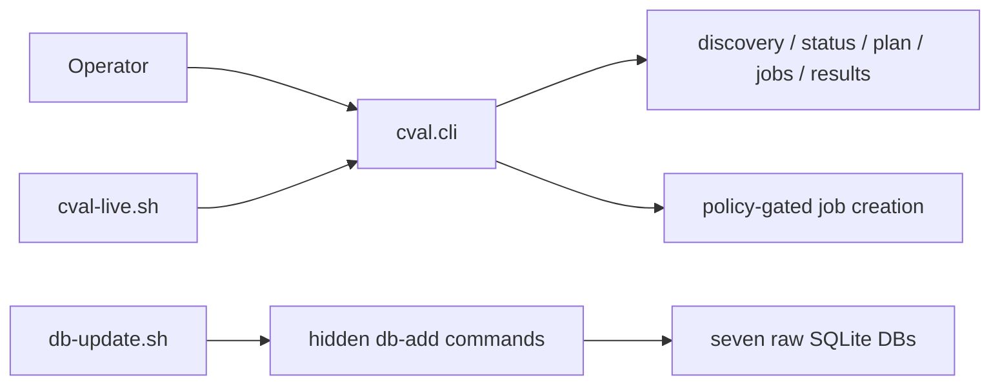
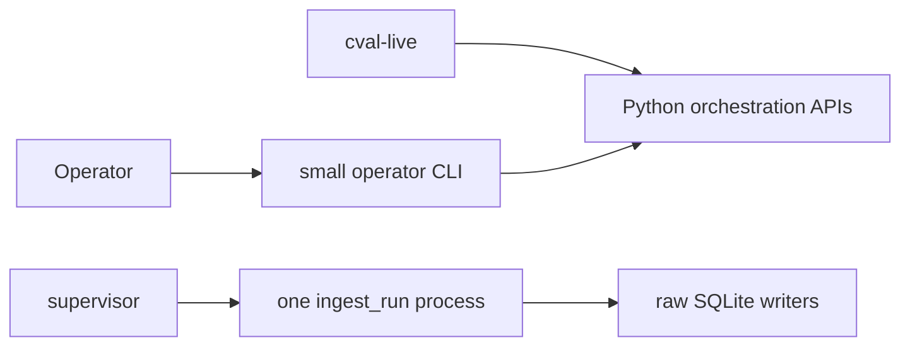

# CLI Design and Trim Plan

## Scope

[`cval/cli.py`](../../cval/cli.py) is the installed `cval` entry point. It is
currently 1,135 lines and serves three audiences:

1. operators reading cluster/raw state;
2. confirmed job submission workflows;
3. in-pod raw SQLite ingestion.

The CLI must preserve exact-commit submission, node eligibility checks,
read-only planning/monitoring, raw result export, immutable write provenance,
and fail-closed behavior.

## Current Surface

| Command | Mutation | Owner/purpose |
|---|---|---|
| `config` | no | Print effective configuration |
| `tests list/describe/validate` | no | Inspect registry and adapters |
| `nodes` | no | Inventory or check one node's eligibility |
| `status` | no | Read latest `validation.db` rows |
| `plan` | no | Prioritize nodes and render exact jobs |
| `jobs` | no | Read/watch Volcano phases |
| `results` | local CSV | Export latest raw statuses/metrics |
| `run` | creates jobs | Submit a confirmed planned batch |
| `validate` | creates one job | Submit, watch, and verify one exact run |

Five hidden commands share the same parser: `db-add-run-results`,
`db-add-storage-result`, `db-add-nccl-health`, `db-add-dltest-run`, and
`db-rebuild-dltest-metrics`. The first four are called only by
[`validation-tests/db-update.sh`](../../validation-tests/db-update.sh).



## Design Assessment

The command boundaries are mostly sound: `plan` is visibly read-only, while
`run` and `validate` require `--submit --confirm submit`. The problem is code
concentration, not missing abstraction. Parser construction is about 290 lines,
public handlers about 415, hidden ingestion about 215, and shared helpers about
90.

Additional CLI-adjacent weight includes:

- [`orchestrator/validate.py`](../../cval/orchestrator/validate.py): 764 lines,
  including log parsing, text reports, and ZIP download support.
- [`validation-tests/db-update.sh`](../../validation-tests/db-update.sh): 536
  lines and four separate Python CLI invocations.
- Dynamic result-export routing across `results_export.py`,
  `operational_targets.py`, `operations.py`, and plugin adapters.

Splitting `cli.py` into more files would improve navigation but not reduce the
codebase. Reduction requires deleting duplicate paths or optional behavior.

## Minimal Target

Keep six operator commands:

```text
nodes   plan   run   status   jobs   results
```

Recommended semantics:

- `run --node NODE --watch --verify` replaces `validate` for single-node
  acceptance; batch `run` remains available to cval-live.
- Configuration and registry validation occur automatically at startup.
  Development-only inspection can be a small repository script, not installed
  production CLI surface.
- In-pod ingestion becomes one private entry point, for example
  `python -m cval.ingest_run`, not hidden public subcommands.
- JSON is the automation contract. Human tables may remain only where they
  materially help (`nodes`, `jobs`, `plan`).



## Trim Sequence

### 1. Consolidate ingestion (highest value, low behavioral change)

Replace four `db-add-*` subprocesses with one in-process ingestion driver that:

1. loads and verifies the result/config snapshot once;
2. creates one write authorization;
3. writes storage, NCCL, and four DL DBs;
4. commits final validation status last.

Move DL rebuild to an explicitly invoked maintenance script. This removes
roughly 290 lines from `cli.py`, most shell argument plumbing, repeated config
loads, and descriptor-inheritance risk. Keep each database's existing
transaction and exact-timestamp checks.

### 2. Remove optional acceptance presentation (low risk)

Delete `validate --download`, ZIP/base64 collection, and bundled text reports.
Canonical PVC artifacts already exist and can be audited separately. Keep the
structured acceptance report. Expected reduction: about 130-180 lines.

### 3. Merge `validate` into `run` (medium risk)

Add single-node watch/verify mode to the existing submission service, then
remove the duplicate single-node command/parser path. Drive progress from
structured events/result JSON and exact DB rows rather than legacy log regexes.
Expected reduction: about 250-450 lines after tests and shared helpers settle.

### 4. Remove compatibility-only inputs (low risk after usage check)

Candidates:

- `status --output tsv` and `plan --db-status-tsv`;
- single-choice `results --type csv`;
- CLI overrides already owned by config: template, job prefix, repository, DB
  paths, namespace allowlist, and maximum batch size.

This reduces parser combinations and test matrix size. Keep runtime controls
needed by cval-live: free nodes, threshold, batch size, timestamp, and exact
Git SHA.

### 5. Simplify result export only if extension is not required (optional)

The registry-driven test runner is core; dynamic plugin-defined CSV export is
not necessarily core. If only built-in exports are required, replace the
operational-target/plugin routing with fixed status, storage, NCCL, and DL raw
export functions. Potential reduction: 150-300 lines. Do not take this step if
third-party test exporters are a supported contract.

## Do Not Trim

- Separate read-only `plan` from confirmed mutation.
- Exact 40-hex commit checks and latest-published-tip enforcement.
- Node GPU/CPU/memory/RDMA eligibility checks at submission time.
- `jobs`, `status`, and exact-timestamp acceptance evidence.
- Immutable config/result authorization and canonical evidence validation.
- Registry-driven execution, secure supervisor descriptors, or raw DB writers.

## Expected Outcome

A realistic target is `cval/cli.py` at 250-350 lines and a net reduction of
roughly 600-1,000 lines across CLI, acceptance, and ingestion code. Measure net
repository lines after each phase; moving code between modules does not count
as trimming.