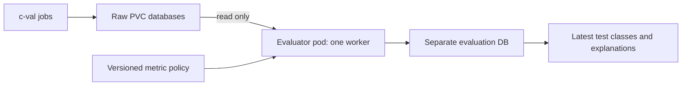
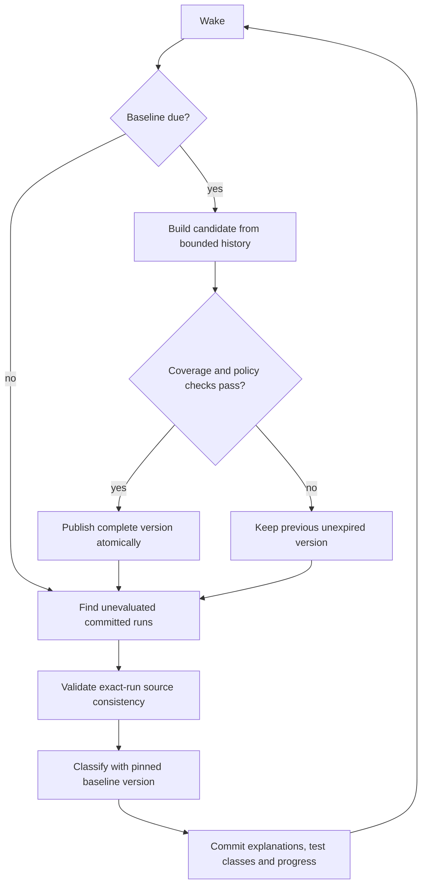
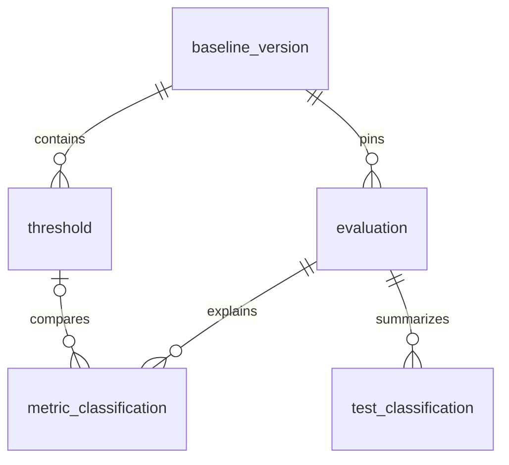

# Evaluation Engine

**Proposal, 2026-09-08. Not deployed.** c-val continues to own discovery,
validation and raw SQLite evidence only. A separate evaluator reads that
evidence and owns all derived thresholds/classes. No raw-row updates.

## Inputs and Draft Review

Inputs: the seven databases in [raw-database-design.md](raw-database-design.md).
PVC spot checks found matching status/metric samples and consistent completed
DL generations. Large datasets were not scanned.

The local drafts, `../evals/threshold.py` and `../evals/classify.py`, are research
inputs, not production code. Keep their periodic refresh, median/percentile
idea, and per-rank explanations; change these behaviors before adoption:

| Draft behavior | Proposed correction |
|---|---|
| First-table discovery; constructed `dltest-` keys | Explicit adapters; exact node/timestamp join; stored run keys |
| Hard-coded B200; mixed plans; global fallback | Verified cohort and full metric key; no cross-cohort fallback |
| Entire history loaded; ranks/repeated runs pooled | Bounded windows and indexed batches; equal node weighting |
| Numerical baseline voted by the evaluated run | Independent reference plus absolute/relative tolerance |
| Append unconstrained thresholds; replace all categorizations | Versioned baselines and transactional, idempotent evaluation history |

## Runtime

One CPU-only Deployment replica, restart policy `Always`, with a Python wake
loop. One process owns both schedules, serialization and recovery. No cron
daemon or parallel Kubernetes CronJob is needed.

Defaults (configurable): classify every 60 seconds; check baselines hourly;
rebuild every 14 days using 28 days of history; expire versions after 28 days.
End training before the evaluation window. Store UTC; display LA time.
Persist last-success/next-due; restart performs one catch-up, not missed ticks.

Mount raw evidence read-only. Put `evaluation.db` on a separate durable
block-backed PVC, not shared NFS. Use SQLite WAL only on a supported single-host
filesystem; use Recreate deployment and a process lock for single-writer
ownership. Verify access to the existing raw WAL DBs before deployment; never
copy live DB files or use `immutable=1`. Multi-host writers require a DB service.

Chunk baseline work between classification batches; bound reads and back off on
errors. Heartbeats/errors are worker state, not health classes. No GPU jobs,
node mutations or Kubernetes write credentials.

## Source and Baseline Rules

- Read explicit tables, never ranking views. Flatten storage/NCCL wide rows
  into metric observations in memory.
- Require exact-run committed statuses, required metrics, DL receipts/rank
  coverage and a completed generation stable around reads. Deduplicate identical
  status rows; conflicts stay unclassified. Disabled tests are `not_applicable`.
  Verified raw failures are bad even without performance metrics.
- Discover via status append-rowid plus overlap; reconcile committed identities
  daily and periodically rehash evaluated inputs to find repairs. Detect source
  replacement and reset discovery. Never rely only on submission timestamp.
  Seed pending evaluation records so newer unknown runs remain visible.
- Cohort = hash(test, GPU model/count, image/build, PyTorch/CUDA, plan/config
  digests, iterations, relevant topology/storage target). Missing provenance
  waits; never guess B200 or fall back globally. Raw DBs alone lack these fields;
  use verified run provenance. Future ingestion enrichment is a separate change.
- Metric key = component/plan/task-group/task/metric/unit/rank-role. Versioned
  policy declares requiredness, direction and units, not substring heuristics.
- Training: passing compatible tests before a fixed cutoff; latest eligible run
  per node; at least 30 distinct nodes per metric. Compare matching rank roles;
  pool ranks only when policy establishes interchangeability, with equal node
  weights. Exclude evaluated runs through a held-out window; historical backfill
  needs a disjoint training set. Persist training membership, not just a cutoff.
- Performance: median plus P95 (lower-better) or P05 (higher-better). Persist
  counts, method and training manifest. No silent P1/P99 trimming. Sparse/tied
  distributions require calibrated absolute/relative gaps or fixed limits;
  otherwise withhold that threshold. No arbitrary epsilon.
- Correctness: independent reference with
  `abs(value-reference) <= atol + rtol*abs(reference)`. Persist both bounds.
  A cross-node mode is provisional consensus, not proof; same-run rank voting
  can miss all-ranks-wrong failures. Unknown references stay unclassified.

Build privately; publish thresholds and activate a cohort version atomically.
Failed builds retain the previous unexpired version. Expired/missing thresholds
yield `unclassified`. New versions re-evaluate a bounded recent window without
overwriting previous evaluations.

## Classification

For a calibrated timing threshold: below P50 = `excellent`, P50 through below
P95 = `good`, at/above P95 = `bad`. Reverse the comparison for higher-better
metrics. Correctness produces `good`/`bad` using its tolerance interval.
These are relative test-result classes, not hardware diagnoses. P95 flags roughly
the slowest 5% of the reference population by construction; calibrate false
alarms and practical tolerances on held-out runs before enabling decisions.

Per test: verified bad required evidence/raw failure => `bad`; missing coverage
otherwise => NULL/`unclassified`. Full coverage is `excellent` only when all
required performance metrics are excellent and correctness passes, else `good`.
`pending`, `unclassified`, `error`, `not_applicable` are processing states, not
classes. No node score or node-wide diagnosis in v1.

## Output Database

Six tables; enforce PK/UQ/FKs. JSON fields contain canonical metadata. Store
epoch times and REAL values. **Fictional, abbreviated examples** below each use
one required metric per test; production covers the complete policy manifest.

### 1. baseline_version

PK `baseline_id`; `cohort_key`, `cohort_json`, `policy_json`, `policy_digest`,
`evaluator_sha`, training window/cutoff, `training_digest`, `built_at`,
`expires_at`, `status`, `active`. Partial UQ `(cohort_key)` where active.
`training_manifest_json` records selected runs/content digests.

| baseline_id | cohort_key | window | status | active |
|---|---|---|---|---|
| b01 | C1: DL/B200/build-A/plan-A/config-A | Aug 1-28 | ready | 0 |
| b02 | C1: DL/B200/build-A/plan-A/config-A | Aug 8-Sep 4 | ready | 1 |

### 2. threshold

PK `threshold_id`; FK `baseline_id`; UQ `(baseline_id, metric_key)`.
`metric_key` encodes full metric identity; columns: direction, unit, method,
baseline, bad boundary or lower/upper bounds, atol/rtol, node/run/sample counts.

| threshold_id | baseline_id | metric_key | direction | median | bad_at | nodes |
|---|---|---|---|---:|---:|---:|
| t01 | b01 | compute/plan-A/nn/linear/gpu_time/ms/any-rank | lower | 10 | 15 | 40 |
| t02 | b02 | compute/plan-A/nn/linear/gpu_time/ms/any-rank | lower | 11 | 16 | 42 |

### 3. evaluation

PK `evaluation_id`; node, raw timestamp, component/test, stored run key,
cohort key, `source_digest`, source-generation metadata, nullable FK baseline,
policy digest, evaluator SHA, status/reason, created/finished/retry times.
UQ `evaluation_key`: hash of run/component, source digest, baseline (or NONE),
policy and evaluator revision. Retries reuse the key; changed evidence creates
a new evaluation. Digest covers metrics, statuses and provenance.

| evaluation_id | node | raw timestamp | component | baseline | status |
|---|---|---:|---|---|---|
| e01 | node-a | 101 | dltest | b01 | complete |
| e02 | node-b | 102 | dltest | b02 | complete |

### 4. metric_classification

PK `(evaluation_id, metric_key, rank)`; FKs evaluation and nullable threshold;
raw value, nullable class, status, reason. Use rank `-1` for node-wide metrics.
Preserve every required observation so healthy denominators remain auditable.

| evaluation_id | metric_key | rank | value | threshold | class | reason |
|---|---|---:|---:|---|---|---|
| e01 | compute/plan-A/nn/linear/gpu_time/ms/any-rank | 0 | 8 | t01 | excellent | below median |
| e02 | compute/plan-A/nn/linear/gpu_time/ms/any-rank | 0 | 17 | t02 | bad | at/above P95 |

### 5. test_classification

PK/FK `evaluation_id`; raw status, evaluation status, nullable health class,
expected/seen/classified/bad counts, reason. One row per evaluated test/run,
not a mutable replacement of the raw status.

| evaluation_id | raw status | health class | classified/expected | bad | reason |
|---|---|---|---|---:|---|
| e01 | pass | excellent | 1/1 | 0 | full coverage |
| e02 | pass | bad | 1/1 | 1 | timing regression |

### 6. worker_state

PK `task`; source identity/cursor JSON, last success, next due, heartbeat,
state/error. Scheduling checkpoints only, not classification evidence.

| task | cursor | last success UTC | next due UTC | state |
|---|---|---|---|---|
| classify | validation-rowid:7200 | Sep 8 03:00 | Sep 8 03:01 | idle |
| baseline | cohort:C1 | Sep 8 02:00 | Sep 8 03:00 | idle |

Index evaluation `(node, raw_timestamp, component)`, pending retry time, and
threshold `(baseline_id, metric_key)`. `latest_test_class` is a view, not another
table: newest discovered raw timestamp per node/test, then newest evaluation
attempt (including pending/unclassified). Left-join its summary; expose coverage,
baseline version/expiry and freshness. Never hide newer unknown evidence behind
an older healthy evaluation. A threshold reference must match its evaluation's
baseline and metric key; enforce this on commit.

## Recovery and Acceptance

Commit metric classifications, test summary, evaluation completion and cursor
advance together. Discovery persists pending work before advancing past it;
restart retries it. Never replace tables. Preserve referenced baseline versions;
back up derived history separately. No copied raw payloads beyond comparison
values. Bound work/windows and define retention before production.

Acceptance fixtures: late arrivals, conflicting duplicates, partial ingestion,
mixed cohorts, expired/missing thresholds, rank disagreement, metric direction,
restart/replay and baseline swaps. Then separately approve a shadow deployment:
exact-run explanations, raw DBs unchanged, no operational health actions.