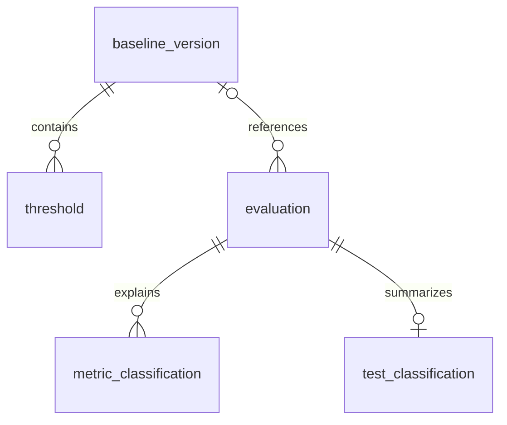

# Evaluation Database Design

Implemented schema at `3c04160` (2026-09-08), not the broader
[evaluation-engine-design.md](evaluation-engine-design.md) proposal.
Source of truth: [evaluation_engine/database.py](../../evaluation_engine/database.py).

## Ownership and Storage

- The independent `evaluation_engine` owns derived thresholds and comparisons.
  c-val still owns the seven [raw databases](raw-database-design.md).
- Config: `[evaluation].output_db` in [config/cval.toml](../../config/cval.toml).
- Pod path: `/evaluation/evaluation.db`; PVC path:
  `/data/continuous_validation/evaluation-engine/evaluation.db`.
- The pod mounts raw `/data` read-only and the isolated output subdirectory
  writable. No derived result changes raw rows or triggers Kubernetes actions.
- SQLite uses DELETE journaling, foreign-key enforcement and short
  `BEGIN IMMEDIATE` transactions. One persistent POSIX worker lock excludes
  other writers; BUSY/LOCKED operations receive bounded retries.

## Tables

Six tables; IDs/digests are TEXT, timestamps are epoch-second INTEGERs,
measurements are REAL, and JSON payloads are stored as TEXT.

| Table | Primary key | Stored data |
|---|---|---|
| `baseline_version` | `baseline_id` | `test`, `cohort_key`, `policy_digest`, `evaluator_sha`; cohort/policy/training-manifest JSON; `built_at`, `cutoff`, `expires_at`, `active` |
| `threshold` | `(baseline_id, metric_key)` | `rule_json`: direction, reference/median, sample count, method, bad boundary or tolerance interval |
| `evaluation` | `evaluation_id` | `node`, `raw_timestamp`, `test`, `source_digest`, nullable `baseline_id`, `policy_digest`, `evaluator_sha`, `status`, `reason`, `evaluated_at` |
| `metric_classification` | `(evaluation_id, metric_key, rank)` | Nullable `value`, nullable `health_class`, `reason` |
| `test_classification` | `evaluation_id` | `raw_status`, nullable `health_class`, coverage counts: `expected`, `seen`, `classified`, `bad` |
| `worker_state` | `task` | `payload` JSON and `updated_at`; worker heartbeat, baseline schedule, classification cursor |



The writer creates one test summary per evaluation; its FK alone does not
require every evaluation to have a summary. Metric rows reference evaluations,
not thresholds directly. `worker_state` is independent scheduling state.

## Identity and Indexes

- Raw correlation: `(node, raw_timestamp, test)`; no foreign keys into raw DBs.
- `cohort_key` hashes compatible environment/configuration and test-owned
  context, including hardware/plan information where required.
- `metric_key` encodes `[component, plan, task_group, task, metric, rank]`.
  Storage/NCCL use rank `-1`; DL keeps individual ranks. Units are defined by
  test policy/source, not a separate SQL column.
- `baseline_id` hashes test/cohort, policy, evaluator revision, cutoff and
  training membership. `evaluation_id` hashes raw identity, source digest,
  baseline, policy, evaluator revision, status and reason.
- Partial unique index `active_baseline(test, cohort_key) WHERE active=1`
  permits only one active version per cohort. `evaluation_run` indexes
  `(node, raw_timestamp, test, evaluated_at)`.

## Publication and Reads

Baseline activation and threshold inserts commit together. Evaluation,
metric comparisons and test summary commit together; cursor updates follow
in a separate transaction. A crash before cursor advancement causes replay.
Identical evaluations only refresh `evaluated_at`; changed inputs produce a
new identity. Historical baselines/evaluations are retained, without automatic
pruning. There is no cross-database transaction.

Runtime processing states are `complete`, `unclassified`, `error` and
`not_applicable`. Classes are `excellent`, `good`, `bad` or NULL. These are
application conventions, not SQL CHECK constraints. Raw `pass` may coexist
with derived `bad`: relative performance bands and provisional numerical
consensus are not hardware diagnoses or certified correctness.

`latest_test_class` selects the newest evaluated raw timestamp per node/test,
then `evaluated_at` and rowid. It includes coverage, baseline expiry and the
latest attempted result, including errors/unclassified states. It does not
discover raw runs that the worker has not evaluated yet; an expiry flag does
not automatically clear a stored class.

```sql
SELECT node, test, raw_timestamp, raw_status, status, health_class,
       classified, expected, bad, baseline_expired
FROM latest_test_class
ORDER BY raw_timestamp DESC, node, test
LIMIT 12;

SELECT metric_key, rank, value, health_class, reason
FROM metric_classification
WHERE evaluation_id = :evaluation_id
ORDER BY metric_key, rank
LIMIT 20;
```

Audit with SQLite `mode=ro` and `PRAGMA query_only=ON`; sample exact identities
instead of scanning raw DL history. Inspect evaluation errors and coverage,
not just the worker heartbeat. Deployment details:
[deploy/evaluation-engine/README.md](../../deploy/evaluation-engine/README.md).

## Readable NCCL Export

An existing detailed NCCL CSV can be rendered without database access or
reclassification:

```bash
python -m evaluation_engine.report --input /path/to/nccl.csv --output-dir /path/to/reports
```

This writes a new `_readable.csv` and `_summary.md`, preserving the source.
Raw status, stored class, missing-evidence reasons, metric coverage, baseline
expiry and test age are separate fields. `not_classified` means no stored class,
not a failing test. Evaluation time can reflect replay of old raw evidence.