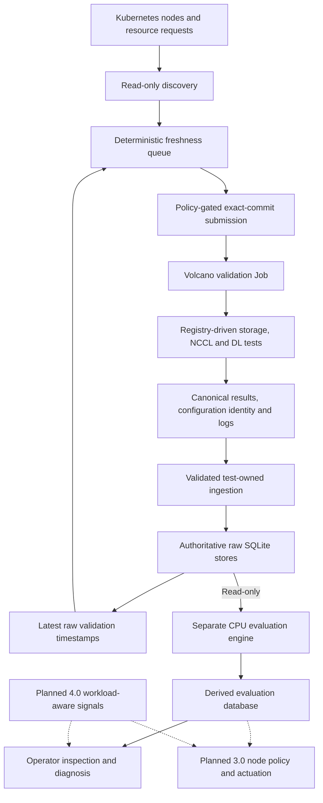
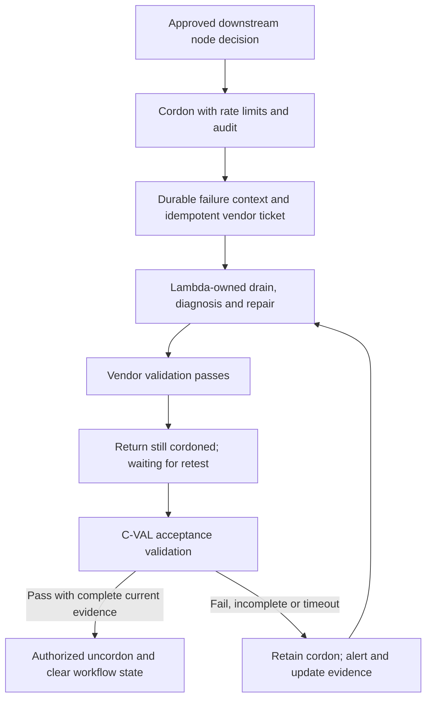

# C-VAL: Overview, Architecture and Roadmap

**Updated:** September 9, 2026.

## 1. Overview and Goals

C-VAL (Continuous Validation) runs repeatable, application-level tests on available GPU nodes and preserves the results for diagnosis and performance analysis. It complements infrastructure monitoring: Kubernetes readiness and normal hardware telemetry do not establish numerical correctness, expected throughput, or suitability for distributed training.

The system separates three responsibilities: **validation produces raw evidence**, a **separate evaluator interprets compatible results**, and a **planned remediation controller governs operational actions**. The raw c-val framework does not classify, score, rank, cordon, or uncordon nodes. [C1] [C8] [C10]

### Goals

- Detect selected numerical, compute, communication and storage problems before they disrupt user workloads.
- Expose fail-slow behavior: nodes that remain operational but reduce the throughput of synchronous training.
- Make investigations reproducible through exact source identity, effective configuration, timestamps and retained artifacts.
- Use available capacity with bounded jobs and deterministic scheduling, while accounting for shared network and storage impact.
- Supply traceable evidence for diagnosis, post-repair acceptance and future workload-aware monitoring.

| Capability stage | Status | Scope |
| --- | --- | --- |
| C-VAL 2.0 | Live | Opportunistic offline validation: discovery, scheduling, storage/NCCL/DL tests, raw results and separate evaluation |
| C-VAL 3.0 | In development | Automated node cordoning, vendor repair handoff and acceptance-gated return to service |
| C-VAL 4.0 | Backlog | Continuous online signals correlated with user-workload behavior |

These stages describe capability milestones, not source release tags. Core offline operation is established; fleet-wide coverage, final node-policy decisions and automatic remediation are separate outcomes.

## 2. Node Health and Validation Strategy

**A node is fit for a specified AI workload when its relevant components have no unresolved material fault signals and current, representative tests demonstrate correct execution and acceptable performance for the applicable hardware/software configuration.** Production workload behavior must continue to support that conclusion.

Health therefore requires **normal component signals plus demonstrated workload capability**. It is time-dependent and workload-dependent. Missing, stale or incompatible evidence cannot establish fitness, and an old passing result is not a permanent guarantee.

| Evidence layer | Signals and checks | Why it matters |
| --- | --- | --- |
| Platform | Kubernetes state, driver/runtime identity, resource availability, host errors | Establishes whether the node can safely run the intended environment |
| GPU and host | Numerical results, compute timings, HBM/ECC signals, clocks, temperature, power, CPU/memory behavior | Distinguishes execution correctness and sustained performance from simple device availability |
| Communication | NVLink/PCIe behavior, HCA/link state, bandwidth, latency, routing and cross-node collectives | Finds bottlenecks that propagate through synchronized workers |
| Storage | Dataset/checkpoint I/O, bandwidth, IOPS, latency and errors | Identifies input and checkpoint bottlenecks, including shared-service effects |
| Workload | Step-time distribution, useful throughput, stalls, retries and checkpoint behavior | Connects infrastructure observations to actual training impact |

Slow training does not automatically imply faulty hardware. Application imbalance, data loading, resource allocation and shared congestion can produce similar symptoms. Diagnosis needs correlated node, job, rank and time information. [R1] [R2]

### Offline, Online and Hybrid Approaches

Offline validation reserves a diagnostic workload outside the user's running workload. Online validation observes production behavior and allows only explicitly budgeted, non-disruptive checks alongside it.

| Approach | Advantages | Limitations | Role in C-VAL |
| --- | --- | --- | --- |
| Offline | Controlled conditions, repeatable tests, deeper component exercise, useful post-repair evidence | Consumes capacity; busy nodes remain untested; results age; limited-duration or single-node tests miss some production faults | Current 2.0 foundation |
| Online | Observes real workload, scale, duration and contention; detects degradation on busy nodes | Workload-sensitive comparisons, false alarms and instrumentation overhead; monitoring may not localize the cause | Planned 4.0 capability |
| Hybrid | Online signals identify suspicious behavior; offline tests reproduce/localize it and gate return to service | Requires shared identities, calibrated policies, retest capacity and controlled operational handoff | Target architecture across 2.0, 3.0 and 4.0 |

The hybrid approach has published support from Guard, but its detection policies and reported improvements require local validation before adoption. Existing DCGM telemetry alone is not equivalent to an integrated online validation service.

## 3. Architecture

Solid paths describe the implemented architecture; dotted paths represent planned integrations. [C4] [C5] [C6] [C8]

| Component | Responsibility | Design benefit |
| --- | --- | --- |
| Discovery and scheduler | Read cluster state, check capacity, prioritize never-tested and expired nodes | Deterministic selection with explicit eligibility reasons |
| CLI and live loop | Inspect, plan, submit bounded jobs, track progress and apply cooldowns | Common operator interface and controlled use of available capacity |
| Validation runtime | Execute registered tests with setup, deadlines, structured results and artifacts | Tests extend the system through their own configuration and plugins |
| Raw ingestion | Validate run identity, configuration and destinations; persist test-owned measurements | Retains original observations independently of evaluation policy |
| Evaluation engine | Read compatible raw evidence, build baselines and classify metrics/tests | Evaluation can evolve without rewriting raw history |
| Future policy/controller | Combine approved evidence into node decisions and repair workflows | Keeps interpretation and operational authority outside the raw framework |

Reproducibility depends on more than a Git commit: image identity, external test dependencies, hardware/software cohort and effective configuration also matter. Architectural benefits should be measured through coverage, detection quality and workload impact rather than assumed incident reduction.

## 4. Process Logic

1. **Discover eligible capacity.** Inspect node readiness, schedulability and active Kubernetes resource requests. Ordinary discovery excludes unsuitable nodes and checks GPU, CPU, memory and RDMA availability. GPU idleness alone is insufficient. [C2]
2. **Build the priority queue.** Select never-tested nodes first, followed by nodes whose latest validation timestamp is older than the configured threshold. Sort by timestamp, then node name for deterministic ties. This is scheduling priority, not health ranking. [C3] [C4]
3. **Plan and authorize submission.** Render a bounded batch of jobs. Execution requires explicit confirmation and an exact published commit; the default placeholder commit fails closed. [C1] [C7]
4. **Run enabled tests.** The registry controls order, setup, timeout, artifacts and continuation behavior. Disabled tests are skipped/incomplete, never recorded as passed. [C5]
5. **Preserve canonical evidence.** Retain structured results, progress events, logs, summaries and configuration identity. The supervisor protects canonical evidence paths and file descriptors. [C5] [C6]
6. **Ingest raw results.** Verify result identity/digest, the immutable configuration snapshot and approved database targets. Storage/NCCL metrics precede the atomic built-in status set; DL stores carry receipt/generation evidence. There is no single transaction spanning all seven raw databases. [C6] [C8]
7. **Evaluate independently.** The CPU worker reads raw sources without modifying them, applies compatible baselines, and publishes derived metric/test results with provenance. It performs no Kubernetes actuation. [C8] [C10]
8. **Inspect and follow up.** Operators examine results and evidence gaps. Incident-driven retests and post-repair acceptance require explicit handling rather than relying on the age-based queue.

**Successful validation requires more than a completed Job:** a successful terminal phase, passing required tests, canonical result evidence, successful ingestion and matching exact-timestamp raw rows must agree. [C7]

## 5. Test Coverage and Runtime Configuration

### Enabled Test Families

The profiles below are checked-in defaults. Individual runs retain their effective configuration. [S1] [S2] [S3]

| Test family | Profile and measurements | Coverage boundary |
| --- | --- | --- |
| Storage FIO | Order 10; 30-minute timeout. Shared-storage read/write profiles; evaluation selects 12 bandwidth/IOPS fields across depth, parallel-file and random I/O patterns | Not application checkpoint validation or a latency acceptance policy; shared-service contention influences results |
| NCCL and HCA bandwidth | Order 20; 20-minute timeout. Eight GPUs, 20 iterations, `data_size_gb=8`, IB transport, P2P/shared-memory paths disabled, IB bandwidth tracker enabled. Bus bandwidth, latency and eight HCA transmit-bandwidth fields | Single-node IB loopback; does not qualify the entire fabric, topology or cross-node all-to-all behavior |
| Deep-learning unit test | Order 30; 40-minute timeout. Eight ranks, `80gb-example`, 100 iterations. Numerical norms/parameters, CPU/GPU forward/backward timings, collective timings and compute/communication overlap | Selected primitives, not a complete training workload or certified numerical reference; exact task coverage depends on the external benchmark plan |

The suite exercises host and communication paths through these operations, but does not constitute comprehensive CPU/RAM/HBM diagnostics or dedicated all-pairs NVLink qualification. Sustained straggler detection, MoE readiness and multi-node fabric tests remain additional coverage goals.

Phase timeouts total **90 minutes**; the configured monitoring timeout is **100 minutes**. These are budgets, not measured typical durations. Targeted on-demand validation exists, but a comprehensive five-minute check requires a separately designed and validated quick profile.

### Scheduling and Resources

| Setting | Default | Meaning |
| --- | --- | --- |
| Retest age | 7 days | Eligibility threshold, not a weekly coverage guarantee |
| Batch size / policy maximum | 3 / 5 jobs | Bounded submission; live-loop overrides may differ |
| Submission cooldown | 4 hours per node | Limits repeat submissions; separate from result freshness |
| Job resources | 8 GPUs, 100 CPU, 1,500 GiB memory, 256 GiB shared-memory volume, one RDMA allocation | Full-node-scale reservation; RDMA resource count is not a physical-link count |
| Image | `nvcr.io/nvidia/pytorch:26.05-py3` | Configured tag, not an immutable image digest |
| Monitoring | 60-second polling; 1,200-second (20-minute) pending-start timeout | Execution/observation controls, not performance thresholds |

Opportunism limits direct competition for busy GPUs but can leave those nodes with stale evidence. Diagnostic traffic can still affect shared storage and fabric. [C1] [C3]

## 6. Evidence and Evaluation

### Persistence Boundaries

| Layer | Contents and contract |
| --- | --- |
| Authoritative raw stores | Seven SQLite files under `metadata/`: validation status, storage, NCCL, and four DL stores for numerical, compute, collective and overlap observations |
| Canonical artifacts | `cval.results`, `cval.event.v1` progress, logs, summaries, run identity and configuration identity; historical result formats remain readable |
| Derived evaluation store | Separate `/evaluation/evaluation.db`: baseline versions, thresholds, evaluation receipts, metric/test classifications and worker state; `latest_test_class` view |
| Future workflow state | Node-policy decisions, durable failure context, tickets and acceptance transitions; not responsibilities of raw ingestion |

Raw reads use SQLite `mode=ro` and `query_only=ON`. Bounded queries, retries and evidence identity checks limit ambiguity and resource use. Derived publication is isolated from raw storage, and repeated evaluations replay idempotently. Shared-storage locking, journaling, capacity and recovery remain operational requirements. [C6] [C8] [C10]

### Baseline and Classification Logic

Baselines group compatible observations by recorded image/PyTorch/CUDA identity, test configuration and metric context. DL/NCCL also require GPU/rank provenance. Training selects one latest passing observation per node/cohort; incomplete evidence cannot borrow an unrelated global baseline. [C8]

| Policy | Current default / behavior |
| --- | --- |
| Worker cadence | 60-second wake; 20 runs/test/pass; hourly baseline check |
| Training eligibility | Minimum 30 distinct nodes per applicable metric/cohort; 28-day window; 24-hour holdout; at most 100 training candidates/test |
| Baseline lifecycle | 14-day refresh; 28-day expiry; qualifying versions activate automatically |
| Performance comparison | Median reference; adverse-tail quantile with 0.95 policy setting; at least 5% separation from the median, with an absolute floor |
| Numerical comparison | At least 90% independent-node value consensus; tolerance of 1e-6 plus 1% of the reference magnitude |
| Derived classes | Metric/test results: `bad`, `good`, `excellent` |
| Evidence states | `complete`, `unclassified`, `not_applicable`, `error` |

These are policy defaults, not active per-metric production thresholds. A valid raw failure or adverse metric can produce a bad test result. Otherwise, missing thresholds or incomplete coverage remain unclassified; disabled tests are not applicable. Reference-interval boundaries are inclusive; performance adverse-boundary equality is classified as bad. [C8] [C9]

Peer consensus is not certified mathematical correctness: a common-mode error across the cohort can remain undetected. The current evaluator publishes metric/test-level results, not a final node-health ranking. Any downstream aggregation and actuation policy needs its own explicit contract and validation. Tests cover raw immutability, missing/expired evidence and cohort isolation. [T1]

## 7. Industry Research

### Llama 3: Reliability at Training Scale

Meta's *The Llama 3 Herd of Models* describes training on up to 16,384 H100 GPUs, eight per server. Section 3.3.4 and Table 5 provide a 54-day interruption snapshot. It is a useful public reference, not an industry failure-rate standard. [R2]

| Observation | Reported value / calculation |
| --- | --- |
| Job interruptions | 466 total: 47 planned and 419 unexpected |
| Unexpected interruption frequency | 7.76/day across the job; mean spacing 3.09 hours |
| Hardware attribution | Approximately 78%, including confirmed and suspected causes |
| Published component shares | Faulty GPU 30.1%; GPU HBM3 memory 17.2%; software bugs 12.9%; network switch/cable 8.4% |
| Operational outcome | More than 90% effective training time; significant manual intervention only three times in the snapshot |

Table 5's printed faulty-GPU count (148) is inconsistent with its 30.1% share and the narrative total of 419. The shares above are retained as published; normalization uses the narrative total. Hardware attribution is not a count of confirmed component replacements.

**Implication:** Validation must complement checkpointing, rapid diagnosis and automated workload recovery. C-VAL supplies validation evidence; it does not implement training checkpoint/restart resilience. Interruptions across a large synchronous job must not be interpreted as a single-node failure probability.

### Cluster Context and Conditional Scaling

The cluster sizing basis is **3,832 B200 GPUs across 479 eight-GPU nodes**. Connectivity is described as 13 IB links, including eight 400 Gb/s NDR compute links. The remaining five links' roles/speeds and the per-node mapping require inventory confirmation. Eight such links per node imply **3.2 Tb/s (400 GB/s) aggregate line rate per direction**, not measured NCCL throughput or fabric bisection bandwidth.

Assuming 2,048 fully participating nodes throughout Meta's 54-day snapshot:

$$
r = \frac{419}{54 \times 2{,}048}
  = 0.003789\ \text{unexpected interruptions per node-day}.
$$

| Conditional comparison | Result |
| --- | --- |
| Normalized all-cause intensity | 3.79 interruptions per 1,000 node-days |
| Scaled to 479 nodes | 1.81 unexpected interruptions/day |
| Hardware-attributed subset at 78% | 1.42 interruptions/day |

The two daily quantities are an all-cause estimate and its subset, **not a confidence interval or observed B200 failure rates**. The normalized intensity is numerically 0.379% per node-day, not a measured probability of individual-node failure. Exact integrated node exposure is not given for the snapshot; hardware generation, job scale, software, correlated failures and Meta's RoCE versus this cluster's IB further limit transferability. A local rate needs actual exposure and incident attribution.

### Guard: Combining Online Detection and Offline Verification

*Guard: Scalable Straggler Detection and Node Health Management for Large-Scale Training* describes Amazon's hybrid approach to fail-slow detection. Training step time is the primary end-to-end signal, supported by GPU temperature, clocks, power, utilization and communication/link metrics. Peers are compared within the same job, and sustained multi-signal deviations suppress transient alarms. [R1]

- **Online collection:** DCGM and custom sidecars, with reported polling intervals of 30 seconds to one minute. Node telemetry is combined with workload context.
- **Impact-aware response:** Closer observation for signals without throughput impact, checkpoint-aligned mitigation for moderate sustained slowdown, and urgent replacement for severe degradation or stalls.
- **Offline verification:** Sustained compute, intra-node communication and multi-node sweeps. Two-, four- and eight-node cases are evaluated; two-node sweeps are reported as a cost-effective default for many communication faults.
- **Trigger and cost:** Sweeps follow anomalies or repairs and take one to two hours, complementing periodic age-based validation.

| Guard Table 4 configuration | Average mean time to failure | Average model FLOPs utilization |
| --- | --- | --- |
| NCCL / burn-in only | 6.6 hours | 5% |
| Add node sweep | 8.1 hours | 10% |
| Add online monitoring | 9.2 hours | 14% |
| Online monitoring plus enhanced sweep | 16.7 hours | 17% |

Guard also reports step time falling from 17 to 10 seconds and run-to-run variability from 20% to 1%. The step-time change is approximately **41% lower latency**, equivalent to **70% higher step throughput** for comparable work. The 10%-to-17% utilization comparison is 1.7x; it is not a gain over every baseline.

**Limitations:** Table 3 reports 12.4% false positives on 1,000 negative samples and 7.8% false negatives on 1,000 positive samples. These results are workload/deployment-specific, and the paper's ambiguous "human interval" metric is not a basis for operational commitments. Guard supports the hybrid design direction; it does not establish C-VAL's accuracy, overhead or expected gains.

## 8. Progress and Future Work

### Capability Status

| Capability | Current position | Next work |
| --- | --- | --- |
| Discovery, freshness queue, CLI and live loop | Implemented; offline loop activity observed | Fleet coverage/freshness reporting and queue-delay visibility |
| Storage, NCCL loopback and DL tests | Enabled; core 2.0 suite operational | Release-pinned profile/dependency catalog and representative acceptance evidence |
| Raw ingestion and retained artifacts | Implemented with authoritative raw stores | Completeness monitoring, capacity planning and recovery verification |
| Baselines and metric/test evaluation | Separate worker implemented and observed processing | Active threshold coverage, calibration and end-to-end output acceptance |
| Targeted on-demand validation | CLI implemented | Independently validated quick profile for a sub-five-minute use case |
| Final node-policy decisions | Separate downstream contract required; current output is metric/test-level | Define aggregation, evidence freshness and action eligibility |
| Automated cordoning and repair acceptance | 3.0 in development; end-to-end automatic operation not established | State contract, vendor integration, safety controls and bounded pilot |
| DeepSeek MoE readiness | Backlog | Intra/inter-node expert-routing, all-to-all and compute/communication tests |
| Cluster fabric validation | Backlog | Topology-aware multi-node testing and localization |
| Dedicated straggler-GPU detection | Backlog; existing per-rank metrics provide inputs | Sustained peer comparisons and validated attribution |
| Online validation | 4.0 backlog | Workload-correlated signals, temporal detection and measured overhead |
| Ben's Lattice node-health report | Interim observational input planned | Confirm coverage, freshness, access and operating ownership |

### C-VAL 3.0: Repair and Acceptance Workflow

The proposed lifecycle prevents unsuitable nodes from receiving new work, carries durable failure context through vendor repair, and gates return to service on acceptance. **Cordoning prevents new scheduling; it does not drain or terminate running workloads.** Lambda owns draining, diagnosis and repair; C-VAL supplies acceptance evidence.

Release requirements:

1. One state vocabulary and workflow ID across Kubernetes, durable failure context and vendor tickets, with explicit transition ownership.
2. Idempotent retries, rate limits, circuit breakers, dry runs and audit trails; no duplicate tickets or uncontrolled fleet-wide cordoning.
3. Scheduler-compatible handling of running gang-scheduled jobs and a clear vendor-owned drain boundary.
4. Acceptance on repaired, cordoned, fully free Ready nodes, using fresh exact-run evidence and an explicitly authorized return-to-service decision.
5. A fail-closed return policy: **timeout, missing evidence or controller outage must never substitute for passing acceptance**. Escalate and retain the cordon until the gate is satisfied.

The state-transition and timeout policies must be finalized and demonstrated before automatic actuation is enabled.

### C-VAL 4.0: Workload-Aware Online Validation

The planned online layer combines node-level telemetry/log/error collection with job/rank identity and training performance. A DaemonSet is a collection mechanism, not the complete solution: detection, temporal correlation, data quality, policy and operational ownership are separate components.

Use Ben's Lattice report as an interim read-only input for human triage, with observation time, node identity, source signal/window and investigator disposition. Its coverage and freshness still require confirmation; it is not an automatic cordoning authority or a completed 4.0 integration.

Start with observational alerts, measure overhead and adjudicated false alarms, then connect confirmed cases to the approved 3.0 workflow and offline acceptance. Prioritize representative MoE/fabric profiles and a defined validation-capacity budget before expanding fleet-wide automation.

## 9. Operational Measures and Limitations

| Measure | Definition |
| --- | --- |
| Fresh coverage | Nodes with complete required evidence inside the agreed window / all in-scope nodes; separate busy and untestable nodes |
| Evidence completeness | Terminal runs with canonical results, successful ingestion and matching exact-timestamp raw rows / terminal runs |
| Evaluation coverage and lag | Compatible tests with usable baselines; raw-to-derived delay; reasons for unclassified results |
| Detection quality | Adjudicated false-positive/false-negative rates and time to detection |
| Workload impact | Infrastructure-attributed interruptions per defined exposure, useful training time, throughput and tail step times |
| Repair effectiveness | Time to acknowledgement, repair, acceptance and return; recurrence after repair |
| Capacity cost | Validation GPU-hours, quarantine node-hours and measured training time saved |

No fleet-wide coverage, local failure rate or benefit target is established by the operating snapshots alone. Keep `forbidden`, unavailable, empty, stale and incomplete evidence distinguishable; absence of a classification or alert is not affirmative evidence of fitness.

Primary limitations are stale coverage on busy nodes, incomplete multi-node/long-duration coverage, peer-baseline calibration and common-mode errors, shared-storage constraints and the unfinished actuation contract. The evaluator currently uses a single fixed-name pod: container restart is configured, but pod deletion or node loss requires operator replacement. [C10]

## Implementation Baseline

Configuration and implementation details correspond to branch `raw-only-framework`, revision `d827ecbeba054899f8076735cbaca85f2ab36999` (September 8, 2026). Defaults may differ from effective live settings.

Read-only observations on September 9 recorded an active local loop at approximately 03:13 UTC with five Completed, one Pending and one Missing job entry. The five Completed entries were pinned to `3c04160affa460ed678a797c37eb331cd4b35007`. The evaluator was Running/Ready; a 03:20 UTC progress record showed 20 runs processed per test and no new rows written in that pass. These establish operating activity, not fleet health, complete ingestion or acceptance of every derived result. The evaluator's live source revision was not established by those observations.

## References

- [R1] Guard: Scalable Straggler Detection and Node Health Management for Large-Scale Training. Amazon researchers, MLSys 2026 Industry Track; Sections 4-7, Tables 3-4.
- [R2] The Llama 3 Herd of Models. Meta, 2024; Sections 3.3.1 and 3.3.4, Tables 4-5.
- [C1] Operator configuration; [C2] node discovery; [C3] priority logic; [C4] workflow planning.
- [C5] Validation runner; [C6] raw ingestion; [C7] targeted validation and evidence acceptance.
- [C8] Evaluation runtime; [C9] threshold mathematics; [C10] evaluator deployment and operations.
- [S1] Storage profile; [S2] NCCL profile; [S3] DL profile.
- [T1] Evaluator contract tests; [T2] workflow-planning tests.

[R1]: https://arxiv.org/pdf/2605.17879
[R2]: https://arxiv.org/pdf/2407.21783
[C1]: ../config/cval.toml
[C2]: ../cval/k8s/discovery.py
[C3]: ../cval/scheduler/priority.py
[C4]: ../cval/orchestrator/workflow.py
[C5]: ../cval/validation/runner.py
[C6]: ../validation-tests/db-update.sh
[C7]: ../cval/orchestrator/validate.py
[C8]: ../evaluation_engine/runtime.py
[C9]: ../evaluation_engine/statistics.py
[C10]: ../deploy/evaluation-engine/README.md
[S1]: ../validation-tests/storage/test_config.toml
[S2]: ../validation-tests/nccl/test_config.toml
[S3]: ../validation-tests/dltest/test_config.toml
[T1]: ../tests/test_evaluation_engine.py
[T2]: ../tests/test_workflow.py