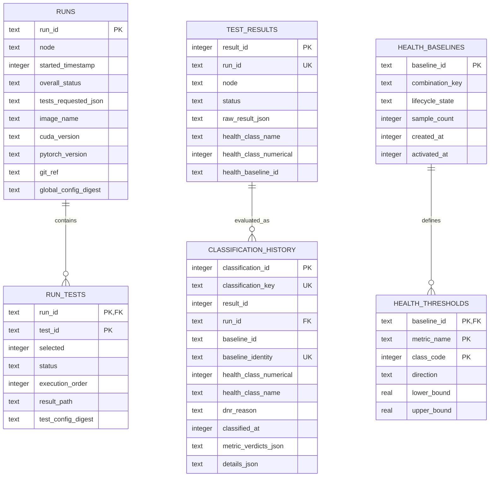

# Modular Database Schema Design

**Design version:** c-val modular schema v3  
**Implementation status:** U6 node run history, U7 common per-test results plus storage/NCCL/DL metric adapters, U8 versioned health classes, and the local dry-run-first U9 evaluator are implemented. U7 schema v2 adds append-only classification history only during evaluator apply; ordinary ingestion accepts exact v1/v2 without auto-migration. No live health database, migration, activation, background service, or deployment is authorized. U6/U7/U9 production writes remain independently default-off.
**Migration rule:** Additive only. Existing databases remain readable until a separately approved compatibility cleanup.

This document defines ownership, relationships, target tables, idempotency, and migration boundaries for node run history, per-test raw results, and per-test health classes.

## Data ownership boundaries

| Data | Authoritative owner | Mutability |
| --- | --- | --- |
| Run identity and per-test execution state | `metadata/node-run-history.db` | State may advance idempotently for the same run; completed evidence is not deleted. |
| Raw test status and metrics | Per-test `<test_id>_results.db` | Append/upsert once by run ID; raw status is not changed by evaluation. |
| Baseline definitions and thresholds | Per-test `<test_id>_health_classes.db` | Versioned immutable baselines; lifecycle state changes are audited. |
| Classification history | Per-test results DB initially, with compatibility export to existing global classification DB | Append-only per `(run_id, baseline_id)`. |
| Latest health assignment cache | Nullable columns on per-test result row | May update only from a persisted classification-history record. |

Raw execution and derived health remain separate concepts even when latest-health cache columns are colocated for convenient queries.

## Canonical paths

```text
/data/continuous_validation/
  metadata/
    node-run-history.db
    validation.db                         # current compatibility surface
  validation_tests/
    storage/
      storage_results.db
      storage_health_classes.db
      runs/
    nccl/
      nccl_results.db
      nccl_health_classes.db
      runs/
    dltest/
      dltest_results.db
      dltest_health_classes.db
      runs/
  baselines/                              # current compatibility surface
    classification-results.db
    ...
```

Database paths are configured root-relative in each test config and resolved beneath the global validation root.

## Relationship overview



Cross-file relationships are logical, not SQLite foreign keys. Foreign keys apply only to tables within the same database file.

---

# Node Run-History Database

Path:

```text
/data/continuous_validation/metadata/node-run-history.db
```

## `runs`

One row represents one c-val execution on one node.

```sql
CREATE TABLE runs (
    run_id TEXT PRIMARY KEY,
    node TEXT NOT NULL,
    started_timestamp INTEGER NOT NULL,
    started_timestamp_la TEXT NOT NULL,
    completed_timestamp INTEGER,
    overall_status TEXT NOT NULL
        CHECK (overall_status IN ('pass', 'fail', 'incomplete')),
    tests_requested_json TEXT NOT NULL DEFAULT '[]',
    image_name TEXT NOT NULL DEFAULT '',
    pytorch_version TEXT NOT NULL DEFAULT '',
    cuda_version TEXT NOT NULL DEFAULT '',
    git_ref TEXT NOT NULL DEFAULT '',
    global_config_digest TEXT NOT NULL DEFAULT '',
    result_path TEXT NOT NULL DEFAULT '',
    result_digest TEXT NOT NULL DEFAULT '',
    created_at INTEGER NOT NULL,
    updated_at INTEGER NOT NULL,
    CHECK (completed_timestamp IS NULL OR completed_timestamp >= started_timestamp)
);

CREATE INDEX idx_runs_node_started
    ON runs(node, started_timestamp DESC);
CREATE INDEX idx_runs_status_started
    ON runs(overall_status, started_timestamp DESC);
```

### Column rules

- `run_id` is immutable and generated before the first result file write.
- `started_timestamp` is UTC epoch; LA timestamp is a display copy.
- `completed_timestamp` remains null until all selected tests are terminal or the framework closes an interrupted run.
- `tests_requested_json` is canonical JSON for operator readability. Queryable membership is authoritative in `run_tests`.
- Digests may be empty only for imported historical compatibility rows.
- Repeated writes update only the same `run_id` and cannot change `node` or start identity.

## `run_tests`

One row per registered test in a run. This preserves selection and disabled state without a comma-separated status model.

```sql
CREATE TABLE run_tests (
    run_id TEXT NOT NULL,
    test_id TEXT NOT NULL,
    enabled INTEGER NOT NULL CHECK (enabled IN (0, 1)),
    selected INTEGER NOT NULL CHECK (selected IN (0, 1)),
    execution_order INTEGER NOT NULL,
    phase TEXT NOT NULL,
    status TEXT NOT NULL
        CHECK (status IN ('pass', 'fail', 'incomplete')),
    started_timestamp INTEGER,
    completed_timestamp INTEGER,
    duration_ms INTEGER,
    exit_code INTEGER,
    result_path TEXT NOT NULL DEFAULT '',
    stdout_path TEXT NOT NULL DEFAULT '',
    stderr_path TEXT NOT NULL DEFAULT '',
    log_path TEXT NOT NULL DEFAULT '',
    summary_path TEXT NOT NULL DEFAULT '',
    test_config_digest TEXT NOT NULL DEFAULT '',
    error_message TEXT NOT NULL DEFAULT '',
    created_at INTEGER NOT NULL,
    updated_at INTEGER NOT NULL,
    PRIMARY KEY (run_id, test_id),
    FOREIGN KEY (run_id) REFERENCES runs(run_id) ON DELETE RESTRICT,
    CHECK (selected = 0 OR enabled = 1),
    CHECK (duration_ms IS NULL OR duration_ms >= 0),
    CHECK (completed_timestamp IS NULL OR started_timestamp IS NULL
           OR completed_timestamp >= started_timestamp)
);

CREATE INDEX idx_run_tests_test_status
    ON run_tests(test_id, status, completed_timestamp DESC);
```

Writers enable `PRAGMA foreign_keys=ON` for each connection.

## `node_run_history` view

Human-readable one-row-per-run view:

```sql
CREATE VIEW node_run_history AS
SELECT
    r.*,
    COALESCE((
        SELECT GROUP_CONCAT(test_id, ',')
        FROM (
            SELECT test_id
            FROM run_tests rt
            WHERE rt.run_id = r.run_id AND rt.selected = 1
            ORDER BY execution_order, test_id
        )
    ), '') AS tests_ran
FROM runs r;
```

`tests_ran` is a display value only. Code uses `run_tests` for filtering and joins.

## Idempotent state transitions

U6 ingests only the finalized v2 result produced before `db-update.sh` runs.
Retries must match the existing node/start identity, aggregate status,
registered test set, and per-test terminal state exactly. Any change is rejected
and rolled back; corrections require a future explicit audited repair path.

A transaction writes the run row and all changed `run_tests` rows from one validated `cval.results.v2` document.

---

# Per-Test Results Database

Path template:

```text
/data/continuous_validation/validation_tests/<test_id>/<test_id>_results.db
```

Each test may add metric tables, but the common execution table is stable.

## `test_results`

```sql
CREATE TABLE test_results (
    result_id INTEGER PRIMARY KEY AUTOINCREMENT,
    run_id TEXT NOT NULL UNIQUE,
    test_id TEXT NOT NULL,
    node TEXT NOT NULL,
    run_timestamp INTEGER NOT NULL CHECK (run_timestamp >= 0),
    started_timestamp INTEGER,
    completed_timestamp INTEGER,
    status TEXT NOT NULL
        CHECK (status IN ('pass', 'fail', 'incomplete')),
    exit_code INTEGER,
    image_name TEXT NOT NULL DEFAULT '',
    pytorch_version TEXT NOT NULL DEFAULT '',
    cuda_version TEXT NOT NULL DEFAULT '',
    test_config_digest TEXT NOT NULL DEFAULT '',
    combination_key TEXT NOT NULL DEFAULT '',
    result_path TEXT NOT NULL DEFAULT '',
    summary_path TEXT NOT NULL DEFAULT '',
    artifacts_path TEXT NOT NULL DEFAULT '',
    raw_result_json TEXT NOT NULL,
    result_digest TEXT NOT NULL,
    health_class_name TEXT,
    health_class_numerical INTEGER
        CHECK (health_class_numerical IS NULL
               OR health_class_numerical BETWEEN 0 AND 5),
    health_baseline_id TEXT,
    evaluated_at INTEGER,
    created_at INTEGER NOT NULL,
    updated_at INTEGER NOT NULL,
    CHECK (completed_timestamp IS NULL OR started_timestamp IS NULL
           OR completed_timestamp >= started_timestamp),
    CHECK ((health_class_name IS NULL) = (health_class_numerical IS NULL)),
    CHECK (health_baseline_id IS NULL OR health_class_numerical IS NOT NULL),
    CHECK (evaluated_at IS NULL OR health_class_numerical IS NOT NULL)
);

CREATE INDEX idx_test_results_node_completed
    ON test_results(node, completed_timestamp DESC);
CREATE INDEX idx_test_results_combination_completed
    ON test_results(combination_key, completed_timestamp DESC);
CREATE INDEX idx_test_results_unevaluated
    ON test_results(combination_key, completed_timestamp)
    WHERE health_class_numerical IS NULL;
```

### Common-column behavior

- `run_id` provides ingestion idempotency.
- `test_id` must equal the database owner's test ID for every row.
- Deployment preflight and copied-DB parity invoke one shared strict content
    check: every `test_results.test_id` and `adapter_schema_versions.test_id`
    equals the effective registered owner, and every durable receipt has that
    owner plus a parent `test_results` row for the same `run_id`. This check runs
    even for schema v1 databases with no classification history.
- `raw_result_json` stores the validated test-specific result object, not the entire run envelope.
- `result_digest` binds the row to the exact validated `cval.results.v2`
    envelope, including envelope-only fields.
- U7 schema version 1 protects every common row with exact immutable
    UPDATE/DELETE triggers. This includes currently-null health cache columns.
- Health assignment persistence is U9 work and will require an explicit schema
    version/migration rather than weakening U7 evidence in place.

## `metric_ingestion_receipts`

One durable adapter receipt is stored in the same transaction as metric DDL
and metric rows:

```sql
CREATE TABLE metric_ingestion_receipts (
    run_id TEXT PRIMARY KEY,
    test_id TEXT NOT NULL,
    adapter_api_version TEXT NOT NULL,
    evidence_digest TEXT NOT NULL,
    inserted_count INTEGER NOT NULL CHECK (inserted_count >= 0),
    updated_count INTEGER NOT NULL CHECK (updated_count >= 0),
    metric_names_json TEXT NOT NULL DEFAULT '[]',
    created_at INTEGER NOT NULL,
    FOREIGN KEY (run_id) REFERENCES test_results(run_id) ON DELETE RESTRICT
);
```

An exact retry must match this receipt, the parsed evidence digest, and every
persisted metric row. The adapter cannot commit the receipt independently of
its metrics.

## `adapter_schema_versions`

```sql
CREATE TABLE adapter_schema_versions (
    test_id TEXT PRIMARY KEY,
    version INTEGER NOT NULL CHECK (version > 0),
    applied_at INTEGER NOT NULL
);
```

The initial built-in adapters use version `1`. Missing, future, mixed, or
unmanifested adapter schemas fail closed before a retry writes anything.

## Test-owned metric tables

Metric schemas remain test-specific. Requirements:

- Include `run_id` or a result foreign key with a uniqueness constraint.
- Keep stable metric names and units.
- Use additive columns/tables for evolution.
- Never encode arbitrary executable SQL in test configuration.
- Preserve current storage/NCCL/DL metric data during migration.

A tall metric table is preferred for tests whose metric set evolves frequently:

```sql
CREATE TABLE metrics (
    run_id TEXT NOT NULL,
    metric_name TEXT NOT NULL,
    metric_value REAL,
    units TEXT NOT NULL DEFAULT '',
    dimensions_json TEXT NOT NULL DEFAULT '{}',
    PRIMARY KEY (run_id, metric_name, dimensions_json)
);
```

Existing wide tables may remain when stable and operationally useful, such as NCCL `IB_HEALTH` and fixed FIO columns.

U7 implements these built-in metric layouts inside the canonical per-test DBs:

| Test | Adapter-owned tables/views | Current-run behavior |
| --- | --- | --- |
| Storage | `storage_performance` with the twelve stable FIO IOPS/bandwidth columns and a unique non-null `run_id` index | Parses exactly six confined JSON artifacts and inserts one immutable row. |
| NCCL | Wide `IB_HEALTH`, `LATEST_NODE_STATUS`, and `NODE_RANKING`, including aggregate BUS_BW/LATENCY and `mlx5_0..mlx5_13` maxima | Parses one exact canonical summary and inserts one immutable row. |
| DL | `numerical_correctness`, `compute_performance`, `collective_performance`, and `overlap_performance` in one DB/transaction | Validates one complete current run, exact rank coverage, task identity, plan, GPU count, and iterations before inserting all component rows. |

Every common and adapter table, index, view, trigger set, constraint, foreign
key, migration row, and persistent DDL identity is validated before reuse.
Unmanifested or future objects are rejected rather than repaired implicitly.
Common raw rows, adapter schema rows, durable receipts, and built-in metric rows
have exact append-only conflict-INSERT/UPDATE/DELETE triggers. A direct SQL
mutation or `INSERT OR REPLACE` collision fails; removing or changing a trigger
fails the schema manifest. Writer connections enable recursive triggers as a
second replacement-defense layer.

## `classification_history` (U9 implemented locally; U7 schema v2)

Evaluator apply performs the only v1→v2 migration by adding this table,
indexes, exact immutable triggers, and migration row
`(2, 'append-only-classification-history', applied_at)` in one transaction.
Dry-run does not migrate. Ordinary U7 ingestion validates and writes exact v1
or v2 without adding this table.

```sql
CREATE TABLE classification_history (
    classification_id INTEGER PRIMARY KEY AUTOINCREMENT
        CHECK (classification_id > 0),
    classification_key TEXT NOT NULL UNIQUE,
    result_id INTEGER NOT NULL CHECK (result_id > 0),
    run_id TEXT NOT NULL,
    baseline_id TEXT,
    baseline_identity TEXT NOT NULL,
    target_digest TEXT NOT NULL,
    evidence_digest TEXT NOT NULL,
    combination_key TEXT NOT NULL DEFAULT '',
    health_class_name TEXT NOT NULL,
    health_class_numerical INTEGER NOT NULL
        CHECK (health_class_numerical BETWEEN 0 AND 5),
    dnr_reason TEXT,
    classified_at INTEGER NOT NULL CHECK (classified_at >= 0),
    evaluator_version TEXT NOT NULL,
    metric_verdicts_json TEXT NOT NULL DEFAULT '[]',
    details_json TEXT NOT NULL DEFAULT '{}',
    UNIQUE (run_id, baseline_identity),
    FOREIGN KEY (run_id) REFERENCES test_results(run_id) ON DELETE RESTRICT,
    CHECK ((health_class_numerical = 5) = (dnr_reason IS NOT NULL)),
    CHECK (health_class_name = CASE health_class_numerical
        WHEN 0 THEN 'Excellent'
        WHEN 1 THEN 'Nominal'
        WHEN 2 THEN 'Underperforming'
        WHEN 3 THEN 'Very Bad'
        WHEN 4 THEN 'Terrible'
        WHEN 5 THEN 'DNR'
    END)
);

CREATE INDEX idx_classification_history_run
    ON classification_history(run_id, classified_at DESC);
CREATE INDEX idx_classification_history_baseline
    ON classification_history(baseline_id, health_class_numerical);
```

`classification_key` is a SHA-256 identity over `run_id` and a versioned
`baseline_identity`. That `ht1:` identity binds test/config/health policy,
evaluator, adapter schema, combination/category, and baseline (if present).
`target_digest` additionally binds exact raw result and receipt evidence;
`evidence_digest` binds the complete class/DNR, metrics, and details. Exact
retries are idempotent; changed evidence for the same target conflicts; a new
baseline, policy, config, adapter, or evaluator target appends. DNR reasons are
restricted to stable `DnrReason` values and details are exactly
`{"dnr_reason":"<value>"}`. `metric_verdicts_json` and `details_json` are
strict canonical JSON. Conflict INSERT, UPDATE, DELETE, hidden-rowid collision,
and `INSERT OR REPLACE` are rejected by exact DDL-validated triggers.

History writes validate strict SQLite types and the owning
`test_results(result_id, run_id)` identity, then commit the entire per-test
batch or roll it back. They never mutate `test_results.health_class_name`,
`health_class_numerical`, `health_baseline_id`, `evaluated_at`, or `updated_at`.
Routine schema validation checks the exact structural manifest without scanning
history content. Evaluator matching uses bounded result pages and batched exact
lookups backed by `UNIQUE (run_id, baseline_identity)`; history appends use
bounded owner/key/target batches and return one `stored` or `idempotent` outcome
per input record. The separate
`audit_classification_history_integrity()` API streams bounded
`classification_id` keyset pages joined once to `test_results`, validating all
typed evidence and owner identities without `fetchall()` over the full table or
an owner N+1 query.

---

# Per-Test Health-Class Database (U8 implemented, local-only)

Path template:

```text
/data/continuous_validation/validation_tests/<test_id>/<test_id>_health_classes.db
```

The implementation owns an exact SQLite object manifest. Every existing-DB
reader and writer compares the complete raw `sqlite_master` table/index/trigger
manifest, the migration row, stable class seeds, owner row, foreign keys, and
candidate chains before use. Partial, extra, future, or semantically similar
schemas fail closed. The authoritative raw DDL is generated by
`cval.health.storage._prepare_schema`; the normalized contract is recorded
below.

## Object manifest

| Object | Purpose and key |
| --- | --- |
| `schema_migrations` | Exactly `(1, "initial-versioned-health-engine", applied_at)`; `version` is the primary key. |
| `health_database_owner` | Exactly one immutable `(id=1, test_id, activation_key_digest)` row for a non-empty DB. |
| `health_class_definitions` | Immutable stable codes 0–5 and descriptions. |
| `health_baselines` | One content-addressed candidate and its only mutable lifecycle timestamps/state. |
| `health_baseline_sources` | Exact raw result, config, combination, adapter-schema, and durable-receipt provenance. Primary key `(baseline_id, result_id)`; run IDs are unique per baseline. |
| `health_observations` | Exact finite observation values and identities used to reconstruct digest, coverage, robust statistics, and thresholds. |
| `health_metric_statistics` | One robust statistical payload per `(baseline_id, source, metric_name)`. |
| `health_source_coverage` | Exact sample membership. Primary key `(baseline_id, source, metric_name, result_id, sample_key)`. |
| `health_thresholds` | Exhaustive/disjoint normalized bands per metric, class, and band index. |
| `health_candidate_triggers` | Exactly one immutable build decision per baseline, linked to the preceding candidate. |
| `health_activation_evidence` | Exactly one immutable, externally HMAC-signed framework authorization row for every active/superseded baseline; absent for candidates. |
| `health_build_state` | Mutable advisory cache only; never authoritative for build eligibility, activation, or classification. |

Named indexes are exactly:

- `idx_health_baselines_test_state` on
    `(test_id, combination_key, lifecycle_state, created_at DESC)`;
- partial unique `uq_health_baselines_one_active` on
    `(test_id, combination_key)` where state is `active`;
- `idx_health_thresholds_metric` on
    `(source, metric_name, class_code)`.

Database triggers reject deletion of baselines; reject updates/deletes of the
owner, migration, class seeds, sources, observations, metric statistics, sample
coverage, thresholds, candidate-trigger/activation evidence; reject child evidence inserted for
a non-candidate owner; and permit only legal `candidate -> active -> superseded`
lifecycle transitions. `health_build_state` is intentionally excluded from
these correctness triggers.

## `health_class_definitions`

Stable operator-facing class names:

```sql
CREATE TABLE health_class_definitions (
    class_code INTEGER PRIMARY KEY CHECK (class_code BETWEEN 0 AND 5),
    class_name TEXT NOT NULL UNIQUE,
    description TEXT NOT NULL
);
```

Seed values:

| Code | Name | Threshold-bearing |
| ---: | --- | --- |
| 0 | Excellent | Yes |
| 1 | Nominal | Yes |
| 2 | Underperforming | Yes |
| 3 | Very Bad | Yes |
| 4 | Terrible | Yes |
| 5 | DNR | No; represents no evaluable run. |

Class labels may be displayed differently in a future UI, but code values and
semantic ordering are stable in U8 schema version 1.

## `health_baselines`

```sql
CREATE TABLE health_baselines (
    baseline_id TEXT PRIMARY KEY,
    payload_digest TEXT NOT NULL UNIQUE,
    test_id TEXT NOT NULL,
    combination_key TEXT NOT NULL,
    combination_factors_json TEXT NOT NULL,
    lifecycle_state TEXT NOT NULL
        CHECK (lifecycle_state IN ('candidate', 'active', 'superseded')),
    method TEXT NOT NULL,
    robust_z_threshold REAL NOT NULL CHECK (robust_z_threshold > 0),
    observation_digest TEXT NOT NULL,
    source_result_count INTEGER NOT NULL CHECK (source_result_count >= 0),
    excluded_result_count INTEGER NOT NULL DEFAULT 0
        CHECK (excluded_result_count >= 0),
    source_first_timestamp INTEGER,
    source_last_timestamp INTEGER,
    source_max_result_id INTEGER,
    test_config_digest TEXT NOT NULL,
    health_policy_version TEXT NOT NULL,
    adapter_schema_version INTEGER NOT NULL CHECK (adapter_schema_version > 0),
    evaluator_version TEXT NOT NULL,
    parent_baseline_id TEXT,
    created_at INTEGER NOT NULL,
    updated_at INTEGER NOT NULL,
    activated_at INTEGER,
    superseded_at INTEGER,
    quality_json TEXT NOT NULL,
    FOREIGN KEY (parent_baseline_id) REFERENCES health_baselines(baseline_id)
        ON DELETE RESTRICT,
    CHECK (source_last_timestamp IS NULL OR source_first_timestamp IS NULL
           OR source_last_timestamp >= source_first_timestamp),
    CHECK (activated_at IS NULL OR lifecycle_state IN ('active', 'superseded')),
    CHECK (superseded_at IS NULL OR lifecycle_state = 'superseded')
);

CREATE INDEX idx_health_baselines_test_state
    ON health_baselines(test_id, combination_key, lifecycle_state, created_at DESC);

CREATE UNIQUE INDEX uq_health_baselines_one_active
    ON health_baselines(test_id, combination_key)
    WHERE lifecycle_state = 'active';
```

A baseline ID is `hb1:<sha256>` over canonical factors, current test-config and
health-policy versions, adapter schema version, effective robust-z policy,
exact source/receipt provenance, exact observation digest, per-result sample
coverage, robust statistics, normalized bands, lifecycle parent, and immutable
build inputs. Wall-clock creation/storage timestamps are not identity inputs.

## Source, coverage, and statistics tables

`health_baseline_sources` stores, for every member result:

```text
result_id, run_id, completed_timestamp, result_digest, raw_result_digest,
test_config_digest, combination_key, adapter_schema_version,
receipt_evidence_digest
```

All candidate source rows must use one adapter schema version. Every digest and
identity is validated without SQLite coercion.

`health_source_coverage` records every stable `sample_key` for every expanded
metric and result. Activation requires the same non-empty sample-key set in
every source result. Classification requires exact current sample keys; missing
or extra ranks/samples return DNR `incomplete_metric_coverage` rather than a
nominal median.

`health_observations` stores the corresponding exact source-result identity,
completion timestamp, source, expanded metric, sample key, and finite value.
Every load/store/activation recomputes observation digest, coverage, trimmed
sample/exclusion counts, all robust statistics, delta, canonical statistical
JSON, and threshold bands from these rows. A caller-rehashed candidate cannot
self-assert a wider delta, ghost sample, fake digest, or inflated sample count.

`health_metric_statistics` stores:

```text
spec_name, source, metric_name, direction, units, weight, tolerance_pct,
center, mad, mad_sigma, delta, p05, p95, sample_count, excluded_count,
statistics_json
```

The canonical statistical JSON also binds all configured/kernel directions,
percentiles, extrema, IQR, skewness, kurtosis, bootstrap median interval,
deterministic flag, method, bounds, tolerance, and robust-z threshold.

## `health_thresholds`

```sql
CREATE TABLE health_thresholds (
    baseline_id TEXT NOT NULL,
    spec_name TEXT NOT NULL,
    source TEXT NOT NULL,
    metric_name TEXT NOT NULL,
    class_code INTEGER NOT NULL CHECK (class_code BETWEEN 0 AND 4),
    band_index INTEGER NOT NULL CHECK (band_index >= 0),
    lower_bound REAL,
    upper_bound REAL,
    lower_inclusive INTEGER NOT NULL CHECK (lower_inclusive IN (0,1)),
    upper_inclusive INTEGER NOT NULL CHECK (upper_inclusive IN (0,1)),
    PRIMARY KEY (baseline_id, source, metric_name, class_code, band_index),
    FOREIGN KEY (baseline_id, source, metric_name)
        REFERENCES health_metric_statistics(baseline_id, source, metric_name)
        ON DELETE RESTRICT,
    CHECK (lower_bound IS NULL OR upper_bound IS NULL OR lower_bound <= upper_bound)
);

CREATE INDEX idx_health_thresholds_metric
    ON health_thresholds(source, metric_name, class_code);
```

`class_code=5` has no threshold row. DNR is assigned when no compatible/evaluable observation exists.

Null lower/upper bounds represent unbounded interval ends. Two-sided metrics can
have two bands for one class, distinguished by `band_index`.

## `health_candidate_triggers`

Immutable trigger evidence stores:

```text
baseline_id, previous_candidate_id, min_samples, min_new_results,
qualifying_result_count, new_result_count
```

Readers recompute total/new distinct result counts from immutable source rows.
Every baseline must have exactly one valid row, every combination must form one
unbranched candidate chain, and configured trigger values are rebound at
activation. Deleting this row makes the database unusable; it cannot silently
fall back to advisory state.

## `health_activation_evidence`

Before the guarded candidate-to-active update, the framework inserts one
immutable row binding baseline/test/combination, config digest, health policy,
adapter schema version, evaluator version, activation timestamp, and exact
quality report. Its `hmac-sha256` signature is generated with the owner-only
`<health-db>.activation.key` sidecar; the owner row binds that key's SHA-256
digest. The lifecycle trigger requires the evidence row, and every
active/superseded read verifies its signature. Candidates must not have one. A
SQL connection that spoofs the structural authorization function still cannot
produce accepted evidence without the external key.

The key file is part of the health database backup/restore unit, is created with
mode `0600`, cannot be a symlink, and is never printed or stored in SQLite.
Arbitrary filesystem/key compromise is outside the SQL-integrity boundary and
must be handled by deployment identity, backup, and secret-storage controls.

## `health_build_state`

Tracks when each combination should build another candidate:

```sql
CREATE TABLE health_build_state (
    test_id TEXT NOT NULL,
    combination_key TEXT NOT NULL,
    last_seen_result_id INTEGER,
    last_candidate_id TEXT,
    qualifying_result_count INTEGER NOT NULL DEFAULT 0,
    new_result_count INTEGER NOT NULL DEFAULT 0,
    last_checked_at INTEGER,
    last_built_at INTEGER,
    last_error TEXT NOT NULL DEFAULT '',
    PRIMARY KEY (test_id, combination_key),
    FOREIGN KEY (last_candidate_id) REFERENCES health_baselines(baseline_id)
        ON DELETE RESTRICT
);
```

This state is advisory and reconstructable. Malformed values fail strict direct
reads, but activation and classification do not consult it.

## Baseline lifecycle transaction

Candidate creation:

1. Open result DB read-only and collect qualifying observations.
2. Compute thresholds outside a write transaction.
3. Open the health DB with a bounded timeout and `BEGIN IMMEDIATE`.
4. Validate exact schema/owner/current active parent and immutable candidate chain.
5. Recompute minimum/new-result trigger evidence from persisted sources.
6. Insert the candidate, trigger evidence, sources, exact sample coverage,
   statistics, thresholds, and advisory state in one transaction.
7. Reload and verify the durable content-addressed round trip before commit.

Activation:

1. Begin an immediate transaction and validate the exact schema and owner.
2. Reload candidate, immutable trigger evidence, sources, sample coverage,
   statistics, and thresholds; recompute content identity and current quality.
3. Require the candidate's lifecycle parent to be the current active baseline.
4. Mark that parent `superseded`, then mark the candidate `active` at one timestamp.
5. Recheck the partial unique one-active invariant and durable lifecycle rows.
6. Commit; trigger guards and rollback prevent partial activation.

Read APIs begin an explicit query-only transaction before schema/owner/row
selection, so concurrent activation cannot mix old and new lifecycle snapshots.
Schema validation traverses and fully reloads every candidate-chain ancestor,
revalidating observation derivation, immutable trigger counts, signed activation
evidence, lifecycle timestamps, parent ownership, one activated child per
superseded row, and the active tail.
No baseline table is dropped or replaced.

---

# Environment Combination Key

The combination key identifies comparable results. It is canonical JSON hashed with SHA-256.

Example factors:

```json
{
  "cuda_version": "12.9",
  "image_name": "pytorch:26.05-py3",
  "iterations": 20,
  "pytorch_version": "2.8.0a0+gitabc123",
  "test_plan": "80gb-example"
}
```

Rules:

- Factor names come from validated test config.
- Values come from validated result metadata or adapter-owned typed settings.
- Keys are sorted and serialized canonically.
- `combination_key` is `sha256:<hex>`.
- Human-readable factor JSON is stored beside the key in the baseline record.
- Missing required factors make a result ineligible for that combination; they do not silently collapse into an empty stratum.

---

# Health Assignment Semantics

The health engine evaluates metrics against one active baseline with the exact compatible combination key.

- Class 0: materially better than the nominal good-side boundary.
- Class 1: inside nominal acceptance bands.
- Class 2: first degradation band.
- Class 3: significant degradation band.
- Class 4: extreme degradation/outlier band.
- Class 5: no evaluable observation, disabled/not selected, or no compatible baseline according to the reported reason.

Raw test failure remains raw failure regardless of health code. A test that failed before producing valid metrics normally receives class 5 with an explanatory classification detail rather than fabricated class 4 metric values.

For multi-metric tests, the adapter/core aggregation policy must be versioned and included in `details_json`. The most severe qualifying metric class is the default declarative aggregation; DL may retain its custom severity/count/fraction policy.

---

# Concurrency and SQLite Rules

- Use bounded SQLite connection timeouts.
- Use one external lock per test database family for evaluator writes.
- Keep write transactions short; compute statistics before opening them.
- Do not rely on WAL without validating the actual PVC/NFS filesystem behavior.
- Never attempt a transaction spanning multiple SQLite files.
- Commit raw test result before health evaluation; evaluator work is retryable.
- Use unique keys for idempotency.
- U9 read preflight copies a checkpointed main DB image into shared memory
    without opening SQLite on the source; adapters read that same snapshot. It
    requires absent WAL/SHM/rollback-journal sidecars and never deletes or creates them.
- U9 history-append revalidation reads the catalog from the already-open U7
    `BEGIN IMMEDIATE` connection and serializes adapter evidence from that same
    transaction into memory. It never snapshots or reopens the U7 source while
    its WAL write reservation is active.
- Eligible candidate revalidation likewise projects the selected-result guard's
    active U7 transaction. The complete catalog rebuild and adapter observation
    load use that projection, including for checkpointed-WAL apply.
- U7 migration/history and U8 candidate/activation writers bind a file identity
    captured before SQLite open and assert it immediately before commit (or an
    exact retry return). In-transaction rename/replacement fails closed and
    rolls back without writing the replacement file.
- Back up live databases before an approved migration.

## Write ordering across database files

Because SQLite cannot atomically commit across independent files, use recoverable ordering:

1. Atomically write `cval.results.v2`.
2. Preflight the immutable config snapshot, result digest, evidence tree, and
    every configured write target.
3. If independently enabled, upsert node run history from that artifact.
4. Write compatibility storage/NCCL metrics and fixed status rows.
5. If independently enabled, insert each common per-test raw row and then its
    adapter metric transaction. Adapter failure does not undo compatibility
    status or another test's result.
6. Build/activate baselines separately.
7. U9 preflights all reads/builds first, then performs U7 migration, U8
    candidate persistence, and U7 history as short per-file transactions.
    Cross-file commits are not atomic and stage-aware reports preserve every
    completed durable effect for safe retry. U9 never updates latest-health
    cache columns.

Every step can be retried from durable earlier evidence.

---

# Compatibility and Migration Map

No migration in this section is authorized by documentation approval alone.

| Current data | Target | Initial migration behavior |
| --- | --- | --- |
| `metadata/validation.db` `runs` rows | `metadata/node-run-history.db` | New v2 jobs dual-write only after approval; current DB remains authoritative for v1. Optional historical import is a separate dry-run/backup task. |
| `metadata/test-storage.db` | `validation_tests/storage/storage_results.db` | Default-off adapter dual-write is implemented; activation and any historical copy require separate approval. |
| `metadata/test-nccl.db` `IB_HEALTH` | `validation_tests/nccl/nccl_results.db` | Default-off adapter preserves the wide table/views; no in-place rename. |
| Four `metadata/dltest_*` DBs | `validation_tests/dltest/dltest_results.db` | Default-off one-run adapter writes all four component tables transactionally; existing four-DB readers remain in service. |
| `baselines/*-baselines.db` | Per-test health-class DB | Import only through a tested versioned conversion; originals remain. |
| `baselines/classification-results.db` | Per-test classification history/cache | Compatibility exports/readers remain until reporting parity. |

## Required migration evidence

Before any live path cutover:

- File-level backup path and size/hash inventory.
- Read-only source counts and schema capture.
- Dry-run conversion report.
- Duplicate/idempotency test.
- Target row counts and sampled metric equality.
- Rollback command that restores readers to old paths without deleting target data.
- Explicit operator approval for the exact write commands.

---

# Schema Evolution

- Add tables and columns only.
- Maintain a `schema_migrations` table in each new database:

```sql
CREATE TABLE schema_migrations (
    version INTEGER PRIMARY KEY,
    name TEXT NOT NULL,
    applied_at INTEGER NOT NULL
);
```

- Migrations are monotonic and idempotent.
- A newer unsupported schema is rejected rather than partially interpreted.
- Test adapters declare the minimum/maximum schema versions they support.
- Removing a validation test never removes its database or history automatically.
