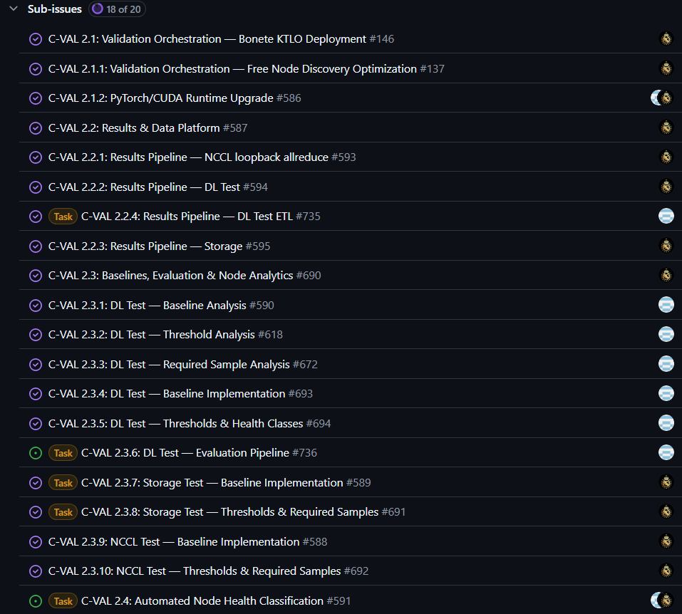

# C-VAL 2.0: Service Overview and Test Catalog

Status: Working draft for engineering review. Not yet approved or published.
Prepared: September 8, 2026.
Program contact: Chris Erdman. Technical reviewers proposed: Hari Sreenath and Eric Krebs.

## C-VAL 2.0 tasks screenshots

## What C-VAL 2.0 Does

Continuous Validation (C-VAL) 2.0 checks the health and performance of available Bonete GPU nodes using application-level tests. It helps identify hardware or software problems that may not be apparent from a Kubernetes Ready status, including numerical errors and performance degradation that can slow distributed training.

The service discovers free nodes, prioritizes never-tested nodes and nodes with older results, runs controlled batches of validation jobs, retains results, and evaluates node health against appropriate baselines. Its three core test families are deep-learning unit tests, NCCL InfiniBand loopback AllReduce, and shared-storage I/O tests. [S1, S2]

Chris confirmed C-VAL 2.0 project completion on September 8, 2026. This draft documents that completed scope; outstanding documentation verification does not reverse that completion statement. The GitHub board still contains older Planning and Dev/Build states. [S1, S3, S7]

### Boundary With ANC

C-VAL 2.0 provides validation results and health classification. Auto Node Cordoning (ANC), also called C-VAL 3.0, adds automated cordoning, failure-context records, Lambda ticketing and repair handoff, post-repair acceptance testing, and controlled return to service. Do not describe that automated remediation loop as part of 2.0. [S3, S8]

C-VAL 4.0 is outside this document's scope. DeepSeek MoE, cluster-wide fabric testing, and additional straggler-detection work are not included in the confirmed 2.0 catalog merely because they appear in broader design notes or adjacent backlog items.

## How Validation Works

1. Discover eligible free nodes and inspect previous validation results.
2. Prioritize nodes with no history, then eligible nodes with the oldest results.
3. Submit a bounded number of validation jobs using the cluster scheduler.
4. Run the enabled tests and retain logs, summaries, run identity, node identity, and timestamps.
5. Evaluate compatible results against the applicable active baselines.
6. Produce a node classification with the contributing test and metric evidence. [S1, S2, S7]

Testing is opportunistic, not a promise that every node is revalidated within a fixed period. Busy nodes may have older results. A previous successful test is not a guarantee that a node is healthy now, and a single-node network test is not proof that the entire multi-node fabric is healthy.

## Test Catalog

The table identifies the verified core families. The deployed DL layer list, tensor shapes, data types, test sizes, FIO profiles, and effective thresholds still require a release-pinned engineering export before this can serve as an exhaustive production reference.

| Test family | What it exercises | Metrics and results | Threshold evidence | Important limit |
| --- | --- | --- | --- | --- |
| Deep-learning unit test | Numerical consistency and execution performance of DL layers across CPU/GPU paths | Design notes name forward-output norms, weight/bias norms, and CPU/GPU forward/backward timings | Baseline and threshold work is tracked in S4; historical methodology in S5. Final production numeric tolerances, timing units, sample minimums, and boundaries not retrieved | Publish exact layers, shapes, dtypes, seeds, software cohort, and comparator rules from the deployed package; do not infer them from the family name |
| NCCL InfiniBand loopback AllReduce | Single-node collective communication routed through IB rather than the direct NVLink path, exercising HCA/NIC and related communication paths | Collective completion and performance; canonical metric names, units, message sizes, and thresholds require confirmation | Baseline and threshold stories exist and are marked Done, but their bodies do not provide threshold values [S6] | This is not a full cluster-fabric or application-scale collective test |
| Shared-storage I/O using FIO | Sequential and random reads/writes to shared storage used for datasets and checkpoints | Bandwidth, IOPS, latency, and raw test outcome; exact selected metrics and latency percentiles require confirmation | Explicit configurable defaults and comparison directions are specified in S9; see below | Compare only compatible workloads and storage cohorts; do not reuse a threshold across different profiles without validation |

The repository entrypoint invokes storage, NCCL, and DL tests, corroborating the three families. The inspected main revision was `9498bafb950bcd2a812bf55034eade19e0ee8eed`. Its README is dated January 13, 2026 and describes an older notebook workflow. That revision is source evidence, not a verified September production deployment manifest. [S2, S10]

## Threshold Reference

### Storage: Documented Defaults, Pending Production Confirmation

These values come from the C-VAL 2.3.8 threshold story, not a readout of the live service. The story requires validation against healthy cluster data before production activation. [S9]

| Setting | Documented initial default | Meaning |
| --- | --- | --- |
| `baseline.min_samples` | 8 eligible observations per required metric and compatible cohort | Minimum after filtering and deduplication |
| `baseline.window_days` | 30 days | Rolling baseline eligibility window |
| `baseline.storage_peer_tolerance_pct` | 10 percent | Engineering tolerance floor |
| `baseline.robust_z_threshold` | 3.5 | Robust statistical threshold |
| Baseline center | Median | Center of the eligible metric distribution |
| Baseline dispersion | 1.4826 multiplied by MAD | Scaled median absolute deviation |

The specification requires the wider of the statistical range and the engineering-tolerance range, including protection against zero-width thresholds. It requires storage of the center, MAD, tolerance floor, final boundary, and metric direction. The exact implemented tolerance calculation, boundary inclusivity, units, and active numeric limits must be supplied with the active baseline export; this draft does not invent them.

Comparison directions:

- Bandwidth and IOPS: lower is worse; below the accepted lower boundary is Degraded.
- Latency: higher is worse; above the accepted upper boundary is Degraded.
- Within the accepted range: Normal.
- Beyond the healthy-side boundary: Improved, subject to the complete node classification rules.
- Missing or incompatible required evidence: Unknown, not healthy.

Eligible baseline samples must be successful, complete, deduplicated, current, and compatible in workload, image, configuration, and storage cohort. Failed, disabled, incomplete, malformed, stale, or hard-failed-node results must not define healthy peer behavior. Baseline changes create candidates; activation is an explicit reviewed step. [S9]

### DL: Methodology Is Available, Final Settings Are Not

The July 20 tier-labeling design describes the most common numerical result as the numerical baseline, a median timing baseline, Isolation Forest for tail detection, an additional threshold based on an unspecified number of standard deviations, and DBSCAN for severe outlier separation. [S5]

This is historical design context, not an approved production threshold table. The newer DL threshold story does not supply the final constants. Do not publish a value for numerical tolerance, the standard-deviation multiplier, timing limits, model parameters, minimum sample count, or exact class intervals until engineering confirms the active implementation. [S4]

### NCCL: Values Still Needed

The NCCL baseline and threshold stories establish the work, but the retrieved bodies provide no production values. Required additions are metric name, canonical unit, message size, rank/GPU count, test configuration, cohort, baseline version, minimum samples, comparison direction, and exact acceptance boundary. [S6]

### Keep Scheduling Settings Separate

The older framework contains a seven-day retest setting. That is a scheduling/freshness setting, not a performance threshold or an uptime promise. Current production cadence, batch size, job timeout, and classification-freshness settings remain to be confirmed. [S2]

## Interpreting Node Health

The newer node-classification specification defines the following behavior. Confirm the deployed evaluator uses this vocabulary and precedence before publication. [S7]

| Classification | Meaning |
| --- | --- |
| Failed | A current enabled test has a definitive hard failure, timeout, corruption, or comparable failure |
| Degraded | No hard failure, but at least one evaluated target is below its accepted health standard |
| Unknown | Required evidence is absent, stale, incomplete, incompatible, or lacks an active baseline |
| Normal | All required tests are current and successful; applicable metrics are within their accepted ranges |
| Improved | Complete successful evidence, no degraded targets, and at least one improved target |

Failures and degradation must not be hidden by a better result elsewhere. Incomplete evidence must not appear healthy. Disabled tests are excluded, not recorded as passed. Preserve every contributing reason and its run/baseline provenance.

**Specification ambiguity for review:** S7 lists precedence as Failed, Degraded, Unknown, Normal, Improved, but its detailed Improved rule allows a mixture of normal and improved successful targets. Engineering must confirm the aggregation rule with an example and automated test. The older Excellent/Nominal/Bad/Very bad/Terrible/DNR vocabulary must not be silently mixed with the newer labels.

## Results, Support, and Limitations

- Historical result location: `/data/continuous_validation/metadata/validation.db`; logs under `/data/continuous_validation/<test-name>/<node-name>/`. Newer specifications refer to separate target-classification stores and a PostgreSQL NCCL evaluator. Confirm the current architecture and the supported read-only results interface. [S2, S7]
- A dedicated current C-VAL dashboard URL and approved support intake URL have not been verified. Do not substitute a generic Grafana landing page for a C-VAL report.
- For an investigation, retain cluster/node identifiers, UTC time, run ID, test and metric, actual value and unit, expected boundary, baseline/configuration version, result age, log link, and workload impact. Do not include credentials or unnecessary researcher data.
- Chris Erdman coordinates documentation completion. Hari Sreenath and Eric Krebs are the identified engineering contributors; an ongoing support rota and service-role appointments still need acceptance.

## Publication Gate

Before publishing this as the production reference, obtain:

1. Deployed release/commit, image digest, enabled-test manifest, hardware/software cohorts, and effective configuration.
2. Exhaustive DL layer/profile list, NCCL profile/message-size list, and FIO workload/profile list.
3. Active baseline export containing each metric, unit, cohort, version, sample count, calculation rule, comparison operator, boundary inclusivity, and effective numeric limits.
4. One representative healthy, degraded, failed, and unknown result with traceable evidence, plus an Improved example resolving the aggregation ambiguity.
5. Approved results/dashboard link, support route, content owner, and review date.

## Sources

- S1: [C-VAL 2.0 epic, #123](https://github.com/msr-central/cordillera/issues/123), updated August 18, 2026; scope and test families.
- S2: [C-VAL README at inspected revision](https://github.com/msr-central/c-val/blob/9498bafb950bcd2a812bf55034eade19e0ee8eed/README.md), README dated January 13, 2026; historical implementation, not deployment proof.
- S3: Chris Erdman, direct confirmation in this documentation request, September 8, 2026: 2.0 wrapped up; ANC expected in approximately two weeks; board may lag; 4.0 excluded.
- S4: [DL thresholds and health classes, #694](https://github.com/msr-central/cordillera/issues/694), [DL baseline implementation, #693](https://github.com/msr-central/cordillera/issues/693), and [DL required samples, #672](https://github.com/msr-central/cordillera/issues/672).
- S5: [DL result tier-labeling design, central meeting OneNote](https://microsoft.sharepoint.com/teams/supwhine/_layouts/15/Doc.aspx?sourcedoc=%7BC188B4A9-7067-493A-B272-75AF5BC230D7%7D&wd=target%28/GPU%20Efficiencies.one/%29&wdpartid=%7B94d6ee8c-bbb8-02d3-2ba9-40872aef3447%7D%7B1%7D&wdsectionfileid=%7B17282875-3851-46c1-a7c8-ec1f91ba7d20%7D), modified July 20, 2026 per work-source metadata; historical design.
- S6: [NCCL baseline implementation, #588](https://github.com/msr-central/cordillera/issues/588) and [NCCL thresholds and required samples, #692](https://github.com/msr-central/cordillera/issues/692).
- S7: [Automated node health classification, #591](https://github.com/msr-central/cordillera/issues/591); specification, board state still Dev/Build at retrieval.
- S8: [ANC / C-VAL 3.0 epic, #815](https://github.com/msr-central/cordillera/issues/815), updated September 2, 2026.
- S9: [Storage thresholds and required samples, #691](https://github.com/msr-central/cordillera/issues/691); documented defaults and acceptance rules, board state Done at retrieval.
- S10: [Test entrypoint at inspected revision](https://github.com/msr-central/c-val/blob/9498bafb950bcd2a812bf55034eade19e0ee8eed/validation-tests/run-test.sh).
- S11: [Deep-learning unit-test repository](https://github.com/msr-central/deep-learning-unit-test), identified in engineering correspondence; deployed revision not verified.

Source review date: September 8, 2026. GitHub issue content describes scope and requirements; Done status alone is not evidence of the live configuration. No production service was queried or changed for this draft.