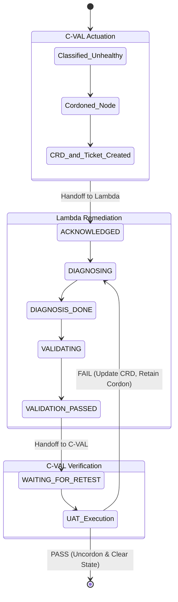

## Overview
Unhealthy GPU nodes currently remain schedulable until manually intervened, causing gang-scheduled training failures and wasted compute. ANC automates the remediation loop: an unhealthy classification triggers K8s cordoning, generates a Lambda support ticket with failure context, tracks state, and strictly gates uncordoning behind a passing C-VAL User Acceptance Test (UAT).

## Scope
* **In:** Cordon/uncordon actuation, `CVAL_*` state contract, K8s failure-context CRD, Lambda ticketing, UAT path, rate limits/safety controls, audit trails.
* **Out:** Lambda's internal repairs, automated draining (Lambda owns drain), node deletion/replacement.

## Lifecycle & State Machine

## Design Principles
1. **Classification-Driven:** ANC acts solely on final health classifications, never raw metrics.
2. **Strict Gates:** Uncordon requires a passing UAT. No timeouts or edge cases can auto-uncordon.
3. **Durable State:** The CRD is the source of truth for failure context; K8s labels are lightweight pointers.
4. **Safety First:** All K8s mutations are explicit, idempotent, rate-limited, auditable, and support `--dry-run`.

## Acceptance Criteria
- [ ] Unhealthy nodes are cordoned automatically.
- [ ] Rate limits and circuit breakers prevent runaway cordoning.
- [ ] Retries generate no duplicate CRDs, tickets, or state mutations.
- [ ] `CVAL_STATE` is synchronized between C-VAL and Lambda.
- [ ] Lambda extracts full failure context directly from the CRD.
- [ ] `WAITING_FOR_RETEST` nodes are validated by C-VAL despite unschedulable taints.
- [ ] Uncordon triggers *only* upon a passing C-VAL UAT.
- [ ] Failed UAT retains the cordon, updates the CRD, and loops back to Lambda.
- [ ] End-to-end workflow is traceable via a single Workflow ID.

Auto node cordoning process design with hardware vendor ( Lambda)

C-VAL process
	1. C-VAL runs validation on node A , produce test results
	2. IF test result IS "healthy"
		a. Set CVAL_HEALTH= set the appropriate health class from the c-val classification.
		b. Set CVAL_TIME= timestamp of the latest c-val validation test.
	3. IF test result IS "Unhealthy"
		a. GCR C-VAL Flagging phase
			i. Check CVAL_STATE
			ii. Set CVAL_HEALTH=BAD
			iii. Set CVAL_TIME= timestamp of the latest c-val validation test
			iv. Create CRD with failure information documented and fetch the CRD ids
			v. Set CVAL_INFO = the CR ID that just created
			vi. Support ticket gets created with Lambda API
			vii. Set CVAL_STATE=CORDENED
		b. C-VAL trigger Kubectl cordon node A
		c. Lambda handover
			i. framework automatically detects the cordoned node A
			ii. Lambda framework  set the CVAL_STATE=AKNOWLEDGED
			iii. Lambda framework read all CVAL labels and CRD for failure information.
			iv. Control plane will have access to node A . We CAN read the labels
				1) [What happens if node A gets drained? Control plane WILL have access to the node /k8s won't have access to drained node - for now CRD could help to ]
			v. Lambda drains node A.
		d. Lambda hardware diagnosis and fix/replacement
			i. Set CVAL_STATE=DIAGNOSING
			ii. Lambda run hardware diagnosis based on the failed hardware component
			iii. Reboot/ reinstall/ replacement
			iv. CVAL_STATE=DIAGNOSIS_DONE
		e. Lambda Validation
			i. Set CVAL_STATE=VALIDATING
			ii. Lambda run validation tests
			iii. IF Validation test result is FAIL
				1) Go to step d "Lambda hardware diagnosis and fix/replacement"
			iv. IF Validation test result is PASS
				1) Set CVAL_STATE=VALIDATION_PASSED
		f. Lambda returns the node A
			i. Set CVAL_STATE=WAITING_FOR_RETEST
			ii. Return node A in "cordoned" status
		g. C_VAL Acceptance test
			i. CVAL detects the node with all the below criteria fulfilled
				1) Node A is cordoned status
				2)  CVAL_STATE=WAITING_FOR_RETEST
			ii. IF criteria fulfilled
				1) C-VAL runs validation test
			iii. If CVAL test result is PASS
				1) Set CVAL_HEALTH=GOOD
				2) Unset CVAL_CONTEXT
				3) Trtigger Kubectl uncordon Node A
				4) Unset CVAL_STATE
			iv. If CVAL_STATE=WAITING_FOR_RETEST stays for more than 1 hr
				1) Automatically uncordon Node A
				2) This is a safetey mechanism in case c-val crashes.
