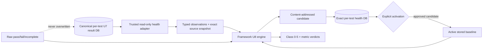

# U8 Versioned Health-Class Engine — Major Design Report

**Design:** `cval.health.v1` / `robust_mad_bands.v1`  
**SQLite schema:** version 1, `initial-versioned-health-engine`  
**Implementation state:** complete and independently certified READY; operationally inactive  
**Approval boundary:** no U9 evaluator, live health DB, migration, automatic activation, cluster action, deployment, commit, or push

## Executive summary

U8 adds a deterministic, callable health interpretation layer above immutable U7 raw results. It converts exact, provenance-bound metric observations into content-addressed baseline candidates and classifies complete current observations into stable classes 0–5.

The design deliberately separates three concepts:

1. **Raw execution truth** — U7 `pass`, `fail`, or `incomplete`; never rewritten by health.
2. **Versioned health evidence** — immutable sources, receipts, sample coverage, robust statistics, normalized thresholds, and build-trigger decisions.
3. **Lifecycle interpretation** — explicit `candidate -> active -> superseded` state for one test/environment combination.

U8 is not a background service. It provides pure engine APIs, strict built-in observation adapters, and transactional local SQLite persistence. U9 remains responsible for any future evaluator cycle, classification history, locking policy, or operational wiring.

## Goals and non-goals

### Delivered

- Stable class codes 0–5 and names.
- Canonical environment-combination stratification.
- Declarative metric direction/tolerance rules.
- Framework-owned robust candidate construction.
- Exact content identity and durable provenance.
- Minimum-sample and minimum-new-result build triggers.
- Candidate/active/superseded lifecycle.
- Normalized exhaustive/disjoint threshold bands.
- DNR precedence and exact missing-sample behavior.
- Aggregation-only custom strategy for DL.
- Exact SQLite schema, immutable evidence triggers, rollback, and snapshot-consistent reads.
- Built-in storage, NCCL, and DL health observation capabilities.

### Explicitly not delivered

- No U9 evaluator loop or scheduler.
- No automatic candidate build from live results.
- No classification-history writer or latest-health cache update.
- No CLI command that creates or activates U8 databases.
- No live PVC schema creation, migration, import, or write.
- No deployment, pod change, background-loop restart, or Kubernetes action.
- No replacement of the existing compatibility baseline CLI, databases, or scripts.

## Architecture



Core modules:

| Module | Responsibility |
| --- | --- |
| `cval.health.models` | Frozen class, observation, provenance, candidate, coverage, lifecycle, and verdict values. |
| `cval.health.combination` | Canonical factor JSON and SHA-256 combination identity. |
| `cval.health.engine` | Validation, canonicalization, robust candidate construction, quality gates, thresholds, classification, DNR, and custom aggregation boundary. |
| `cval.health.sqlite_values` | Strict SQLite integer/number/text decoding without coercion. |
| `cval.health.storage` | Exact schema, immutable candidate persistence, trigger evidence, lifecycle transitions, and snapshot reads. |
| `cval.validation.registry` | Typed `[health]` descriptor rules and config digest. |
| `cval.validation.plugins` | Repository-confined adapter loading, capability/policy checks, and aggregation-only custom contract. |
| `cval.storage.per_test_results` | Strict read-only source metadata, adapter schema, receipt, and result-content validation. |

## Stable health classes

| Code | Name | Meaning |
| ---: | --- | --- |
| 0 | Excellent | Materially beyond the good-side nominal tail. |
| 1 | Nominal | Inside the active baseline's nominal band. |
| 2 | Underperforming | First degradation band. |
| 3 | Very Bad | Second degradation band. |
| 4 | Terrible | Beyond the third degradation boundary. |
| 5 | DNR | No compatible, complete, evaluable observation. |

DNR has no metric threshold row. Reasons include raw failure, raw incomplete, missing combination, no active baseline, no observations, incomplete metric/sample coverage, and incompatible adapter schema version.

Raw failure/incomplete is checked before adapter hooks or observation iteration. The framework validates the requested test owner and canonical combination, omits unvalidated baseline identity from these fast-path verdicts, and prevents custom aggregation from overriding DNR.

## Configuration and adapter contract

Every enabled health descriptor declares:

- `policy_version`, such as `nccl.health.v1`;
- strategy (`declarative` or aggregation-only `custom`);
- minimum total and new result counts;
- exact combination factors;
- `auto_activate=false` in all built-ins;
- one or more metric source/direction/tolerance rules.

The plugin must expose the identical `health_policy_version`. A policy bump changes the validated descriptor digest and invalidates stale candidate/config binding.

Health-capable plugins provide only:

- `metric_specs(definition)`;
- `load_observations(context)`;
- `classify(context, active_candidate, observations, framework_verdict)` for custom aggregation.

Candidate construction is always framework-owned. Exporting `build_candidate` is rejected. A custom classifier must preserve all framework metric verdicts, return canonical details with a versioned aggregation identifier, and satisfy anti-masking rules.

The public framework entry points are `build_candidate_from_plugin()` and
`classify_from_plugin()`. They invoke the adapter's canonical read-only
`load_observations()` hook themselves; caller-supplied observation variants are
kept internal to engine tests and cannot serve as the orchestration boundary.

Repository plugins remain trusted code, not an OS sandbox. The safety boundary is exact framework validation and storage ownership, not prevention of arbitrary malicious Python behavior.

## Comparable environment identity

A baseline is scoped to one test and one canonical combination. Factor names come from validated config; common runtime factors must be non-empty strings; test-owned factors retain exact JSON scalar types.

Factors are serialized with sorted keys, compact separators, UTF-8, and no non-finite numbers:

$$
K_{combination} = \texttt{"sha256:"} \; || \; SHA256(\text{canonical JSON factors})
$$

Built-in factors are:

| Test | Factors |
| --- | --- |
| Storage | image, CUDA version, PyTorch version |
| NCCL | image, CUDA version, PyTorch version, iterations, data size |
| DL | image, CUDA version, PyTorch version, test plan, iterations |

Missing factors make the result ineligible/DNR. They never collapse into an empty shared stratum.

## Exact source and observation provenance

Each candidate source row binds:

- positive `result_id` and unique `run_id`;
- completion timestamp;
- result-envelope digest;
- raw-result JSON digest;
- current test-config digest;
- canonical combination key;
- one uniform positive adapter schema version;
- durable metric-ingestion receipt evidence digest.

Built-in readers open result DBs read-only and validate exact common and adapter schemas, owner/test identity, result/config/combination digests, durable receipt fields, and receipt-to-metric-content equality before returning observations.

Every observation binds source result identity, source rule, expanded metric name, stable sample key, completion timestamp, and a finite numeric value. Duplicate `(result_id, source, metric_name, sample_key)` identities are rejected.

Exact observations are persisted with each candidate. Integrity validation
reconstructs their digest, sample coverage, trimmed sample/exclusion counts,
robust summaries, deltas, statistical JSON, and threshold bands. Content hashes
alone are not treated as proof that derived evidence came from observations.

### Exact sample coverage

Result-ID coverage alone is insufficient for pooled metrics. U8 records every:

```text
(source, expanded metric, result_id, sample_key)
```

Candidate quality requires the same non-empty sample-key set for each expanded metric in every source result. Current classification requires the exact baseline sample-key set for every current result. Missing or extra ranks/samples return DNR `incomplete_metric_coverage`; they cannot be hidden by a median over the remaining values.

This matters most for DL pooled rank timings, while also making storage/NCCL one-sample metrics explicit.

## Deterministic candidate construction

Validated observations are sorted by:

```text
(result_id, source, metric_name, sample_key)
```

before grouping or any order-sensitive statistic. Exact observation content is independently serialized and hashed. Permuting adapter output therefore preserves statistics, confidence intervals, observation digest, payload digest, and baseline ID.

The candidate payload includes:

- test and combination identity;
- config, health-policy, adapter-schema, evaluator, method, and robust-z versions;
- exact source rows and receipt provenance;
- exact per-result sample coverage;
- exact observation digest;
- robust metric statistics and canonical statistical JSON;
- normalized threshold bands;
- lifecycle parent and excluded-result count.

Creation/storage wall-clock timestamps are excluded. The identity is:

$$
D = SHA256(\text{canonical candidate payload})
$$

$$
\text{payload digest}=\texttt{sha256:}D, \qquad
\text{baseline ID}=\texttt{hb1:}D
$$

An exact retry is idempotent. The same ID with different reconstructed content is a collision/corruption error.

## Robust statistics

U8 reuses the existing deterministic baseline kernel:

- median center $m$;
- MAD and scaled MAD $\sigma_{MAD}=1.4826\,MAD$;
- modified-z trimming;
- IQR, p01/p05/p25/p50/p75/p95/p99, extrema;
- skewness and kurtosis;
- deterministic bootstrap median confidence interval;
- configured tolerance floor.

For effective robust-z value $z$ and tolerance percentage $t$:

$$
\Delta = \max\left(z\sigma_{MAD},\frac{t}{100}|m|\right)
$$

The persisted canonical statistical JSON is revalidated against normalized columns, including finite values, percentile ordering, IQR, median interval, deterministic method, MAD scaling, and bounds. Adjacent percentile comparisons tolerate only deterministic $10^{-12}$ floating interpolation noise; material disorder is rejected.

For `absolute`, magnitudes are summarized and classified as `high_bad`. Zero-center verdict severity uses delta-relative distance when available rather than reporting a misleading zero percent.

## Normalized threshold bands

U8 generates and revalidates exact interval tuples `(class_code, band_index, lower, upper, inclusivity)`.

- `low_bad`: class 0 on the high/good tail; class 1 down to $m-\Delta$; classes 2 and 3 cover the next two deltas; class 4 is below $m-3\Delta$.
- `high_bad`: mirror image on the high/degrading side.
- `absolute`: magnitude with `high_bad` semantics.
- `two_sided`: class 1 inside $m\pm\Delta$; classes 2/3 on both sides through $2\Delta/3\Delta$; class 4 outside; no class 0 band.

The good-tail boundary also uses the robust p95 (`low_bad`) or p05 (`high_bad`) so ordinary baseline spread is not labeled Excellent. Zero-delta empty intermediate intervals are omitted. Validation proves every finite probe/boundary belongs to exactly one band and DNR has none.

## Aggregation

Declarative multi-metric verdicts use:

```text
max_metric_class.v1
```

The aggregate is the most severe metric class.

DL uses:

```text
dl_severity_count_fraction.v1
```

It may suppress isolated non-severe metric degradation at the aggregate level according to descriptor-owned severity/count/fraction settings. It cannot alter metric verdicts, return Excellent while degraded metric classes exist, invent a degradation class absent from metrics, or override DNR.

## Quality gates

Activation readiness is recomputed from current config and immutable candidate content. Gates cover:

- test owner;
- current config digest;
- current health policy version;
- uniform content-bound adapter schema version;
- effective robust-z policy;
- minimum distinct source results;
- exact configured metric spec identities;
- exact expanded-metric/result coverage;
- stable exact sample-key coverage;
- minimum clean samples per metric;
- normalized threshold presence/partition;
- non-self lifecycle parent.

A candidate can be persisted for inspection only after the immutable minimum build trigger is satisfied, but it cannot activate unless every quality gate passes.

## Build triggers and candidate chain

For current source IDs $C$ and preceding candidate source IDs $P$:

$$
N_{qualifying}=|C|, \qquad N_{new}=|C\setminus P|
$$

A build requires:

$$
|C| \ge min\_samples \quad\land\quad |C\setminus P| \ge min\_new\_results
$$

Late older IDs still count when absent from $P$. Duplicate, Boolean, fractional, or non-positive IDs are rejected.

Every baseline stores exactly one immutable trigger row with the preceding candidate, configured minima, and computed counts. Every test/combination must form one unbranched chain. Trigger evidence is revalidated on load and against current config on activation. The mutable build-state cache is not used for correctness.

## Lifecycle and concurrency

Lifecycle is storage-owned:

```text
candidate -> active -> superseded
```

Candidate storage requires its lifecycle parent to equal the current active baseline for the same test/combination. Activation uses `BEGIN IMMEDIATE`, reloads and validates all evidence, requires the parent still be active, supersedes that parent, activates the candidate at the same timestamp, verifies exactly one active row, reloads lifecycle rows, and commits. Any failure rolls back.

A partial unique index enforces one active baseline per `(test_id, combination_key)`. SQL triggers allow only legal lifecycle transitions and reject baseline deletion or correctness-evidence mutation. Read APIs begin an explicit query-only transaction before schema, owner, active-ID, and child-row reads, preserving one SQLite snapshot across concurrent activation.

## SQLite schema and immutability

Each test owns one declared DB:

```text
validation_tests/<test-id>/<test-id>_health_classes.db
```

The exact schema contains:

- migration and immutable owner rows;
- stable class seeds;
- baselines;
- source provenance;
- exact source/sample coverage;
- metric statistics;
- normalized threshold bands;
- immutable candidate-trigger evidence;
- advisory build state.

Readers/writers compare the complete raw table/index/trigger manifest, migration record, stable seeds, owner set, foreign-key check, missing trigger evidence, and candidate chains. Extra, partial, future, or alternate-equivalent schemas fail closed.

Database triggers protect owner/migration/class/source/observation/coverage/
statistics/threshold/trigger/activation rows from update/delete, restrict child
evidence to candidate owners, reject baseline deletion, and enforce legal
lifecycle updates. Offline corruption reconstructed behind a trigger is still
detected through observation derivation, exact content identity, strict scalar
decoding, source metadata, trigger evidence, quality, or lifecycle validation.

Framework activation first inserts immutable authorization evidence binding the
candidate ID, owner/combination, config and health policy, adapter/evaluator
versions, quality report, and activation timestamp. Evidence is HMAC-SHA-256
signed with a generated owner-only `<health-db>.activation.key` sidecar; SQLite
stores only its immutable digest and the signature. The lifecycle trigger and
all active/superseded readers require a valid signature. A SQL connection cannot
advertise an unapproved active baseline merely by spoofing an application UDF.
The key and DB form one backup/restore unit. Filesystem/key compromise remains
outside the SQL-only integrity boundary.

## Built-in adapters

### Storage

- Policy: `storage.health.v1`.
- Twelve FIO IOPS/bandwidth expanded metrics.
- Direction: `low_bad`; 10% tolerance.
- One stable sample per expanded metric/result.
- Declarative `max_metric_class.v1` aggregation.

### NCCL

- Policy: `nccl.health.v1`.
- Aggregate bus bandwidth (`low_bad`) and latency (`high_bad`), 5% tolerance.
- Combination binds iteration count and BF16 data size.
- Reader validates canonical LA timestamp, HCA evidence, exact receipt, and metric content.
- Per-port values remain diagnostic, not U8 baseline metrics.

### DL

- Policy: `dltest.health.v1`.
- Numerical (`two_sided`), compute/collective (`high_bad`), overlap (`two_sided`).
- Exact plan/iteration/GPU/rank/component provenance.
- Numerical expanded names retain rank; pooled performance metrics retain exact rank sample keys.
- Framework candidate/metric classification plus `dl_severity_count_fraction.v1` final aggregation.

All built-ins use `min_samples=8`, `min_new_results=10`, and `auto_activate=false`.

## Compatibility and safety

U8 does not replace or cut over the production compatibility baseline modules.
Existing baseline build/classify commands, DBs under `baselines/`, scripts,
readers, and writers remain the operational path; the combined modular update
may synchronize their settings from per-test descriptors without routing them
through U8.

Canonical U7 common rows, adapter schema rows, durable receipts, and built-in
metric rows are append-only under exact conflict-INSERT/UPDATE/DELETE trigger
manifests, including `INSERT OR REPLACE` defense. U8
health readers hold one query-only SQLite snapshot across schema, source,
receipt, and metric-content validation. This anchors provenance within the
trusted canonical DB boundary; privileged replacement of the entire DB/artifact
trust root remains an operational backup/signing concern, not a repository
plugin sandbox guarantee.

Safety posture:

- `run_history_enabled=false` remains independent.
- `per_test_ingestion_enabled=false` remains independent.
- Built-in `auto_activate=false`.
- U8 code does not assume canonical U7 or health DBs exist live.
- No Kubernetes or PVC operation is needed for local tests.
- Raw status and generated operational evidence remain preserved.

## Validation strategy

The test suite covers:

- stable class codes and exact/epsilon directional boundaries;
- robust median/MAD regression and zero-delta/zero-center behavior;
- observation permutation identity;
- exact observation digest and source/receipt provenance;
- mixed/current adapter schema-version rejection;
- partial result and missing/extra sample coverage;
- raw DNR precedence without iterable/plugin execution;
- custom aggregation anti-forgery rules;
- immutable candidate/trigger/source/statistics rows;
- exact schema, owner, seeds, strict scalar reads, and offline corruption;
- minimum/new-result trigger recomputation and unbranched chains;
- stale parent, idempotent retry, one-active lifecycle, rollback, and concurrent snapshot reads;
- built-in storage/NCCL/DL read-only observation adapters;
- U7 and existing compatibility ingestion/config/script regressions.

Final certification ran recursive Python compilation, Bash syntax,
registry/plugin validation, editor diagnostics, full unit discovery, and
`git diff --check`. The complete suite passed 512 tests, including a
`ResourceWarning`-as-error run after deterministic SQLite/temp cleanup. The final independent
read-only adversarial audit reported `READY` with no P0/P1/P2 findings under the
documented SQL-only integrity and trusted filesystem-owner/plugin boundaries.
Exact completion evidence is recorded in the U8 tracker entry.

## Retrospective and cleanup

The adversarial audit cadence materially improved the design. The most useful
lessons were:

- Content-addressing is not derivation proof. Persisting exact observations and
    reconstructing coverage, statistics, delta, and thresholds closed the gap.
- Result-ID coverage is not sample coverage. Exact stable rank/sample keys are
    necessary to prevent partial pooled metrics from becoming nominal.
- SQLite append-only policy must cover conflict inserts and hidden `rowid`, not
    only explicit `UPDATE` and `DELETE` statements.
- Lifecycle timestamps and SQL triggers are not authorization. Signed evidence
    bound to an owner-only external key makes activation independently verifiable.
- Correctness reads must validate the complete ancestor chain in one snapshot,
    not only the selected active row.
- Public orchestration must invoke canonical adapter readers itself; pure
    caller-observation helpers belong behind private testing boundaries.

The final cleanup removed dead symbols and an orphan manual job manifest,
centralized timestamp conversion, made runtime decoding test-private, closed
SQLite readers deterministically, promoted `ResourceWarning` during the full
suite, ignored only canonical generated DB/key artifacts, and synchronized
live-loop deletion scope, current PVC-pod commands, atomic ingestion, recursive
validation, and historical-document labels. Operational logs and existing
CSV/ZIP evidence were intentionally preserved.

## Operational handoff

Before any live use, a separately approved U9 plan must define at least:

1. read-only local/PVC-copy discovery and dry-run output;
2. evaluator locking and bounded SQLite waits;
3. candidate build selection/window policy;
4. explicit activation workflow and authorization;
5. append-only classification history and latest-cache transaction semantics;
6. backup, migration, rollback, and compatibility verification;
    this must preserve each health DB with its owner-only activation key;
7. per-test failure isolation and structured cycle summaries;
8. deployment, monitoring, and rollback evidence.

Until then, the correct operational behavior is **no U8 live action**.
