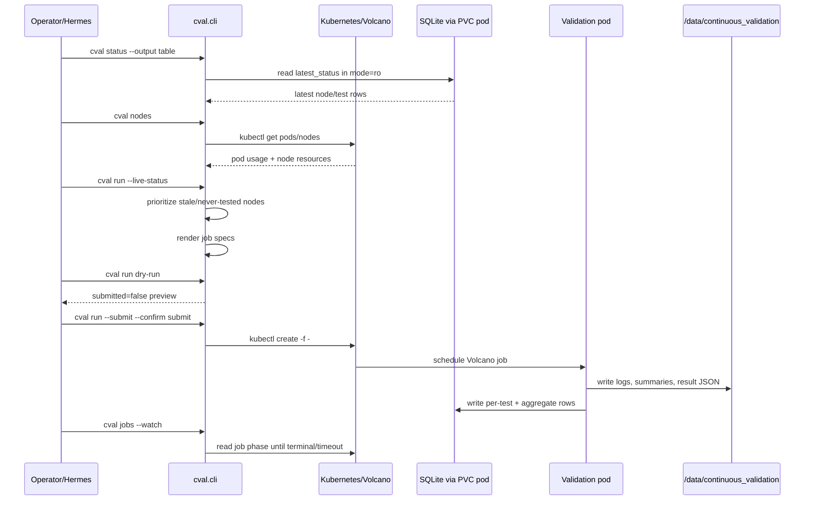
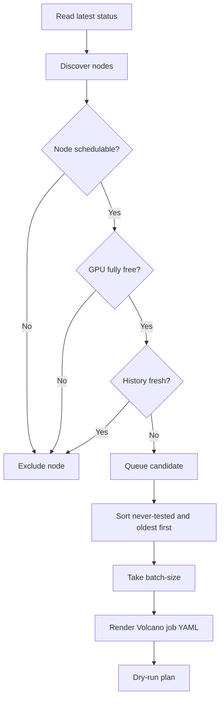
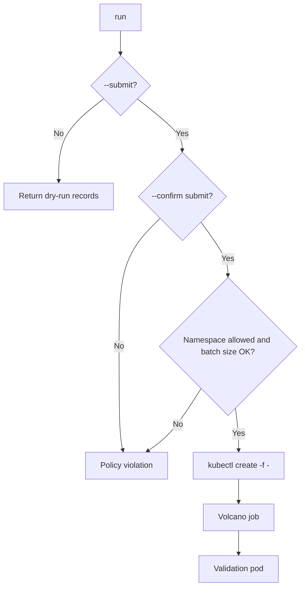
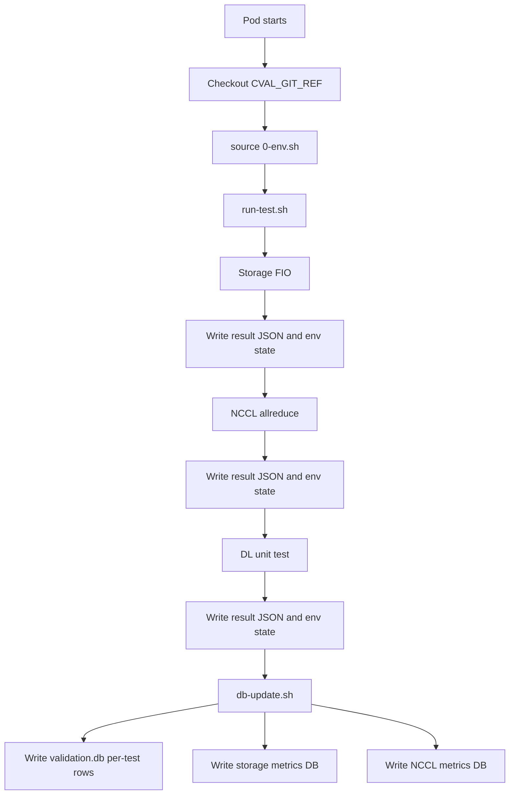
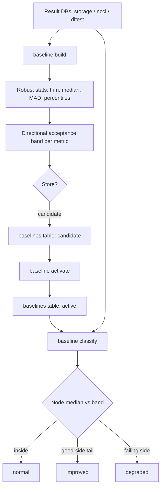

# Workflow

## High-Level Logical Flow

## Planning Flow

## Live Runner Per-Slot Rebuild Policy

The live runner treats the ranked node list as a short-lived snapshot. It does
not build one large queue and walk it blindly.

For every open batch slot, it rebuilds the ranked list from scratch:

1. Rebuilds the free schedulable node list from current Kubernetes state.
2. Re-reads latest validation status from SQLite.
3. Filters out nodes with valid `all` results inside the threshold window.
4. Ranks never-tested nodes first, then nodes with the oldest available results.
5. Submits exactly one job for the top currently valid node.
6. Repeats the same rebuild for the next open slot.

If a submitted job remains `Pending` and does not reach `Running` within the
configured pending-start timeout, the runner deletes that specific validation
job and opens the slot for a fresh live-ranked candidate.

## Execution Flow

## In-Pod Validation Flow

## Completion Criteria

A one-node c-val 2.0 run is considered successful when all are true:

- Volcano job phase is `Completed`.
- Pod phase is `Succeeded` and exit code is `0`.
- `cval.results.v1` JSON exists.
- `storage`, `nccl`, `dltest`, and `all` rows exist in latest status for the node.
- Storage and NCCL metric DB updates complete.
- DL test log shows completed task output without failure markers.

## Baseline Classification Flow

After results land in the metric DBs, c-val can build a baseline and classify
nodes against it.

