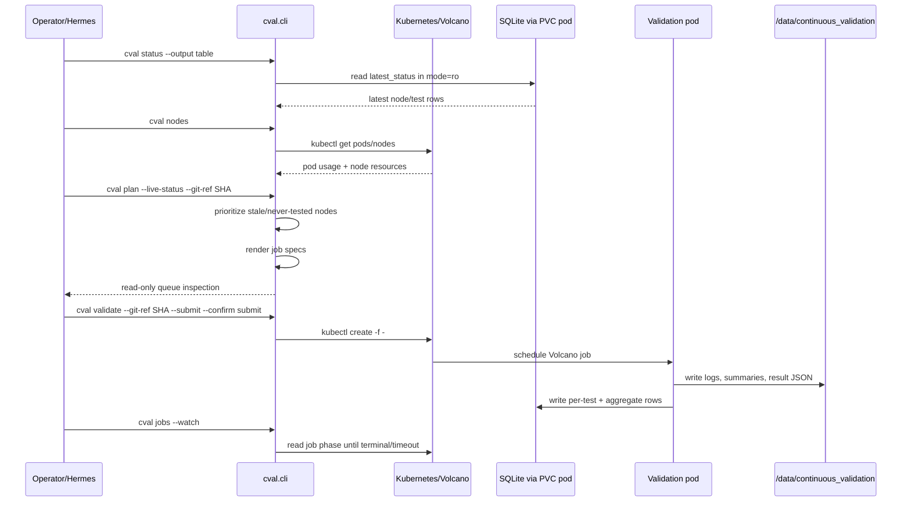
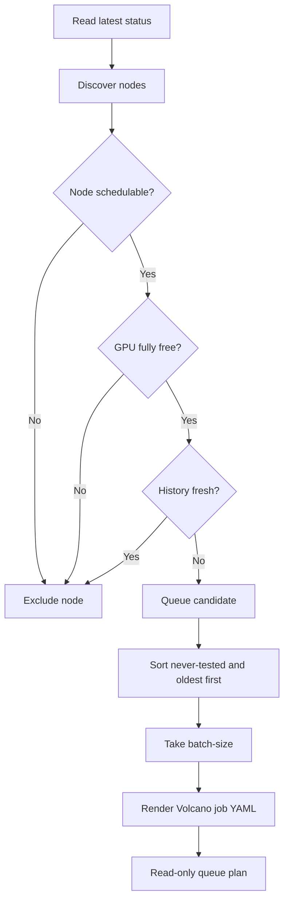
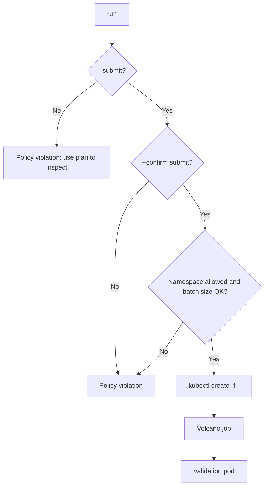
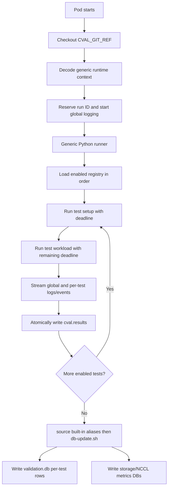
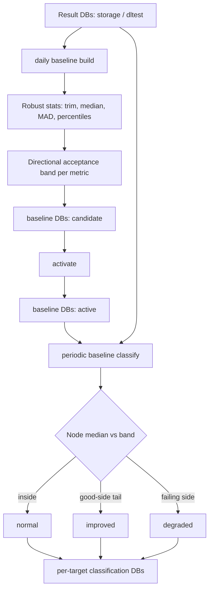

# Workflow

## High-Level Logical Flow

## Planning Flow

## Live Runner Per-Slot Rebuild Policy

The live runner treats the ranked node list as a short-lived snapshot. It does
not build one large queue and walk it blindly.

For every open batch slot, it rebuilds the ranked list from scratch:

1. Rebuilds the free schedulable node list from current Kubernetes state.
2. Reads the local latest-submission cooldown table and excludes nodes whose
    configured cooldown has not expired.
3. Re-reads latest validation status from SQLite.
4. Filters out nodes with valid `all` results inside the threshold window.
5. Ranks never-tested nodes first, then nodes with the oldest available results.
6. Submits exactly one job for the top currently valid node.
7. Records that node's latest submission timestamp atomically.
8. Repeats the same rebuild for the next open slot.

The default cooldown is four hours. Its compact local state is
`run-logs/cval-live/node_cool_down.csv`, with exactly one row per node and the
latest successful cval-live submission timestamp. It is a scheduler guard, not
authoritative test evidence or run history. A malformed table fails planning
closed. Audit mode reads the table and reports exclusions but never updates it.

If a submitted job remains `Pending` and does not reach `Running` within the
configured pending-start timeout (480 seconds by default), the runner may delete that specific
validation job and open the slot only when submit mode and the independent
`CVAL_PRUNE_CONFIRM=delete-pending` gate are both active. Audit mode never
deletes it. Successfully self-pruned jobs are written to a per-cycle
`pruned-jobs.csv` receipt, so a restart does not misclassify the known deletion
as an unexplained missing job. Missing jobs without that exact local receipt
remain indeterminate and block new submissions.

## Saved-job resume goal

Before discovering new nodes, submit mode reads submission receipts from the
latest cycle and observes every unresolved Job by exact name. The goal is
restart safety: after a shell restart, host reboot, or transient Kubernetes API
failure, cval must not forget active Jobs, exceed its batch size, or submit a
duplicate replacement. Pending and Running Jobs continue to occupy slots;
terminal Jobs release slots. An unexplained `Unknown` phase fails closed rather
than guessing that capacity is available.

## Cycle artifact goal

Every pass receives a timestamped directory under `run-logs/cval-live/`. It
retains the raw node snapshot, latest-status snapshot and map, cooldown report,
plan, submission receipts, phase observations, prune receipts, and final status.
These files answer why a node was selected, excluded, submitted, monitored, or
pruned and allow the saved-job resume step to recover after restart. They are a
local operational audit trail; authoritative test results and metrics remain on
the PVC and in the raw metadata databases.

## Execution Flow

## In-Pod Validation Flow

## Completion Criteria

A one-node c-val 2.0 run is considered successful when all are true:

- Volcano job phase is `Completed`.
- Pod phase is `Succeeded` and exit code is `0`.
- Canonical `cval.results` JSON exists and validates.
- Every enabled test is terminal and global/per-test logs plus events exist.
- `storage`, `nccl`, `dltest`, and `all` rows exist in latest status for the node.
- Storage and NCCL metric DB updates complete.
- DL test log shows completed task output without failure markers.

## Baseline Classification Flow

After results land in the metric DBs, c-val runs two independent background
loops:

1. A daily builder creates/activates dynamic baselines under
    `/data/continuous_validation/baselines`.
2. A periodic classifier evaluates node metrics against the active baselines and
    writes derived decisions to the selected target classification DB.

NCCL is not part of these generic SQLite baseline loops. Its optional
PostgreSQL path uses calibration decisions, immutable baseline versions, and a
durable evaluation queue described in `docs/evals/nccl-eval-process.md`.